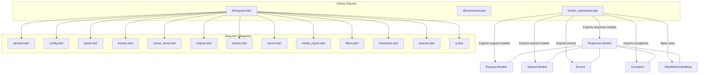
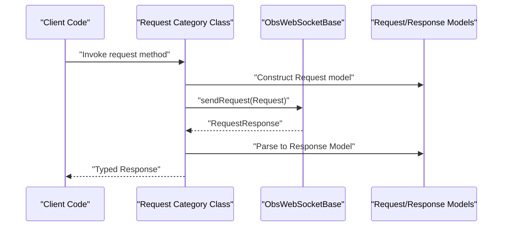

# Request Categories Reference

<cite>
**Referenced Files in This Document**
- [lib/request.dart](file://lib/request.dart)
- [lib/command.dart](file://lib/command.dart)
- [lib/obs_websocket.dart](file://lib/obs_websocket.dart)
- [lib/src/request/general.dart](file://lib/src/request/general.dart)
- [lib/src/request/config.dart](file://lib/src/request/config.dart)
- [lib/src/request/inputs.dart](file://lib/src/request/inputs.dart)
- [lib/src/request/scenes.dart](file://lib/src/request/scenes.dart)
- [lib/src/request/scene_items.dart](file://lib/src/request/scene_items.dart)
- [lib/src/request/outputs.dart](file://lib/src/request/outputs.dart)
- [lib/src/request/stream.dart](file://lib/src/request/stream.dart)
- [lib/src/request/record.dart](file://lib/src/request/record.dart)
- [lib/src/request/media_inputs.dart](file://lib/src/request/media_inputs.dart)
- [lib/src/request/filters.dart](file://lib/src/request/filters.dart)
- [lib/src/request/transitions.dart](file://lib/src/request/transitions.dart)
- [lib/src/request/sources.dart](file://lib/src/request/sources.dart)
- [lib/src/request/ui.dart](file://lib/src/request/ui.dart)
- [lib/src/model/response/version_response.dart](file://lib/src/model/response/version_response.dart)
- [lib/src/model/response/stats_response.dart](file://lib/src/model/response/stats_response.dart)
- [lib/src/model/response/profile_list_response.dart](file://lib/src/model/response/profile_list_response.dart)
- [lib/src/model/response/scene_collection_list_response.dart](file://lib/src/model/response/scene_collection_list_response.dart)
- [lib/src/model/response/video_settings_response.dart](file://lib/src/model/response/video_settings_response.dart)
- [lib/src/model/response/stream_service_settings_response.dart](file://lib/src/model/response/stream_service_settings_response.dart)
- [lib/src/model/response/record_directory_response.dart](file://lib/src/model/response/record_directory_response.dart)
- [lib/src/model/response/input_default_settings_response.dart](file://lib/src/model/response/input_default_settings_response.dart)
- [lib/src/model/response/input_settings_response.dart](file://lib/src/model/response/input_settings_response.dart)
- [lib/src/model/response/input_volume_response.dart](file://lib/src/model/response/input_volume_response.dart)
- [lib/src/model/response/scene_list_response.dart](file://lib/src/model/response/scene_list_response.dart)
- [lib/src/model/response/scene_item_list_response.dart](file://lib/src/model/response/scene_item_list_response.dart)
- [lib/src/model/response/scene_scene_transition_override_response.dart](file://lib/src/model/response/scene_scene_transition_override_response.dart)
- [lib/src/model/response/stream_status_response.dart](file://lib/src/model/response/stream_status_response.dart)
- [lib/src/model/response/record_status_response.dart](file://lib/src/model/response/record_status_response.dart)
- [lib/src/model/response/media_input_status_response.dart](file://lib/src/model/response/media_input_status_response.dart)
- [lib/src/model/response/boolean_response.dart](file://lib/src/model/response/boolean_response.dart)
- [lib/src/model/response/string_response.dart](file://lib/src/model/response/string_response.dart)
- [lib/src/model/response/integer_response.dart](file://lib/src/model/response/integer_response.dart)
- [lib/src/model/response/string_list_response.dart](file://lib/src/model/response/string_list_response.dart)
- [lib/src/model/response/input.dart](file://lib/src/model/response/input.dart)
- [lib/src/model/response/special_inputs_response.dart](file://lib/src/model/response/special_inputs_response.dart)
- [lib/src/model/response/source_active_response.dart](file://lib/src/model/response/source_active_response.dart)
- [lib/src/model/response/source_screenshot_response.dart](file://lib/src/model/response/source_screenshot_response.dart)
- [lib/src/model/response/monitor_list_response.dart](file://lib/src/model/response/monitor_list_response.dart)
- [lib/src/model/response/call_vendor_request_response.dart](file://lib/src/model/response/call_vendor_request_response.dart)
- [lib/src/model/request/key_modifiers.dart](file://lib/src/model/request/key_modifiers.dart)
- [lib/src/model/request/source_screenshot.dart](file://lib/src/model/request/source_screenshot.dart)
- [lib/src/model/request/video_settings.dart](file://lib/src/model/request/video_settings.dart)
- [lib/src/model/shared/scene_item.dart](file://lib/src/model/shared/scene_item.dart)
- [lib/src/model/shared/scene_item_detail.dart](file://lib/src/model/shared/scene_item_detail.dart)
- [lib/src/model/shared/scene.dart](file://lib/src/model/shared/scene.dart)
- [lib/src/model/shared/transform.dart](file://lib/src/model/shared/transform.dart)
- [lib/src/enum/obs_media_input_action.dart](file://lib/src/enum/obs_media_input_action.dart)
- [lib/src/enum/obs_media_state.dart](file://lib/src/enum/obs_media_state.dart)
- [lib/src/enum/obs_monitoring_type.dart](file://lib/src/enum/obs_monitoring_type.dart)
- [lib/src/model/comm/request.dart](file://lib/src/model/comm/request.dart)
- [lib/src/model/comm/request_response.dart](file://lib/src/model/comm/request_response.dart)
- [lib/src/model/comm/request_status.dart](file://lib/src/model/comm/request_status.dart)
- [lib/src/model/comm/request_batch.dart](file://lib/src/model/comm/request_batch.dart)
- [lib/src/model/comm/request_batch_response.dart](file://lib/src/model/comm/request_batch_response.dart)
- [lib/src/model/comm/event.dart](file://lib/src/model/comm/event.dart)
- [lib/src/model/comm/hello.dart](file://lib/src/model/comm/hello.dart)
- [lib/src/model/comm/identified.dart](file://lib/src/model/comm/identified.dart)
- [lib/src/model/comm/identify.dart](file://lib/src/model/comm/identify.dart)
- [lib/src/model/comm/authentication.dart](file://lib/src/model/comm/authentication.dart)
- [lib/src/model/comm/reidentify.dart](file://lib/src/model/comm/reidentify.dart)
- [lib/src/model/comm/opcode.dart](file://lib/src/model/comm/opcode.dart)
- [lib/src/exception.dart](file://lib/src/exception.dart)
- [lib/src/obs_websocket_base.dart](file://lib/src/obs_websocket_base.dart)
</cite>

## Table of Contents
1. [Introduction](#introduction)
2. [Project Structure](#project-structure)
3. [Core Components](#core-components)
4. [Architecture Overview](#architecture-overview)
5. [Detailed Component Analysis](#detailed-component-analysis)
6. [Dependency Analysis](#dependency-analysis)
7. [Performance Considerations](#performance-considerations)
8. [Troubleshooting Guide](#troubleshooting-guide)
9. [Conclusion](#conclusion)

## Introduction
This document provides comprehensive API documentation for the obs-websocket protocol request categories implemented in the Dart library. It covers the purpose, available requests, parameters, return values, error handling, validation rules, and practical usage examples for each category. The categories documented here include General, Config, Inputs, Scenes, SceneItems, Outputs, Stream, Record, MediaInputs, Filters, Transitions, Sources, and UI.

## Project Structure
The library organizes request categories into dedicated modules under lib/src/request and exposes them via lib/request.dart. Each category module encapsulates methods that correspond to specific obs-websocket requests. Supporting models for requests, responses, enums, and shared data structures are located under lib/src/model.

**Diagram sources**
- [lib/request.dart:6-19](file://lib/request.dart#L6-L19)
- [lib/obs_websocket.dart:6-69](file://lib/obs_websocket.dart#L6-L69)

**Section sources**
- [lib/request.dart:1-19](file://lib/request.dart#L1-L19)
- [lib/obs_websocket.dart:1-69](file://lib/obs_websocket.dart#L1-L69)

## Core Components
- Request Category Classes: Each category is represented by a class that exposes methods mirroring obs-websocket requests. Examples include General, Config, Inputs, Scenes, SceneItems, Outputs, Stream, Record, MediaInputs, Filters, Transitions, Sources, and UI.
- Response Models: Strongly typed response models are used to parse server responses for each request category, ensuring type safety and easier consumption by client applications.
- Shared Models: Common data structures such as scene items, scenes, and transforms are reused across categories to maintain consistency.
- Enums and Utilities: Enumerations for media actions, monitoring types, and other constants are provided to standardize parameter values.

**Section sources**
- [lib/src/request/general.dart:1-143](file://lib/src/request/general.dart#L1-L143)
- [lib/src/request/config.dart:1-268](file://lib/src/request/config.dart#L1-L268)
- [lib/src/request/inputs.dart:1-389](file://lib/src/request/inputs.dart#L1-L389)
- [lib/src/request/scenes.dart:1-232](file://lib/src/request/scenes.dart#L1-L232)
- [lib/src/request/scene_items.dart:1-324](file://lib/src/request/scene_items.dart#L1-L324)
- [lib/src/request/outputs.dart:1-158](file://lib/src/request/outputs.dart#L1-L158)
- [lib/src/request/stream.dart:1-94](file://lib/src/request/stream.dart#L1-L94)
- [lib/src/request/record.dart:1-128](file://lib/src/request/record.dart#L1-L128)
- [lib/src/request/media_inputs.dart:1-134](file://lib/src/request/media_inputs.dart#L1-L134)
- [lib/src/request/filters.dart:1-140](file://lib/src/request/filters.dart#L1-L140)
- [lib/src/request/transitions.dart](file://lib/src/request/transitions.dart)
- [lib/src/request/sources.dart](file://lib/src/request/sources.dart)
- [lib/src/request/ui.dart](file://lib/src/request/ui.dart)

## Architecture Overview
The request architecture follows a layered pattern:
- Client-facing request classes encapsulate method calls that construct and send obs-websocket requests.
- Responses are parsed into strongly typed models for easy consumption.
- Shared models and enums ensure consistent data representation across categories.

**Diagram sources**
- [lib/src/request/general.dart:21-25](file://lib/src/request/general.dart#L21-L25)
- [lib/src/obs_websocket_base.dart](file://lib/src/obs_websocket_base.dart)
- [lib/src/model/comm/request.dart](file://lib/src/model/comm/request.dart)
- [lib/src/model/comm/request_response.dart](file://lib/src/model/comm/request_response.dart)

## Detailed Component Analysis

### General Requests
Purpose: Provides version information, statistics, hotkey management, vendor request invocation, and sleep functionality for request batches.

Available Requests and Methods:
- GetVersion
  - Method signature: Future<VersionResponse> getVersion()
  - Parameters: none
  - Returns: VersionResponse
  - Practical example: Retrieve plugin and RPC version information.
- GetStats
  - Method signature: Future<StatsResponse> getStats()
  - Parameters: none
  - Returns: StatsResponse
  - Practical example: Obtain OBS, obs-websocket, and session statistics.
- BroadcastCustomEvent
  - Method signature: Future<void> broadcastCustomEvent(Map<String, dynamic> arg)
  - Parameters: arg (payload map)
  - Returns: void
  - Practical example: Emit a custom event to subscribed clients.
- CallVendorRequest
  - Method signature: Future<CallVendorRequestResponse> callVendorRequest({required String vendorName, required String requestType, RequestData? requestData})
  - Parameters: vendorName, requestType, requestData
  - Returns: CallVendorRequestResponse
  - Practical example: Invoke a vendor-specific request (e.g., obs-browser).
- ObsBrowserEvent
  - Method signature: Future<CallVendorRequestResponse> obsBrowserEvent({required String eventName, dynamic eventData})
  - Parameters: eventName, eventData
  - Returns: CallVendorRequestResponse
  - Practical example: Send an event to the obs-browser plugin.
- GetHotkeyList
  - Method signature: Future<List<String>> getHotkeyList()
  - Parameters: none
  - Returns: List<String>
  - Practical example: Enumerate all hotkey names.
- TriggerHotkeyByName
  - Method signature: Future<void> triggerHotkeyByName(String hotkeyName)
  - Parameters: hotkeyName
  - Returns: void
  - Practical example: Trigger a hotkey by its name.
- TriggerHotkeyByKeySequence
  - Method signature: Future<void> triggerHotkeyByKeySequence({String? keyId, KeyModifiers? keyModifiers})
  - Parameters: keyId, keyModifiers
  - Returns: void
  - Practical example: Trigger a hotkey using a key sequence with modifiers.
- Sleep
  - Method signature: Future<void> sleep({int? sleepMillis, int? sleepFrames})
  - Parameters: sleepMillis, sleepFrames
  - Returns: void
  - Practical example: Introduce delays in request batches.

Validation Rules:
- Hotkey triggers require either a valid hotkey name or a proper key sequence with modifiers.
- Vendor requests require both vendorName and requestType.

Common Use Cases:
- Monitoring system health via stats.
- Automating hotkey-triggered actions.
- Integrating with vendor plugins.

**Section sources**
- [lib/src/request/general.dart:9-143](file://lib/src/request/general.dart#L9-L143)
- [lib/src/model/response/version_response.dart](file://lib/src/model/response/version_response.dart)
- [lib/src/model/response/stats_response.dart](file://lib/src/model/response/stats_response.dart)
- [lib/src/model/response/call_vendor_request_response.dart](file://lib/src/model/response/call_vendor_request_response.dart)
- [lib/src/model/request/key_modifiers.dart](file://lib/src/model/request/key_modifiers.dart)

### Config Requests
Purpose: Manages profiles, scene collections, settings, stream service configuration, and recording directory.

Available Requests and Methods:
- GetPersistentData
  - Method signature: Future<Map<String, dynamic>> getPersistentData({required String realm, required String slotName})
  - Parameters: realm, slotName
  - Returns: Map<String, dynamic>
  - Practical example: Retrieve persistent data slots.
- SetPersistentData
  - Method signature: Future<void> setPersistentData({required String realm, required String slotName, required dynamic slotValue})
  - Parameters: realm, slotName, slotValue
  - Returns: void
  - Practical example: Store persistent data in a realm.
- GetSceneCollectionList
  - Method signature: Future<SceneCollectionListResponse> getSceneCollectionList()
  - Parameters: none
  - Returns: SceneCollectionListResponse
  - Practical example: List available scene collections.
- SetCurrentSceneCollection
  - Method signature: Future<void> setCurrentSceneCollection(String sceneCollectionName)
  - Parameters: sceneCollectionName
  - Returns: void
  - Practical example: Switch to a specific scene collection.
- CreateSceneCollection
  - Method signature: Future<void> createSceneCollection(String sceneCollectionName)
  - Parameters: sceneCollectionName
  - Returns: void
  - Practical example: Create and switch to a new scene collection.
- GetProfileList
  - Method signature: Future<ProfileListResponse> getProfileList()
  - Parameters: none
  - Returns: ProfileListResponse
  - Practical example: List available profiles.
- SetCurrentProfile
  - Method signature: Future<void> setCurrentProfile(String profileName)
  - Parameters: profileName
  - Returns: void
  - Practical example: Switch to a specific profile.
- CreateProfile
  - Method signature: Future<void> createProfile(String profileName)
  - Parameters: profileName
  - Returns: void
  - Practical example: Create and switch to a new profile.
- RemoveProfile
  - Method signature: Future<void> removeProfile(String profileName)
  - Parameters: profileName
  - Returns: void
  - Practical example: Remove a profile after switching away.
- GetProfileParameter
  - Method signature: Future<ProfileParameterResponse> getProfileParameter({required String parameterCategory, required String parameterName})
  - Parameters: parameterCategory, parameterName
  - Returns: ProfileParameterResponse
  - Practical example: Retrieve a profile parameter value.
- SetProfileParameter
  - Method signature: Future<void> setProfileParameter({required String parameterCategory, required String parameterName, required String parameterValue})
  - Parameters: parameterCategory, parameterName, parameterValue
  - Returns: void
  - Practical example: Update a profile parameter.
- GetVideoSettings
  - Method signature: Future<VideoSettingsResponse> getVideoSettings()
  - Parameters: none
  - Returns: VideoSettingsResponse
  - Practical example: Retrieve current video settings (note: derive true FPS by dividing FPS numerator by denominator).
- SetVideoSettings
  - Method signature: Future<void> setVideoSettings(VideoSettings videoSettings)
  - Parameters: videoSettings
  - Returns: void
  - Practical example: Apply new video settings.
- GetStreamServiceSettings
  - Method signature: Future<StreamServiceSettingsResponse> getStreamServiceSettings()
  - Parameters: none
  - Returns: StreamServiceSettingsResponse
  - Practical example: Retrieve current stream destination settings.
- SetStreamServiceSettings
  - Method signature: Future<void> setStreamServiceSettings({required String streamServiceType, required Map<String, dynamic> streamServiceSettings})
  - Parameters: streamServiceType, streamServiceSettings
  - Returns: void
  - Practical example: Configure stream destination (e.g., RTMP settings).
- GetRecordDirectory
  - Method signature: Future<RecordDirectoryResponse> getRecordDirectory()
  - Parameters: none
  - Returns: RecordDirectoryResponse
  - Practical example: Retrieve the current recording directory.

Validation Rules:
- Profile and scene collection operations require valid names.
- Stream service settings must specify a valid type and appropriate settings map.

Common Use Cases:
- Managing multiple production environments via profiles.
- Switching scene collections during live events.
- Configuring streaming destinations and recording paths.

**Section sources**
- [lib/src/request/config.dart:9-268](file://lib/src/request/config.dart#L9-L268)
- [lib/src/model/response/profile_list_response.dart](file://lib/src/model/response/profile_list_response.dart)
- [lib/src/model/response/scene_collection_list_response.dart](file://lib/src/model/response/scene_collection_list_response.dart)
- [lib/src/model/response/video_settings_response.dart](file://lib/src/model/response/video_settings_response.dart)
- [lib/src/model/response/stream_service_settings_response.dart](file://lib/src/model/response/stream_service_settings_response.dart)
- [lib/src/model/response/record_directory_response.dart](file://lib/src/model/response/record_directory_response.dart)
- [lib/src/model/request/video_settings.dart](file://lib/src/model/request/video_settings.dart)

### Inputs Requests
Purpose: Manages audio/video sources (inputs), including listing, creation, removal, renaming, settings retrieval/updates, mute state, and volume.

Available Requests and Methods:
- GetInputList
  - Method signature: Future<List<Input>> getInputList(String? inputKind)
  - Parameters: inputKind (optional)
  - Returns: List<Input>
  - Practical example: List all inputs or filter by kind.
- GetInputKindList
  - Method signature: Future<List<String>> getInputKindList([bool unversioned = false])
  - Parameters: unversioned
  - Returns: List<String>
  - Practical example: Enumerate available input kinds.
- GetSpecialInputs
  - Method signature: Future<SpecialInputsResponse> getSpecialInputs()
  - Parameters: none
  - Returns: SpecialInputsResponse
  - Practical example: Retrieve names of special inputs (e.g., desktop/auxiliary).
- CreateInput
  - Method signature: Future<CreateInputResponse> createInput({String? sceneName, String? sceneUuid, required String inputName, required String inputKind, Map<String, dynamic>? inputSettings, bool? sceneItemEnabled})
  - Parameters: sceneName, sceneUuid, inputName, inputKind, inputSettings, sceneItemEnabled
  - Returns: CreateInputResponse
  - Practical example: Add a new input to a scene.
- RemoveInput
  - Method signature: Future<void> remove({String? inputName, String? inputUuid})
  - Parameters: inputName, inputUuid (at least one required)
  - Returns: void
  - Practical example: Remove an input and its scene items.
- SetInputName
  - Method signature: Future<void> setName({String? inputName, String? inputUuid, required String newInputName})
  - Parameters: inputName, inputUuid, newInputName
  - Returns: void
  - Practical example: Rename an input.
- GetInputDefaultSettings
  - Method signature: Future<InputDefaultSettingsResponse> getInputDefaultSettings({required String inputKind})
  - Parameters: inputKind
  - Returns: InputDefaultSettingsResponse
  - Practical example: Fetch default settings for an input kind.
- GetInputSettings
  - Method signature: Future<InputSettingsResponse> getInputSettings({String? inputName, String? inputUuid})
  - Parameters: inputName, inputUuid (at least one required)
  - Returns: InputSettingsResponse
  - Practical example: Retrieve current input settings.
- SetInputSettings
  - Method signature: Future<void> setInputSettings({String? inputName, String? inputUuid, required Map<String, dynamic> inputSettings, bool? overlay})
  - Parameters: inputName, inputUuid, inputSettings, overlay
  - Returns: void
  - Practical example: Update input settings, optionally overlaying values.
- GetInputMute
  - Method signature: Future<bool> getInputMute(String inputName)
  - Parameters: inputName
  - Returns: bool
  - Practical example: Check mute state.
- SetInputMute
  - Method signature: Future<void> setInputMute({String? inputName, String? inputUuid, required bool inputMuted})
  - Parameters: inputName, inputUuid, inputMuted
  - Returns: void
  - Practical example: Set mute state.
- ToggleInputMute
  - Method signature: Future<bool> toggleInputMute({String? inputName, String? inputUuid})
  - Parameters: inputName, inputUuid
  - Returns: bool
  - Practical example: Toggle mute state and receive new state.
- GetInputVolume
  - Method signature: Future<InputVolumeResponse> getInputVolume({String? inputName, String? inputUuid})
  - Parameters: inputName, inputUuid (at least one required)
  - Returns: InputVolumeResponse
  - Practical example: Retrieve volume level and related details.

Validation Rules:
- Removal and mute operations require either inputName or inputUuid.
- Settings updates should overlay against default settings for completeness.

Common Use Cases:
- Dynamically adding/removing sources during a stream.
- Adjusting audio levels and muting inputs programmatically.
- Discovering supported input kinds for device selection.

**Section sources**
- [lib/src/request/inputs.dart:9-389](file://lib/src/request/inputs.dart#L9-L389)
- [lib/src/model/response/input_default_settings_response.dart](file://lib/src/model/response/input_default_settings_response.dart)
- [lib/src/model/response/input_settings_response.dart](file://lib/src/model/response/input_settings_response.dart)
- [lib/src/model/response/input_volume_response.dart](file://lib/src/model/response/input_volume_response.dart)
- [lib/src/model/response/input.dart](file://lib/src/model/response/input.dart)
- [lib/src/model/response/special_inputs_response.dart](file://lib/src/model/response/special_inputs_response.dart)

### Scenes Requests
Purpose: Manages scenes, including listing, creating, removing, renaming, and controlling program/preview scenes. Also supports per-scene transition overrides.

Available Requests and Methods:
- GetSceneList
  - Method signature: Future<SceneListResponse> list()
  - Parameters: none
  - Returns: SceneListResponse
  - Practical example: List all scenes.
- GetGroupList
  - Method signature: Future<List<String>> groupList()
  - Parameters: none
  - Returns: List<String>
  - Practical example: List groups (renamed scenes).
- GetCurrentProgramScene
  - Method signature: Future<String> getCurrentProgram()
  - Parameters: none
  - Returns: String
  - Practical example: Determine the currently active program scene.
- SetCurrentProgramScene
  - Method signature: Future<void> setCurrentProgram(String sceneName)
  - Parameters: sceneName
  - Returns: void
  - Practical example: Change the program scene.
- GetCurrentPreviewScene
  - Method signature: Future<String> getCurrentPreview()
  - Parameters: none
  - Returns: String
  - Practical example: Determine the currently active preview scene.
- SetCurrentPreviewScene
  - Method signature: Future<void> setCurrentPreview(String sceneName)
  - Parameters: sceneName
  - Returns: void
  - Practical example: Change the preview scene.
- CreateScene
  - Method signature: Future<void> create(String sceneName)
  - Parameters: sceneName
  - Returns: void
  - Practical example: Create a new scene.
- RemoveScene
  - Method signature: Future<void> remove(String sceneName)
  - Parameters: sceneName
  - Returns: void
  - Practical example: Delete a scene.
- SetSceneName
  - Method signature: Future<void> set(String sceneName)
  - Parameters: sceneName
  - Returns: void
  - Practical example: Rename a scene.
- GetSceneSceneTransitionOverride
  - Method signature: Future<SceneSceneTransitionOverrideResponse> getSceneSceneTransitionOverride(String sceneName)
  - Parameters: sceneName
  - Returns: SceneSceneTransitionOverrideResponse
  - Practical example: Retrieve per-scene transition override settings.
- SetSceneSceneTransitionOverride
  - Method signature: Future<void> setSceneSceneTransitionOverride(String sceneName, {String? transitionName, int? transitionDuration})
  - Parameters: sceneName, transitionName, transitionDuration
  - Returns: void
  - Practical example: Override the transition used when switching to a specific scene.

Validation Rules:
- Program/preview scene changes require valid scene names.
- Transition override accepts either transition name or duration (or both).

Common Use Cases:
- Automating scene changes in a live production.
- Managing separate preview and program states.
- Customizing transitions per scene.

**Section sources**
- [lib/src/request/scenes.dart:9-232](file://lib/src/request/scenes.dart#L9-L232)
- [lib/src/model/response/scene_list_response.dart](file://lib/src/model/response/scene_list_response.dart)
- [lib/src/model/response/scene_scene_transition_override_response.dart](file://lib/src/model/response/scene_scene_transition_override_response.dart)

### SceneItems Requests
Purpose: Manages individual elements within scenes, including listing, finding IDs, enabling/disabling, locking, indexing, and group variants.

Available Requests and Methods:
- GetSceneItemList
  - Method signature: Future<List<SceneItemDetail>> list(String sceneName)
  - Parameters: sceneName
  - Returns: List<SceneItemDetail>
  - Practical example: Retrieve all items in a scene.
- GetGroupSceneItemList
  - Method signature: Future<List<SceneItemDetail>> groupList(String sceneName)
  - Parameters: sceneName
  - Returns: List<SceneItemDetail>
  - Practical example: Retrieve items in a group.
- GetSceneItemId
  - Method signature: Future<int> getSceneItemId({required String sceneName, required String sourceName, int? searchOffset})
  - Parameters: sceneName, sourceName, searchOffset
  - Returns: int
  - Practical example: Find the ID of a source within a scene.
- GetSceneItemEnabled
  - Method signature: Future<bool> getEnabled({required String sceneName, required int sceneItemId})
  - Parameters: sceneName, sceneItemId
  - Returns: bool
  - Practical example: Check if a scene item is enabled.
- SetSceneItemEnabled
  - Method signature: Future<void> setEnabled(SceneItemEnableStateChanged sceneItemEnableStateChanged)
  - Parameters: sceneItemEnableStateChanged
  - Returns: void
  - Practical example: Enable or disable a scene item.
- GetSceneItemLocked
  - Method signature: Future<bool> getSceneItemLocked({required String sceneName, required int sceneItemId})
  - Parameters: sceneName, sceneItemId
  - Returns: bool
  - Practical example: Check if a scene item is locked.
- SetSceneItemLocked
  - Method signature: Future<void> setSceneItemLocked({required String sceneName, required int sceneItemId, required bool sceneItemLocked})
  - Parameters: sceneName, sceneItemId, sceneItemLocked
  - Returns: void
  - Practical example: Lock or unlock a scene item.
- GetSceneItemIndex
  - Method signature: Future<int> getSceneItemIndex({required String sceneName, required int sceneItemId})
  - Parameters: sceneName, sceneItemId
  - Returns: int
  - Practical example: Retrieve the index (z-order) of a scene item.
- SetSceneItemIndex
  - Method signature: Future<void> setSceneItemIndex({required String sceneName, required int sceneItemId, required int sceneItemIndex})
  - Parameters: sceneName, sceneItemId, sceneItemIndex
  - Returns: void
  - Practical example: Reorder a scene item within a scene.

Validation Rules:
- Item operations require valid scene names and item IDs.
- Index positions are zero-based and reflect UI ordering.

Common Use Cases:
- Building dynamic layouts by reordering and enabling/disabling elements.
- Locking items to prevent accidental edits during a stream.

**Section sources**
- [lib/src/request/scene_items.dart:10-324](file://lib/src/request/scene_items.dart#L10-L324)
- [lib/src/model/response/scene_item_list_response.dart](file://lib/src/model/response/scene_item_list_response.dart)
- [lib/src/model/shared/scene_item_detail.dart](file://lib/src/model/shared/scene_item_detail.dart)

### Outputs Requests
Purpose: Controls global outputs such as VirtualCam, Replay Buffer, and arbitrary outputs by name.

Available Requests and Methods:
- GetVirtualCamStatus
  - Method signature: Future<bool> getVirtualCamStatus()
  - Parameters: none
  - Returns: bool
  - Practical example: Check if VirtualCam is active.
- ToggleVirtualCam
  - Method signature: Future<bool> toggleVirtualCam()
  - Parameters: none
  - Returns: bool
  - Practical example: Toggle VirtualCam state.
- StartVirtualCam
  - Method signature: Future<void> startVirtualCam()
  - Parameters: none
  - Returns: void
  - Practical example: Start VirtualCam.
- StopVirtualCam
  - Method signature: Future<void> stopVirtualCam()
  - Parameters: none
  - Returns: void
  - Practical example: Stop VirtualCam.
- GetReplayBufferStatus
  - Method signature: Future<bool> getReplayBufferStatus()
  - Parameters: none
  - Returns: bool
  - Practical example: Check if Replay Buffer is active.
- ToggleReplayBuffer
  - Method signature: Future<bool> toggleReplayBuffer()
  - Parameters: none
  - Returns: bool
  - Practical example: Toggle Replay Buffer state; throws on non-success status.
- StartReplayBuffer
  - Method signature: Future<void> startReplayBuffer()
  - Parameters: none
  - Returns: void
  - Practical example: Start Replay Buffer.
- StopReplayBuffer
  - Method signature: Future<void> stopReplayBuffer()
  - Parameters: none
  - Returns: void
  - Practical example: Stop Replay Buffer.
- SaveReplayBuffer
  - Method signature: Future<void> saveReplayBuffer()
  - Parameters: none
  - Returns: void
  - Practical example: Save the current Replay Buffer content.
- ToggleOutput
  - Method signature: Future<bool> toggleOutput(String outputName)
  - Parameters: outputName
  - Returns: bool
  - Practical example: Toggle an output by name.
- StartOutput
  - Method signature: Future<void> start(String outputName)
  - Parameters: outputName
  - Returns: void
  - Practical example: Start an output by name.
- StopOutput
  - Method signature: Future<void> stop(String outputName)
  - Parameters: outputName
  - Returns: void
  - Practical example: Stop an output by name.

Validation Rules:
- Replay Buffer toggling validates request status and throws on failure.
- Output operations require valid output names.

Common Use Cases:
- Managing auxiliary outputs for streaming and recording workflows.
- Saving highlights from the replay buffer post-event.

**Section sources**
- [lib/src/request/outputs.dart:9-158](file://lib/src/request/outputs.dart#L9-L158)
- [lib/src/model/response/boolean_response.dart](file://lib/src/model/response/boolean_response.dart)

### Stream Requests
Purpose: Controls the streaming output, including status checks, toggling, starting/stopping, and sending captions.

Available Requests and Methods:
- GetStreamStatus
  - Method signature: Future<StreamStatusResponse> getStreamStatus()
  - Parameters: none
  - Returns: StreamStatusResponse
  - Practical example: Check current stream status and metrics.
- ToggleStream
  - Method signature: Future<bool> toggle()
  - Parameters: none
  - Returns: bool
  - Practical example: Toggle the stream output.
- StartStream
  - Method signature: Future<void> start()
  - Parameters: none
  - Returns: void
  - Practical example: Start streaming.
- StopStream
  - Method signature: Future<void> stop()
  - Parameters: none
  - Returns: void
  - Practical example: Stop streaming.
- SendStreamCaption
  - Method signature: Future<void> sendStreamCaption(String captionText)
  - Parameters: captionText
  - Returns: void
  - Practical example: Send caption text over the stream.

Validation Rules:
- Status queries return structured metrics for monitoring.

Common Use Cases:
- Live streaming automation and captioning.
- Monitoring stream health and status.

**Section sources**
- [lib/src/request/stream.dart:9-94](file://lib/src/request/stream.dart#L9-L94)
- [lib/src/model/response/stream_status_response.dart](file://lib/src/model/response/stream_status_response.dart)

### Record Requests
Purpose: Controls the recording output, including status checks, toggling, starting/stopping, pausing/resuming, and retrieving recorded file paths.

Available Requests and Methods:
- GetRecordStatus
  - Method signature: Future<RecordStatusResponse> getRecordStatus()
  - Parameters: none
  - Returns: RecordStatusResponse
  - Practical example: Check current recording status and path.
- ToggleRecord
  - Method signature: Future<void> toggle()
  - Parameters: none
  - Returns: void
  - Practical example: Toggle recording.
- StartRecord
  - Method signature: Future<void> start()
  - Parameters: none
  - Returns: void
  - Practical example: Start recording.
- StopRecord
  - Method signature: Future<String> stop()
  - Parameters: none
  - Returns: String (recorded file path)
  - Practical example: Stop recording and retrieve the saved file path.
- ToggleRecordPause
  - Method signature: Future<void> togglePause()
  - Parameters: none
  - Returns: void
  - Practical example: Toggle pause state.
- PauseRecord
  - Method signature: Future<void> pause()
  - Parameters: none
  - Returns: void
  - Practical example: Pause recording.
- ResumeRecord
  - Method signature: Future<void> resume()
  - Parameters: none
  - Returns: void
  - Practical example: Resume recording.

Validation Rules:
- Stop returns the absolute path to the recorded file.

Common Use Cases:
- Automated recording workflows and pause/resume controls.
- Post-processing integration using returned file paths.

**Section sources**
- [lib/src/request/record.dart:9-128](file://lib/src/request/record.dart#L9-L128)
- [lib/src/model/response/record_status_response.dart](file://lib/src/model/response/record_status_response.dart)

### MediaInputs Requests
Purpose: Controls media input playback state, cursor positioning, and actions.

Available Requests and Methods:
- GetMediaInputStatus
  - Method signature: Future<MediaInputStatusResponse> getMediaInputStatus({String? inputName, String? inputUuid})
  - Parameters: inputName, inputUuid (at least one required)
  - Returns: MediaInputStatusResponse
  - Practical example: Check the current state of a media input (playing, paused, etc.).
- SetMediaInputCursor
  - Method signature: Future<void> setMediaInputCursor({String? inputName, String? inputUuid, required int mediaCursor})
  - Parameters: inputName, inputUuid, mediaCursor
  - Returns: void
  - Practical example: Jump to a specific position in the media.
- OffsetMediaInputCursor
  - Method signature: Future<void> offsetMediaInputCursor({String? inputName, String? inputUuid, required int mediaCursorOffset})
  - Parameters: inputName, inputUuid, mediaCursorOffset
  - Returns: void
  - Practical example: Move the cursor forward or backward by a given amount.
- TriggerMediaInputAction
  - Method signature: Future<void> triggerMediaInputAction({String? inputName, String? inputUuid, required ObsMediaInputAction mediaAction})
  - Parameters: inputName, inputUuid, mediaAction
  - Returns: void
  - Practical example: Play, pause, restart, stop, or next track.

Validation Rules:
- Cursor operations do not enforce bounds; callers should manage valid ranges.
- Action triggering requires a valid media action enumeration.

Common Use Cases:
- Precise media cueing and looping.
- Playlist and timeline control.

**Section sources**
- [lib/src/request/media_inputs.dart:9-134](file://lib/src/request/media_inputs.dart#L9-L134)
- [lib/src/model/response/media_input_status_response.dart](file://lib/src/model/response/media_input_status_response.dart)
- [lib/src/enum/obs_media_input_action.dart](file://lib/src/enum/obs_media_input_action.dart)

### Filters Requests
Purpose: Manages source filters, including removal, renaming, reordering, and enabling/disabling.

Available Requests and Methods:
- RemoveSourceFilter
  - Method signature: Future<void> removeSourceFilter({required String sourceName, required String filterName})
  - Parameters: sourceName, filterName
  - Returns: void
  - Practical example: Remove a filter from a source.
- SetSourceFilterName
  - Method signature: Future<void> setSourceFilterName({required String sourceName, required String filterName, required String newFilterName})
  - Parameters: sourceName, filterName, newFilterName
  - Returns: void
  - Practical example: Rename a filter on a source.
- SetSourceFilterIndex
  - Method signature: Future<void> setSourceFilterIndex({required String sourceName, required String filterName, required int filterIndex})
  - Parameters: sourceName, filterName, filterIndex
  - Returns: void
  - Practical example: Reorder filters on a source.
- SetSourceFilterEnabled
  - Method signature: Future<void> setSourceFilterEnabled({required String sourceName, required String filterName, required bool filterEnabled})
  - Parameters: sourceName, filterName, filterEnabled
  - Returns: void
  - Practical example: Enable or disable a filter.

Validation Rules:
- Operations target specific source/filter pairs.

Common Use Cases:
- Applying and managing visual/audio effects dynamically.
- Organizing filter order for optimal performance.

**Section sources**
- [lib/src/request/filters.dart:9-140](file://lib/src/request/filters.dart#L9-L140)

### Transitions Requests
Purpose: Manages scene transitions, including listing, getting/setting current transition, and per-scene overrides.

Available Requests and Methods:
- GetTransitionList
  - Method signature: Future<List<String>> getTransitionList()
  - Parameters: none
  - Returns: List<String>
  - Practical example: List available transition kinds.
- GetCurrentTransition
  - Method signature: Future<String> getCurrentTransition()
  - Parameters: none
  - Returns: String
  - Practical example: Retrieve the current global transition.
- SetCurrentTransition
  - Method signature: Future<void> setCurrentTransition(String transitionName)
  - Parameters: transitionName
  - Returns: void
  - Practical example: Change the global transition.
- GetTransitionDuration
  - Method signature: Future<int> getTransitionDuration()
  - Parameters: none
  - Returns: int
  - Practical example: Retrieve the current transition duration.
- SetTransitionDuration
  - Method signature: Future<void> setTransitionDuration(int transitionDuration)
  - Parameters: transitionDuration
  - Returns: void
  - Practical example: Change the transition duration.

Validation Rules:
- Transition names must match available kinds.

Common Use Cases:
- Smooth scene changes with consistent timing.
- Dynamic transition selection based on content.

**Section sources**
- [lib/src/request/transitions.dart](file://lib/src/request/transitions.dart)

### Sources Requests
Purpose: Manages source properties such as active state, screenshot capture, and monitor list.

Available Requests and Methods:
- GetSourceActive
  - Method signature: Future<bool> getSourceActive(String sourceName)
  - Parameters: sourceName
  - Returns: bool
  - Practical example: Check if a source is active.
- SetSourceActive
  - Method signature: Future<void> setSourceActive({required String sourceName, required bool active})
  - Parameters: sourceName, active
  - Returns: void
  - Practical example: Activate or deactivate a source.
- GetSourceScreenshot
  - Method signature: Future<SourceScreenshotResponse> getSourceScreenshot({required String sourceName, required String imageFormat, required int imageWidth, required int imageHeight, required int imageCompression})
  - Parameters: sourceName, imageFormat, imageWidth, imageHeight, imageCompression
  - Returns: SourceScreenshotResponse
  - Practical example: Capture a screenshot of a source.
- SaveSourceScreenshot
  - Method signature: Future<void> saveSourceScreenshot({required String sourceName, required String imageFormat, required int imageWidth, required int imageHeight, required int imageCompression, required String imageFilePath})
  - Parameters: sourceName, imageFormat, imageWidth, imageHeight, imageCompression, imageFilePath
  - Returns: void
  - Practical example: Save a screenshot to disk.
- GetMonitorList
  - Method signature: Future<List<Monitor>> getMonitorList()
  - Parameters: none
  - Returns: List<Monitor>
  - Practical example: List available monitors for monitoring.

Validation Rules:
- Screenshot operations require valid image parameters and file paths.

Common Use Cases:
- Preview overlays and thumbnails.
- Monitoring source activity and output.

**Section sources**
- [lib/src/request/sources.dart](file://lib/src/request/sources.dart)
- [lib/src/model/response/source_active_response.dart](file://lib/src/model/response/source_active_response.dart)
- [lib/src/model/response/source_screenshot_response.dart](file://lib/src/model/response/source_screenshot_response.dart)
- [lib/src/model/response/monitor_list_response.dart](file://lib/src/model/response/monitor_list_response.dart)
- [lib/src/model/shared/monitor.dart](file://lib/src/model/shared/monitor.dart)

### UI Requests
Purpose: Controls interface-related features such as studio mode, window state, and dock management.

Available Requests and Methods:
- GetStudioModeEnabled
  - Method signature: Future<bool> getStudioModeEnabled()
  - Parameters: none
  - Returns: bool
  - Practical example: Check if studio mode is active.
- SetStudioModeEnabled
  - Method signature: Future<void> setStudioModeEnabled(bool studioModeEnabled)
  - Parameters: studioModeEnabled
  - Returns: void
  - Practical example: Enable or disable studio mode.
- GetPreviewScene
  - Method signature: Future<String> getPreviewScene()
  - Parameters: none
  - Returns: String
  - Practical example: Retrieve the preview scene name.
- SetPreviewScene
  - Method signature: Future<void> setPreviewScene(String sceneName)
  - Parameters: sceneName
  - Returns: void
  - Practical example: Set the preview scene.
- GetWindowLayout
  - Method signature: Future<String> getWindowLayout()
  - Parameters: none
  - Returns: String
  - Practical example: Retrieve the current window layout.
- SetWindowLayout
  - Method signature: Future<void> setWindowLayout(String windowLayout)
  - Parameters: windowLayout
  - Returns: void
  - Practical example: Change the window layout.
- GetWindowState
  - Method signature: Future<String> getWindowState()
  - Parameters: none
  - Returns: String
  - Practical example: Retrieve the window state (normal/minimized/maximized).
- SetWindowState
  - Method signature: Future<void> setWindowState(String windowState)
  - Parameters: windowState
  - Returns: void
  - Practical example: Change the window state.
- GetWindowVisibility
  - Method signature: Future<bool> getWindowVisibility()
  - Parameters: none
  - Returns: bool
  - Practical example: Check if the window is visible.
- SetWindowVisibility
  - Method signature: Future<void> setWindowVisibility(bool windowVisibility)
  - Parameters: windowVisibility
  - Returns: void
  - Practical example: Show or hide the window.

Validation Rules:
- Window operations require valid states and layouts.

Common Use Cases:
- Automating interface states for different workflows.
- Managing multi-monitor setups and window visibility.

**Section sources**
- [lib/src/request/ui.dart](file://lib/src/request/ui.dart)

## Dependency Analysis
The request category classes depend on:
- ObsWebSocketBase for sending requests and receiving responses.
- Request models for constructing request payloads.
- Response models for parsing server replies.
- Shared models and enums for consistent data representation.

```mermaid
classDiagram
class General {
+getVersion() VersionResponse
+getStats() StatsResponse
+getHotkeyList() String[]
+triggerHotkeyByName(hotkeyName) void
+triggerHotkeyByKeySequence(args) void
+broadcastCustomEvent(arg) void
+callVendorRequest(args) CallVendorRequestResponse
+obsBrowserEvent(args) CallVendorRequestResponse
+sleep(args) void
}
class Config {
+getPersistentData(args) Map
+setPersistentData(args) void
+getSceneCollectionList() SceneCollectionListResponse
+setCurrentSceneCollection(name) void
+createSceneCollection(name) void
+getProfileList() ProfileListResponse
+setCurrentProfile(name) void
+createProfile(name) void
+removeProfile(name) void
+getProfileParameter(args) ProfileParameterResponse
+setProfileParameter(args) void
+videoSettings() VideoSettingsResponse
+setVideoSettings(settings) void
+streamServiceSettings() StreamServiceSettingsResponse
+setStreamServiceSettings(args) void
+recordDirectory() RecordDirectoryResponse
}
class Inputs {
+getInputList(kind) Input[]
+getInputKindList(unversioned) String[]
+getSpecialInputs() SpecialInputsResponse
+createInput(args) CreateInputResponse
+remove(args) void
+setName(args) void
+defaultSettings(args) InputDefaultSettingsResponse
+settings(args) InputSettingsResponse
+setSettings(args) void
+getInputMute(name) bool
+setInputMute(args) void
+toggleInputMute(args) bool
+getInputVolume(args) InputVolumeResponse
}
class Scenes {
+list() SceneListResponse
+groupList() String[]
+getCurrentProgram() String
+setCurrentProgram(name) void
+getCurrentPreview() String
+setCurrentPreview(name) void
+create(name) void
+remove(name) void
+set(name) void
+getSceneSceneTransitionOverride(name) SceneSceneTransitionOverrideResponse
+setSceneSceneTransitionOverride(name,args) void
}
class SceneItems {
+list(name) SceneItemDetail[]
+groupList(name) SceneItemDetail[]
+getSceneItemId(args) int
+getEnabled(args) bool
+setEnabled(state) void
+getSceneItemLocked(args) bool
+setSceneItemLocked(args) void
+getSceneItemIndex(args) int
+setSceneItemIndex(args) void
}
class Outputs {
+getVirtualCamStatus() bool
+toggleVirtualCam() bool
+startVirtualCam() void
+stopVirtualCam() void
+getReplayBufferStatus() bool
+toggleReplayBuffer() bool
+startReplayBuffer() void
+stopReplayBuffer() void
+saveReplayBuffer() void
+toggleOutput(name) bool
+start(name) void
+stop(name) void
}
class Stream {
+getStreamStatus() StreamStatusResponse
+toggle() bool
+start() void
+stop() void
+sendStreamCaption(text) void
}
class Record {
+getRecordStatus() RecordStatusResponse
+toggle() void
+start() void
+stop() String
+togglePause() void
+pause() void
+resume() void
}
class MediaInputs {
+getMediaInputStatus(args) MediaInputStatusResponse
+setMediaInputCursor(args) void
+offsetMediaInputCursor(args) void
+triggerMediaInputAction(args) void
}
class Filters {
+removeSourceFilter(args) void
+setSourceFilterName(args) void
+setSourceFilterIndex(args) void
+setSourceFilterEnabled(args) void
}
class Transitions {
+getTransitionList() String[]
+getCurrentTransition() String
+setCurrentTransition(name) void
+getTransitionDuration() int
+setTransitionDuration(ms) void
}
class Sources {
+getSourceActive(name) bool
+setSourceActive(args) void
+getSourceScreenshot(args) SourceScreenshotResponse
+saveSourceScreenshot(args) void
+getMonitorList() Monitor[]
}
class UI {
+getStudioModeEnabled() bool
+setStudioModeEnabled(enabled) void
+getPreviewScene() String
+setPreviewScene(name) void
+getWindowLayout() String
+setWindowLayout(layout) void
+getWindowState() String
+setWindowState(state) void
+getWindowVisibility() bool
+setWindowVisibility(visible) void
}
General --> Request : "uses"
General --> VersionResponse : "parses"
General --> StatsResponse : "parses"
General --> CallVendorRequestResponse : "parses"
Config --> Request : "uses"
Config --> SceneCollectionListResponse : "parses"
Config --> ProfileListResponse : "parses"
Config --> VideoSettingsResponse : "parses"
Config --> StreamServiceSettingsResponse : "parses"
Config --> RecordDirectoryResponse : "parses"
Inputs --> Request : "uses"
Inputs --> Input : "parses"
Inputs --> InputDefaultSettingsResponse : "parses"
Inputs --> InputSettingsResponse : "parses"
Inputs --> InputVolumeResponse : "parses"
Inputs --> SpecialInputsResponse : "parses"
Scenes --> Request : "uses"
Scenes --> SceneListResponse : "parses"
Scenes --> SceneSceneTransitionOverrideResponse : "parses"
SceneItems --> Request : "uses"
SceneItems --> SceneItemListResponse : "parses"
SceneItems --> SceneItemDetail : "parses"
Outputs --> Request : "uses"
Outputs --> BooleanResponse : "parses"
Stream --> Request : "uses"
Stream --> StreamStatusResponse : "parses"
Record --> Request : "uses"
Record --> RecordStatusResponse : "parses"
MediaInputs --> Request : "uses"
MediaInputs --> MediaInputStatusResponse : "parses"
Filters --> Request : "uses"
Transitions --> Request : "uses"
Sources --> Request : "uses"
Sources --> SourceActiveResponse : "parses"
Sources --> SourceScreenshotResponse : "parses"
Sources --> MonitorListResponse : "parses"
Sources --> Monitor : "parses"
UI --> Request : "uses"
```

**Diagram sources**
- [lib/src/request/general.dart:1-143](file://lib/src/request/general.dart#L1-L143)
- [lib/src/request/config.dart:1-268](file://lib/src/request/config.dart#L1-L268)
- [lib/src/request/inputs.dart:1-389](file://lib/src/request/inputs.dart#L1-L389)
- [lib/src/request/scenes.dart:1-232](file://lib/src/request/scenes.dart#L1-L232)
- [lib/src/request/scene_items.dart:1-324](file://lib/src/request/scene_items.dart#L1-L324)
- [lib/src/request/outputs.dart:1-158](file://lib/src/request/outputs.dart#L1-L158)
- [lib/src/request/stream.dart:1-94](file://lib/src/request/stream.dart#L1-L94)
- [lib/src/request/record.dart:1-128](file://lib/src/request/record.dart#L1-L128)
- [lib/src/request/media_inputs.dart:1-134](file://lib/src/request/media_inputs.dart#L1-L134)
- [lib/src/request/filters.dart:1-140](file://lib/src/request/filters.dart#L1-L140)
- [lib/src/request/transitions.dart](file://lib/src/request/transitions.dart)
- [lib/src/request/sources.dart](file://lib/src/request/sources.dart)
- [lib/src/request/ui.dart](file://lib/src/request/ui.dart)
- [lib/src/model/response/*](file://lib/src/model/response/version_response.dart)

**Section sources**
- [lib/request.dart:6-19](file://lib/request.dart#L6-L19)
- [lib/obs_websocket.dart:22-69](file://lib/obs_websocket.dart#L22-L69)

## Performance Considerations
- Batch Requests: Use request batches for operations requiring precise timing (e.g., sequential scene changes or hotkeys) to minimize latency.
- Minimize Redundant Queries: Cache frequently accessed lists (e.g., input kinds, scene collections) to reduce network overhead.
- Efficient Filtering: Filter input lists by kind to avoid processing unnecessary data.
- Monitor Resource Usage: Streaming and recording operations consume significant CPU/GPU; monitor stats to detect bottlenecks.

## Troubleshooting Guide
Common Issues and Resolutions:
- Authentication Failures: Ensure identification handshake precedes privileged requests. Verify credentials and re-identify if connection resets.
- Invalid Parameters: Many requests require either inputName or inputUuid, or valid scene names. Validate identifiers before invoking operations.
- Non-Success Status Codes: Some operations (e.g., toggling replay buffer) throw exceptions on non-success statuses. Inspect request status codes and comments.
- Vendor Requests: Ensure vendorName and requestType are correct; consult vendor documentation for supported requests.
- Media Cursors: Cursor operations do not enforce bounds; clamp values appropriately to avoid unexpected behavior.

**Section sources**
- [lib/src/request/inputs.dart:127-138](file://lib/src/request/inputs.dart#L127-L138)
- [lib/src/request/inputs.dart:212-215](file://lib/src/request/inputs.dart#L212-L215)
- [lib/src/request/inputs.dart:311-314](file://lib/src/request/inputs.dart#L311-L314)
- [lib/src/request/outputs.dart:74-78](file://lib/src/request/outputs.dart#L74-L78)
- [lib/src/model/comm/request_status.dart](file://lib/src/model/comm/request_status.dart)
- [lib/src/exception.dart](file://lib/src/exception.dart)

## Conclusion
The obs-websocket Dart library provides a comprehensive, type-safe interface for controlling OBS Studio via WebSocket. Each request category encapsulates a cohesive set of operations, with strong typing for requests and responses, shared models for consistency, and clear validation rules. By leveraging these APIs, developers can build robust automation, monitoring, and integration solutions around OBS Studio.