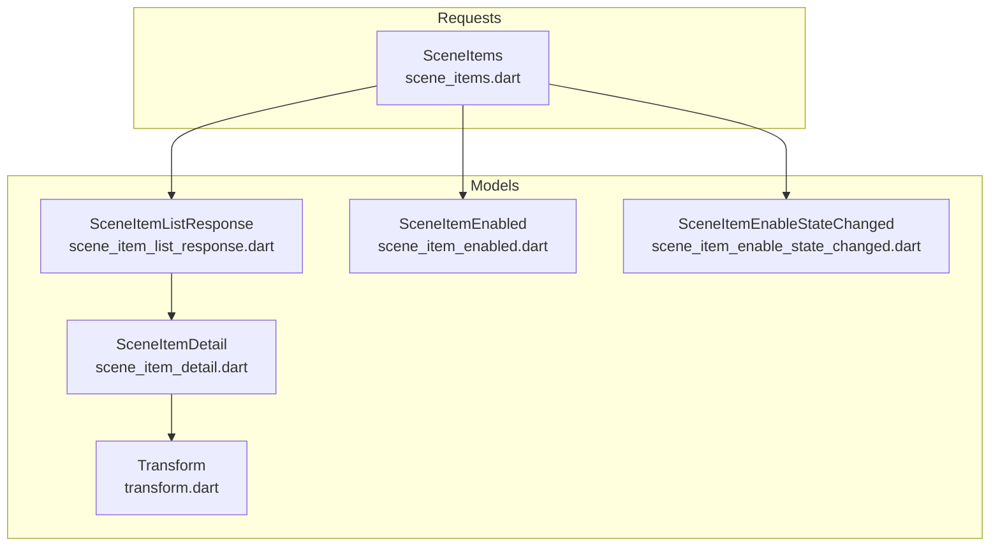
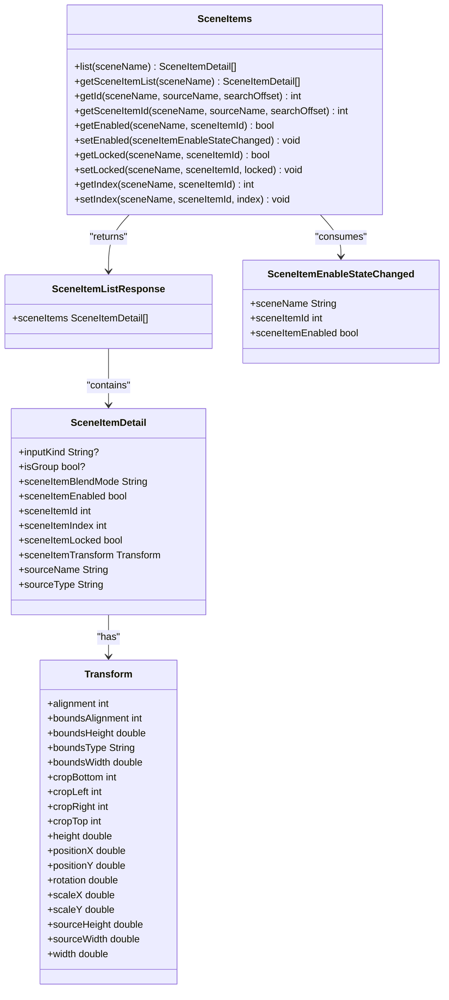
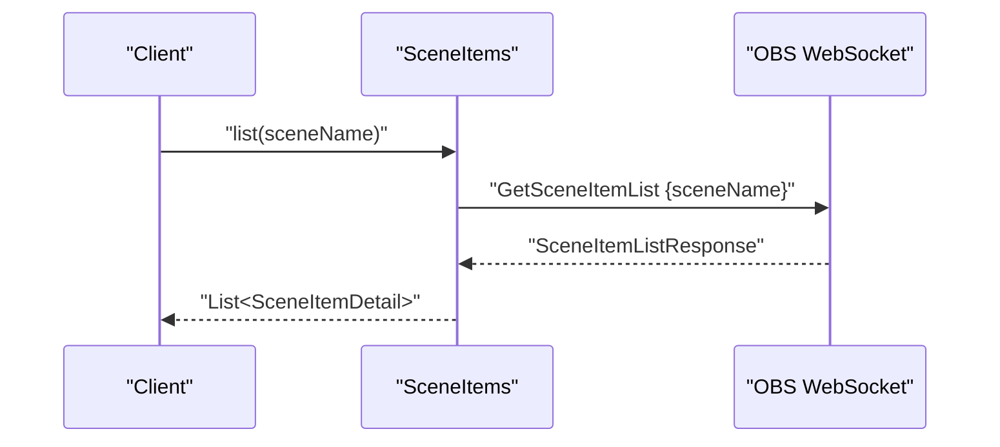
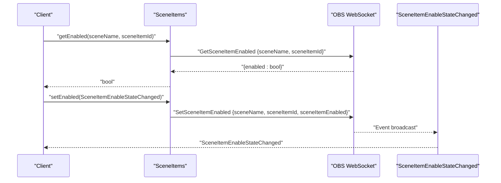
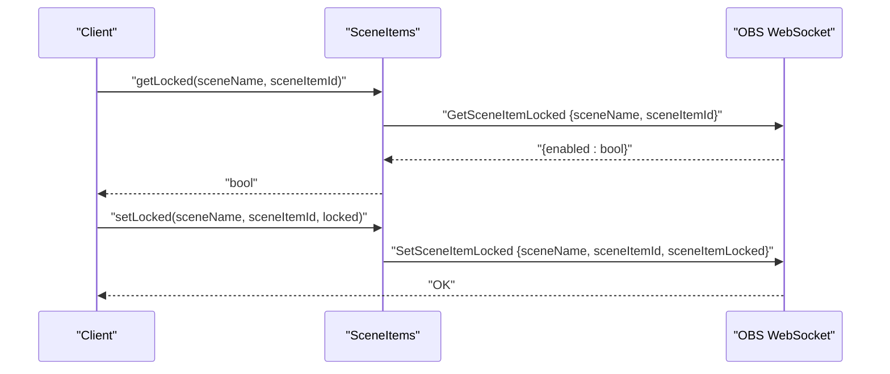
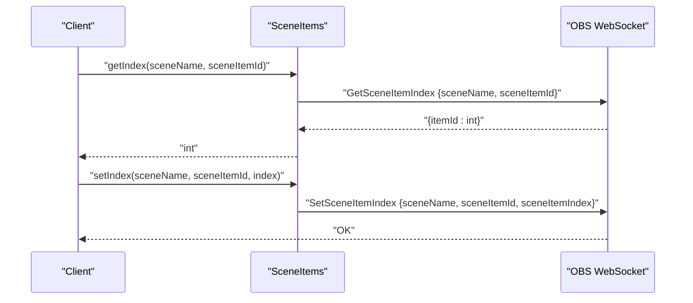
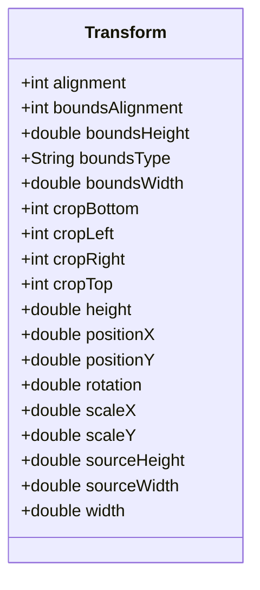
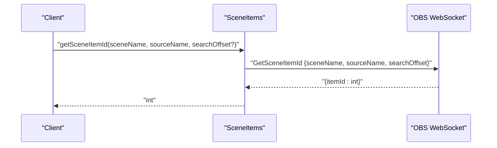
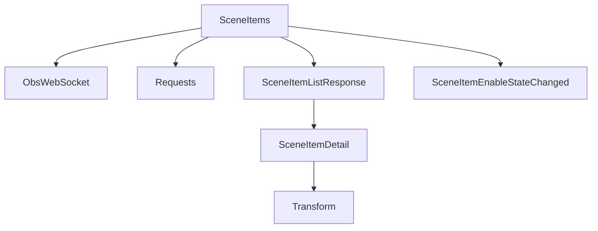

# Scene Item Requests

<cite>
**Referenced Files in This Document**
- [request.dart](file://lib/request.dart)
- [scene_items.dart](file://lib/src/request/scene_items.dart)
- [scene_item_list_response.dart](file://lib/src/model/response/scene_item_list_response.dart)
- [scene_item_detail.dart](file://lib/src/model/shared/scene_item_detail.dart)
- [transform.dart](file://lib/src/model/shared/transform.dart)
- [scene_item_enabled.dart](file://lib/src/model/shared/scene_item_enabled.dart)
- [scene_item_enable_state_changed.dart](file://lib/src/model/event/scene_items/scene_item_enable_state_changed.dart)
- [obs_scene_items_command.dart](file://lib/src/cmd/obs_scene_items_command.dart)
- [show_scene_item.dart](file://example/show_scene_item.dart)
- [obs_websocket_scene_items_test.dart](file://test/obs_websocket_scene_items_test.dart)
</cite>

## Table of Contents
1. [Introduction](#introduction)
2. [Project Structure](#project-structure)
3. [Core Components](#core-components)
4. [Architecture Overview](#architecture-overview)
5. [Detailed Component Analysis](#detailed-component-analysis)
6. [Dependency Analysis](#dependency-analysis)
7. [Performance Considerations](#performance-considerations)
8. [Troubleshooting Guide](#troubleshooting-guide)
9. [Conclusion](#conclusion)
10. [Appendices](#appendices)

## Introduction
This document provides comprehensive API documentation for Scene Item Requests, which manage individual elements within OBS scenes. It covers retrieval and manipulation of scene items, including transforms, visibility, locking, indices, and related metadata. The focus areas include:
- Listing scene items and retrieving transform data
- Enabling/disabling items
- Locking/unlocking items
- Managing item indices
- Understanding coordinate transformations and bounds
- Practical examples for automated scene composition, item animation, and batch operations

The documentation synthesizes the available implementation in the repository to present a complete picture of the Scene Item API surface and recommended usage patterns.

## Project Structure
Scene Item functionality is organized under the request module and supported by shared models for scene items, transforms, and responses. The primary entry point for consumers is the SceneItems class, which exposes methods for querying and modifying scene items. Supporting models define the data structures returned by requests and consumed by setters.

**Diagram sources**
- [scene_items.dart:1-324](file://lib/src/request/scene_items.dart#L1-L324)
- [scene_item_list_response.dart:1-22](file://lib/src/model/response/scene_item_list_response.dart#L1-L22)
- [scene_item_detail.dart:1-42](file://lib/src/model/shared/scene_item_detail.dart#L1-L42)
- [transform.dart:1-56](file://lib/src/model/shared/transform.dart#L1-L56)
- [scene_item_enabled.dart:1-24](file://lib/src/model/shared/scene_item_enabled.dart#L1-L24)
- [scene_item_enable_state_changed.dart:1-36](file://lib/src/model/event/scene_items/scene_item_enable_state_changed.dart#L1-L36)

**Section sources**
- [request.dart:1-19](file://lib/request.dart#L1-L19)
- [scene_items.dart:1-324](file://lib/src/request/scene_items.dart#L1-L324)

## Core Components
This section outlines the primary Scene Item APIs and their responsibilities:

- SceneItems.list and SceneItems.getSceneItemList
  - Purpose: Retrieve all scene items in a given scene
  - Returns: A list of SceneItemDetail entries
  - Notes: Includes blend mode, enabled state, locked state, index, transform, and source metadata

- SceneItems.getId and SceneItems.getSceneItemId
  - Purpose: Resolve a scene item's numeric ID by scene name and source name
  - Parameters: sceneName, sourceName, optional searchOffset
  - Returns: integer item ID

- SceneItems.getEnabled and SceneItems.getSceneItemEnabled
  - Purpose: Query whether a scene item is enabled (visible)
  - Parameters: sceneName, sceneItemId
  - Returns: boolean

- SceneItems.setEnabled and SceneItems.setSceneItemEnabled
  - Purpose: Toggle a scene item's enabled state
  - Parameter: SceneItemEnableStateChanged payload containing sceneName, sceneItemId, and sceneItemEnabled
  - Returns: void

- SceneItems.getLocked and SceneItems.getSceneItemLocked
  - Purpose: Query whether a scene item is locked
  - Parameters: sceneName, sceneItemId
  - Returns: boolean

- SceneItems.setLocked and SceneItems.setSceneItemLocked
  - Purpose: Set a scene item's lock state
  - Parameters: sceneName, sceneItemId, sceneItemLocked
  - Returns: void

- SceneItems.getIndex and SceneItems.getSceneItemIndex
  - Purpose: Retrieve a scene item's index position within its scene
  - Parameters: sceneName, sceneItemId
  - Returns: integer index

- SceneItems.setIndex and SceneItems.setSceneItemIndex
  - Purpose: Set a scene item's index position within its scene
  - Parameters: sceneName, sceneItemId, sceneItemIndex
  - Returns: void

These APIs operate on the OBS WebSocket protocol and return typed responses via JSON models.

**Section sources**
- [scene_items.dart:10-324](file://lib/src/request/scene_items.dart#L10-L324)

## Architecture Overview
The Scene Item API follows a layered architecture:
- Request Layer: SceneItems class encapsulates all scene item operations
- Model Layer: Strongly-typed models represent scene items, transforms, and responses
- Event Layer: Events like SceneItemEnableStateChanged reflect runtime state changes
- CLI Layer: Optional command-line interface supports basic operations

**Diagram sources**
- [scene_items.dart:1-324](file://lib/src/request/scene_items.dart#L1-L324)
- [scene_item_list_response.dart:1-22](file://lib/src/model/response/scene_item_list_response.dart#L1-L22)
- [scene_item_detail.dart:1-42](file://lib/src/model/shared/scene_item_detail.dart#L1-L42)
- [transform.dart:1-56](file://lib/src/model/shared/transform.dart#L1-L56)
- [scene_item_enable_state_changed.dart:1-36](file://lib/src/model/event/scene_items/scene_item_enable_state_changed.dart#L1-L36)

## Detailed Component Analysis

### Scene Item Retrieval and Listing
Scene item listing is performed via SceneItems.list or SceneItems.getSceneItemList, which internally call the GetSceneItemList RPC. The response is parsed into SceneItemListResponse, containing a list of SceneItemDetail objects. Each detail includes:
- Identification: sceneItemId, sourceName, sourceType
- Behavior flags: sceneItemEnabled, sceneItemLocked, sceneItemBlendMode
- Positioning and sizing: sceneItemTransform (Transform)
- Ordering: sceneItemIndex
- Group membership: isGroup (boolean), inputKind (present for inputs)

Coordinate system and bounds:
- Transform defines positional coordinates (positionX, positionY), scaling (scaleX, scaleY), rotation, and sizing (width, height, sourceWidth, sourceHeight).
- Bounds-related fields (boundsType, boundsWidth, boundsHeight, boundsAlignment) describe containment constraints.
- Cropping fields (cropTop, cropBottom, cropLeft, cropRight) indicate source cropping relative to the item's bounding box.

**Diagram sources**
- [scene_items.dart:27-37](file://lib/src/request/scene_items.dart#L27-L37)
- [scene_item_list_response.dart:8-21](file://lib/src/model/response/scene_item_list_response.dart#L8-L21)

**Section sources**
- [scene_items.dart:10-37](file://lib/src/request/scene_items.dart#L10-L37)
- [scene_item_list_response.dart:1-22](file://lib/src/model/response/scene_item_list_response.dart#L1-L22)
- [scene_item_detail.dart:1-42](file://lib/src/model/shared/scene_item_detail.dart#L1-L42)
- [transform.dart:1-56](file://lib/src/model/shared/transform.dart#L1-L56)

### Visibility Control (Enabled State)
Visibility is controlled via two complementary operations:
- Query: SceneItems.getEnabled retrieves the current enabled state
- Modify: SceneItems.setEnabled accepts a SceneItemEnableStateChanged payload to change visibility

The enable state toggles rendering of the associated source within the scene. The example demonstrates subscribing to SceneItemEnableStateChanged events to react to visibility changes and programmatically hiding an item after a delay.

**Diagram sources**
- [scene_items.dart:134-173](file://lib/src/request/scene_items.dart#L134-L173)
- [scene_item_enable_state_changed.dart:1-36](file://lib/src/model/event/scene_items/scene_item_enable_state_changed.dart#L1-L36)

**Section sources**
- [scene_items.dart:115-173](file://lib/src/request/scene_items.dart#L115-L173)
- [show_scene_item.dart:32-53](file://example/show_scene_item.dart#L32-L53)

### Locking Controls
Locking prevents accidental movement or editing of a scene item:
- Query: SceneItems.getLocked retrieves the lock state
- Modify: SceneItems.setLocked sets the lock state

Locking is commonly used during automated animations or batch operations to avoid unintended edits while transformations are applied.

**Diagram sources**
- [scene_items.dart:182-246](file://lib/src/request/scene_items.dart#L182-L246)

**Section sources**
- [scene_items.dart:175-246](file://lib/src/request/scene_items.dart#L175-L246)

### Index Management
Scene items are ordered within a scene. Index 0 corresponds to the bottom-most item in the UI:
- Query: SceneItems.getIndex retrieves the current index
- Modify: SceneItems.setIndex moves an item to a new index

Index manipulation enables precise control over layering and compositing order.

**Diagram sources**
- [scene_items.dart:257-322](file://lib/src/request/scene_items.dart#L257-L322)

**Section sources**
- [scene_items.dart:248-322](file://lib/src/request/scene_items.dart#L248-L322)

### Transform and Coordinate System
Transform data describes positioning, scaling, rotation, and bounds:
- Position: positionX, positionY
- Scale: scaleX, scaleY
- Rotation: rotation (angle)
- Size: width, height, sourceWidth, sourceHeight
- Bounds: boundsType, boundsWidth, boundsHeight, boundsAlignment
- Crop: cropTop, cropBottom, cropLeft, cropRight
- Alignment: alignment, boundsAlignment

These fields collectively define how a source appears within a scene and how it interacts with other items.

**Diagram sources**
- [transform.dart:1-56](file://lib/src/model/shared/transform.dart#L1-L56)

**Section sources**
- [transform.dart:1-56](file://lib/src/model/shared/transform.dart#L1-L56)

### Scene Item Identification
To target a specific item, resolve its numeric ID using SceneItems.getSceneItemId:
- Inputs: sceneName, sourceName, optional searchOffset
- Output: integer sceneItemId

This ID is used across all item-specific requests.

**Diagram sources**
- [scene_items.dart:96-113](file://lib/src/request/scene_items.dart#L96-L113)

**Section sources**
- [scene_items.dart:72-113](file://lib/src/request/scene_items.dart#L72-L113)

### Example: Automated Scene Composition and Visibility Control
The example demonstrates:
- Connecting to OBS WebSocket and subscribing to events
- Determining the current program scene
- Resolving a scene item by name to obtain its ID
- Reacting to SceneItemEnableStateChanged events
- Programmatically enabling or disabling an item based on current state

This pattern supports automated scene composition where visibility changes trigger downstream actions.

**Section sources**
- [show_scene_item.dart:1-70](file://example/show_scene_item.dart#L1-L70)

### Example: Batch Operations
Batch operations can be implemented by:
- Using SceneItems.list to fetch all items in a scene
- Iterating through SceneItemDetail entries to apply uniform changes (e.g., enabling, locking, reordering)
- Applying transforms in a controlled sequence while temporarily locking items to prevent conflicts

This approach leverages the existing list and index APIs to orchestrate complex compositions.

**Section sources**
- [scene_items.dart:17-37](file://lib/src/request/scene_items.dart#L17-L37)
- [scene_items.dart:292-305](file://lib/src/request/scene_items.dart#L292-L305)

## Dependency Analysis
The SceneItems class depends on:
- ObsWebSocket for sending requests and receiving responses
- Typed models for parsing responses and constructing payloads
- Event models for state change notifications

**Diagram sources**
- [scene_items.dart:1-324](file://lib/src/request/scene_items.dart#L1-L324)
- [scene_item_list_response.dart:1-22](file://lib/src/model/response/scene_item_list_response.dart#L1-L22)
- [scene_item_detail.dart:1-42](file://lib/src/model/shared/scene_item_detail.dart#L1-L42)
- [transform.dart:1-56](file://lib/src/model/shared/transform.dart#L1-L56)
- [scene_item_enable_state_changed.dart:1-36](file://lib/src/model/event/scene_items/scene_item_enable_state_changed.dart#L1-L36)

**Section sources**
- [scene_items.dart:1-324](file://lib/src/request/scene_items.dart#L1-L324)

## Performance Considerations
- Minimize repeated list queries: Cache SceneItemDetail lists when performing batch operations to reduce round-trips.
- Batch index updates: Apply index changes in a single pass to avoid intermediate UI redraws.
- Lock items during bulk edits: Temporarily lock items to prevent accidental interference from user actions or other clients.
- Use events for state synchronization: Subscribe to SceneItemEnableStateChanged to react to changes without polling.

## Troubleshooting Guide
Common issues and resolutions:
- Invalid scene item ID: Ensure the item exists in the specified scene and that the ID was resolved using getSceneItemId.
- Permission errors: Verify the connection has appropriate permissions for scene item modifications.
- Unexpected state changes: Subscribe to SceneItemEnableStateChanged to track visibility changes caused by external factors.
- Testing: Use the included tests to validate request/response handling for list and lock operations.

**Section sources**
- [obs_websocket_scene_items_test.dart:1-58](file://test/obs_websocket_scene_items_test.dart#L1-L58)

## Conclusion
The Scene Item Requests provide a robust foundation for managing individual elements within OBS scenes. By combining listing, identification, transform, visibility, locking, and indexing capabilities, developers can build sophisticated automation workflows. The provided models and examples demonstrate practical patterns for automated scene composition, visibility control, and batch operations.

## Appendices

### API Reference Summary
- SceneItems.list/getSceneItemList: Retrieve all items in a scene
- SceneItems.getSceneItemId: Resolve item ID by scene and source name
- SceneItems.getEnabled/setEnabled: Query and set visibility
- SceneItems.getLocked/setLocked: Query and set lock state
- SceneItems.getIndex/setIndex: Query and set item order

**Section sources**
- [scene_items.dart:10-324](file://lib/src/request/scene_items.dart#L10-L324)