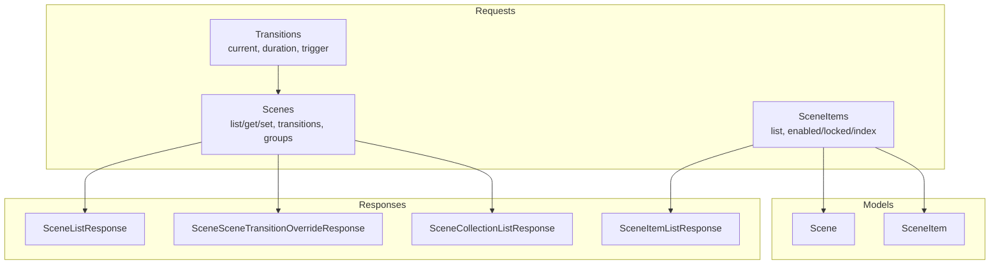
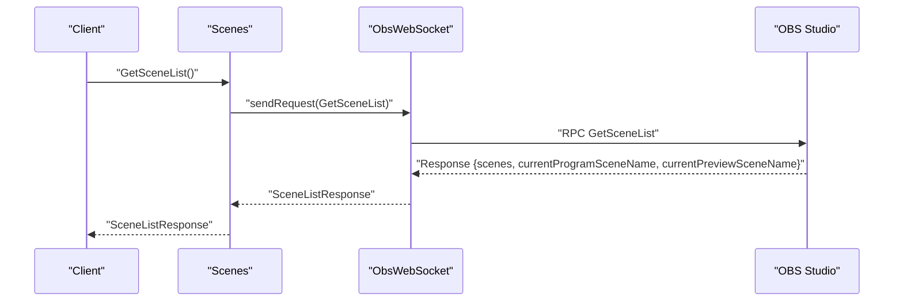
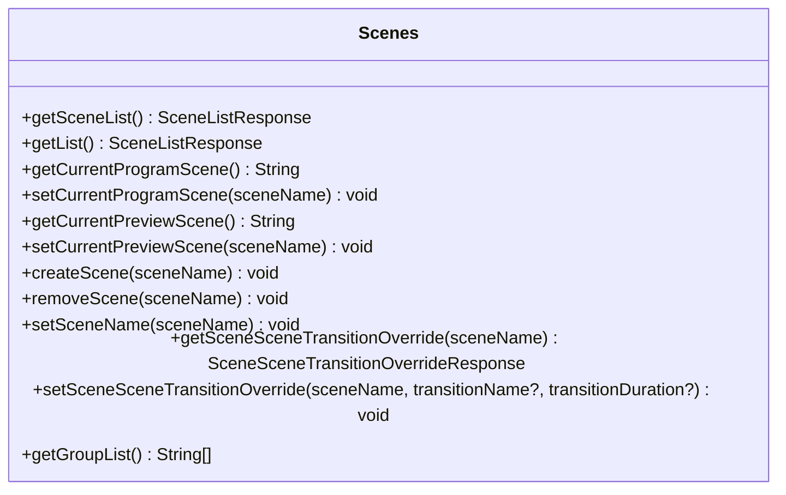
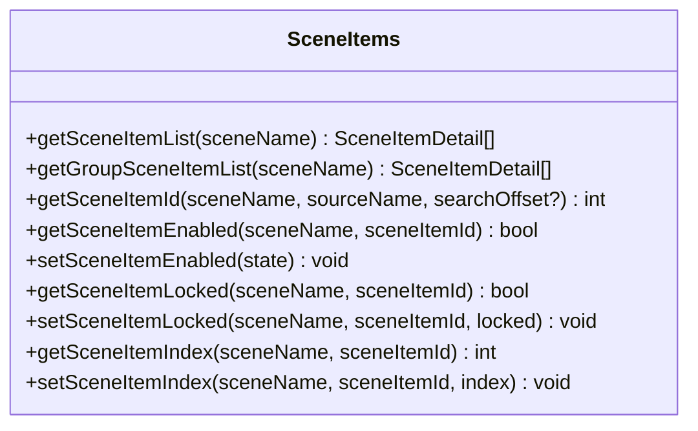
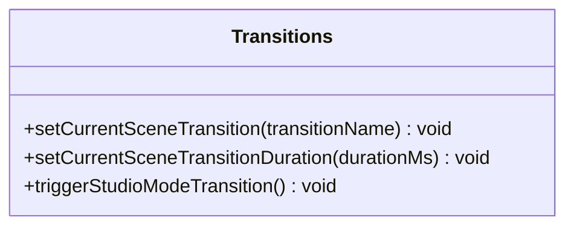
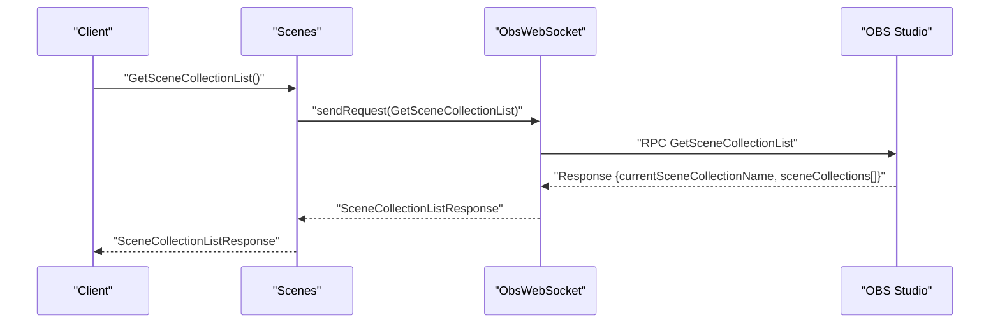
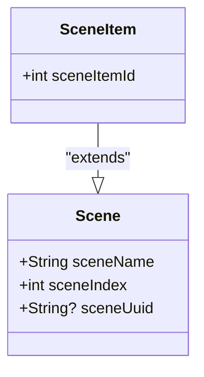
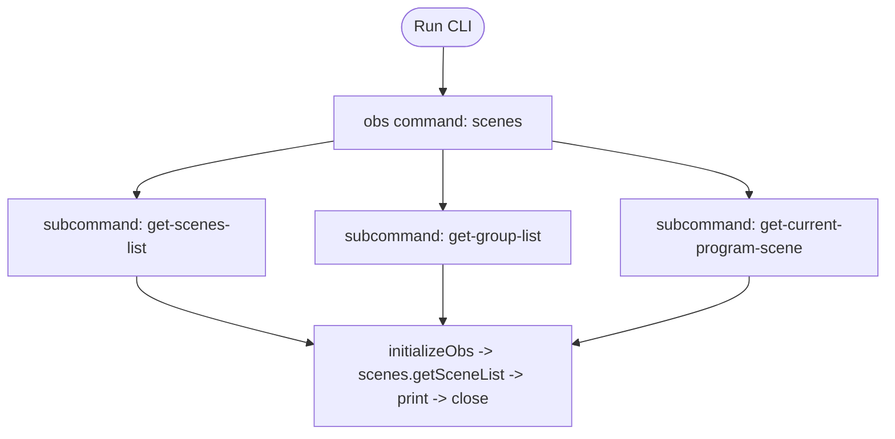
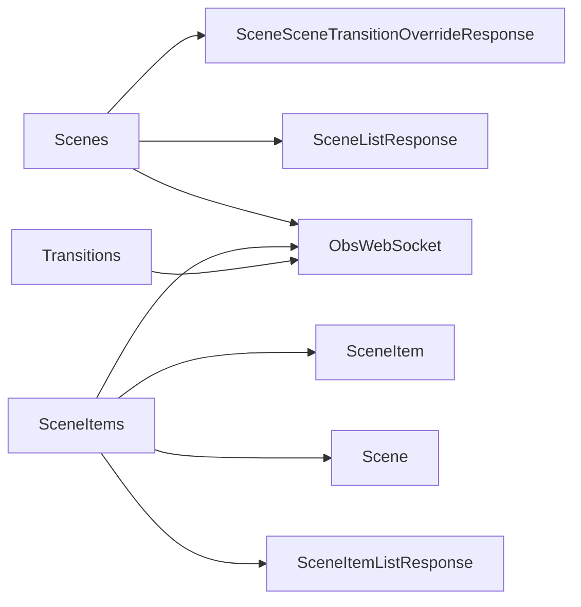

# Scene Requests

<cite>
**Referenced Files in This Document**
- [obs_websocket.dart](file://lib/obs_websocket.dart)
- [request.dart](file://lib/request.dart)
- [command.dart](file://lib/command.dart)
- [scenes.dart](file://lib/src/request/scenes.dart)
- [scene_items.dart](file://lib/src/request/scene_items.dart)
- [transitions.dart](file://lib/src/request/transitions.dart)
- [obs_scenes_command.dart](file://lib/src/cmd/obs_scenes_command.dart)
- [scene_list_response.dart](file://lib/src/model/response/scene_list_response.dart)
- [scene_item_list_response.dart](file://lib/src/model/response/scene_item_list_response.dart)
- [scene_scene_transition_override_response.dart](file://lib/src/model/response/scene_scene_transition_override_response.dart)
- [scene_collection_list_response.dart](file://lib/src/model/response/scene_collection_list_response.dart)
- [scene.dart](file://lib/src/model/shared/scene.dart)
- [scene_item.dart](file://lib/src/model/shared/scene_item.dart)
- [obs_websocket_config_test.dart](file://test/obs_websocket_config_test.dart)
</cite>

## Table of Contents
1. [Introduction](#introduction)
2. [Project Structure](#project-structure)
3. [Core Components](#core-components)
4. [Architecture Overview](#architecture-overview)
5. [Detailed Component Analysis](#detailed-component-analysis)
6. [Dependency Analysis](#dependency-analysis)
7. [Performance Considerations](#performance-considerations)
8. [Troubleshooting Guide](#troubleshooting-guide)
9. [Conclusion](#conclusion)
10. [Appendices](#appendices)

## Introduction
This document provides comprehensive API documentation for Scene Requests in the OBS WebSocket Dart library. It covers scene management, transition effects, and scene collection operations. The focus areas include:
- Scene discovery and selection: GetSceneList, GetCurrentProgramScene, SetCurrentProgramScene, GetCurrentPreviewScene, SetCurrentPreviewScene
- Transition override configuration per scene: GetSceneSceneTransitionOverride, SetSceneSceneTransitionOverride
- Group and scene item operations: GetGroupList, GetSceneItemList
- Scene collection management: Listing and current selection awareness
- Practical examples for dynamic scene switching, transition timing, and complex scene compositions
- Guidance on scene dependency management and performance optimization for heavy setups

## Project Structure
The Scene Requests functionality is organized around dedicated request classes and supporting model/response types. The high-level structure relevant to scenes is:
- Request entry points: Scenes, SceneItems, Transitions
- Response models for scene lists, scene item lists, transition overrides, and scene collections
- Shared models for Scene and SceneItem entities
- CLI helpers for quick scene operations

**Diagram sources**
- [scenes.dart:1-232](file://lib/src/request/scenes.dart#L1-L232)
- [scene_items.dart:1-324](file://lib/src/request/scene_items.dart#L1-L324)
- [transitions.dart:1-75](file://lib/src/request/transitions.dart#L1-L75)
- [scene_list_response.dart:1-27](file://lib/src/model/response/scene_list_response.dart#L1-L27)
- [scene_item_list_response.dart:1-21](file://lib/src/model/response/scene_item_list_response.dart#L1-L21)
- [scene_scene_transition_override_response.dart:1-27](file://lib/src/model/response/scene_scene_transition_override_response.dart#L1-L27)
- [scene_collection_list_response.dart:1-24](file://lib/src/model/response/scene_collection_list_response.dart#L1-L24)
- [scene.dart:1-26](file://lib/src/model/shared/scene.dart#L1-L26)
- [scene_item.dart:1-25](file://lib/src/model/shared/scene_item.dart#L1-L25)

**Section sources**
- [request.dart:1-19](file://lib/request.dart#L1-L19)
- [obs_websocket.dart:1-69](file://lib/obs_websocket.dart#L1-L69)

## Core Components
This section outlines the primary APIs for scene management and transition configuration.

- Scenes API
  - Scene discovery: GetSceneList (alias getList, list)
  - Current scene queries: GetCurrentProgramScene, GetCurrentPreviewScene
  - Scene switching: SetCurrentProgramScene, SetCurrentPreviewScene
  - Scene lifecycle: CreateScene, RemoveScene, SetSceneName
  - Transition overrides: GetSceneSceneTransitionOverride, SetSceneSceneTransitionOverride
  - Group operations: GetGroupList

- SceneItems API
  - Scene item enumeration: GetSceneItemList
  - Item metadata: Enabled state, Locked state, Index position
  - Item manipulation: SetEnabled, SetLocked, SetIndex

- Transitions API
  - Global transition control: SetCurrentSceneTransition, SetCurrentSceneTransitionDuration
  - Trigger transition: TriggerStudioModeTransition

- Scene Collection Management
  - Scene collection listing: GetSceneCollectionList
  - Awareness of current collection via events

**Section sources**
- [scenes.dart:1-232](file://lib/src/request/scenes.dart#L1-L232)
- [scene_items.dart:1-324](file://lib/src/request/scene_items.dart#L1-L324)
- [transitions.dart:1-75](file://lib/src/request/transitions.dart#L1-L75)
- [scene_list_response.dart:1-27](file://lib/src/model/response/scene_list_response.dart#L1-L27)
- [scene_item_list_response.dart:1-21](file://lib/src/model/response/scene_item_list_response.dart#L1-L21)
- [scene_scene_transition_override_response.dart:1-27](file://lib/src/model/response/scene_scene_transition_override_response.dart#L1-L27)
- [scene_collection_list_response.dart:1-24](file://lib/src/model/response/scene_collection_list_response.dart#L1-L24)

## Architecture Overview
The Scene Requests architecture follows a layered pattern:
- Request classes encapsulate RPC calls to OBS
- Response models parse and expose typed data
- Shared models represent scenes and scene items
- CLI commands demonstrate practical usage

**Diagram sources**
- [scenes.dart:34-38](file://lib/src/request/scenes.dart#L34-L38)
- [scene_list_response.dart:1-27](file://lib/src/model/response/scene_list_response.dart#L1-L27)

## Detailed Component Analysis

### Scenes API
The Scenes class exposes methods to manage scenes and transitions.

**Diagram sources**
- [scenes.dart:1-232](file://lib/src/request/scenes.dart#L1-L232)

Key operations:
- Scene discovery and selection
  - GetSceneList returns the current program/preview scene names along with the full scene list.
  - GetCurrentProgramScene and GetCurrentPreviewScene fetch the respective active scenes.
  - SetCurrentProgramScene and SetCurrentPreviewScene switch scenes immediately or in preview.

- Scene lifecycle
  - CreateScene adds a new scene.
  - RemoveScene deletes a scene by name.
  - SetSceneName renames a scene.

- Transition overrides per scene
  - GetSceneSceneTransitionOverride retrieves the configured transition name and duration for a given scene.
  - SetSceneSceneTransitionOverride allows overriding the transition used when switching to a specific scene, optionally specifying transition name and duration.

- Group operations
  - GetGroupList returns the list of groups (treated as scenes internally).

Usage examples (conceptual):
- Dynamic scene switching: Query current program scene, then set a new scene name to switch.
- Transition timing: Configure a scene-specific transition duration via SetSceneSceneTransitionOverride.
- Complex scene compositions: Combine scene switching with transition triggers and per-scene overrides.

**Section sources**
- [scenes.dart:9-38](file://lib/src/request/scenes.dart#L9-L38)
- [scenes.dart:62-142](file://lib/src/request/scenes.dart#L62-L142)
- [scenes.dart:144-190](file://lib/src/request/scenes.dart#L144-L190)
- [scenes.dart:192-230](file://lib/src/request/scenes.dart#L192-L230)
- [scenes.dart:40-60](file://lib/src/request/scenes.dart#L40-L60)

### SceneItems API
The SceneItems class manages individual items within scenes.

**Diagram sources**
- [scene_items.dart:1-324](file://lib/src/request/scene_items.dart#L1-L324)

Operational highlights:
- Enumerate items in a scene or group with GetSceneItemList and GetGroupSceneItemList.
- Locate a specific item by source name using GetSceneItemId.
- Control visibility and interactivity with Enabled state.
- Lock/unlock items to prevent accidental edits.
- Reorder items via Index to control draw order.

Practical tips:
- Use searchOffset to disambiguate multiple instances of the same source name.
- Batch operations on indices can improve performance when reordering many items.

**Section sources**
- [scene_items.dart:10-37](file://lib/src/request/scene_items.dart#L10-L37)
- [scene_items.dart:48-70](file://lib/src/request/scene_items.dart#L48-L70)
- [scene_items.dart:72-113](file://lib/src/request/scene_items.dart#L72-L113)
- [scene_items.dart:115-146](file://lib/src/request/scene_items.dart#L115-L146)
- [scene_items.dart:155-173](file://lib/src/request/scene_items.dart#L155-L173)
- [scene_items.dart:175-207](file://lib/src/request/scene_items.dart#L175-L207)
- [scene_items.dart:209-246](file://lib/src/request/scene_items.dart#L209-L246)
- [scene_items.dart:248-283](file://lib/src/request/scene_items.dart#L248-L283)
- [scene_items.dart:285-322](file://lib/src/request/scene_items.dart#L285-L322)

### Transitions API
The Transitions class controls global transition behavior.

**Diagram sources**
- [transitions.dart:1-75](file://lib/src/request/transitions.dart#L1-L75)

Operational highlights:
- SetCurrentSceneTransition selects the active transition globally.
- SetCurrentSceneTransitionDuration adjusts the duration for variable-duration transitions.
- TriggerStudioModeTransition initiates the transition in studio mode.

Guidance:
- Duration constraints apply to variable-duration transitions.
- Use scene-specific overrides for granular control when needed.

**Section sources**
- [transitions.dart:9-32](file://lib/src/request/transitions.dart#L9-L32)
- [transitions.dart:34-58](file://lib/src/request/transitions.dart#L34-L58)
- [transitions.dart:60-74](file://lib/src/request/transitions.dart#L60-L74)

### Scene Collection Management
Scene collections represent separate sets of scenes and configurations.

**Diagram sources**
- [scenes.dart:34-38](file://lib/src/request/scenes.dart#L34-L38)
- [scene_collection_list_response.dart:1-24](file://lib/src/model/response/scene_collection_list_response.dart#L1-L24)

Notes:
- The library includes a test verifying the shape of the GetSceneCollectionList response.
- Events exist for scene collection changes; integrate them to react to collection switches.

**Section sources**
- [scene_collection_list_response.dart:1-24](file://lib/src/model/response/scene_collection_list_response.dart#L1-L24)
- [obs_websocket_config_test.dart:39-57](file://test/obs_websocket_config_test.dart#L39-L57)

### Response Models and Data Structures
Scene and scene item models define the structure of returned data.

**Diagram sources**
- [scene.dart:1-26](file://lib/src/model/shared/scene.dart#L1-L26)
- [scene_item.dart:1-25](file://lib/src/model/shared/scene_item.dart#L1-L25)

Additional response models:
- SceneListResponse: includes current program/preview scene names and the scenes array.
- SceneItemListResponse: array of scene items with details.
- SceneSceneTransitionOverrideResponse: optional transition name and duration for a scene.
- SceneCollectionListResponse: current collection name and the list of available collections.

**Section sources**
- [scene_list_response.dart:1-27](file://lib/src/model/response/scene_list_response.dart#L1-L27)
- [scene_item_list_response.dart:1-21](file://lib/src/model/response/scene_item_list_response.dart#L1-L21)
- [scene_scene_transition_override_response.dart:1-27](file://lib/src/model/response/scene_scene_transition_override_response.dart#L1-L27)
- [scene_collection_list_response.dart:1-24](file://lib/src/model/response/scene_collection_list_response.dart#L1-L24)

### CLI Helpers for Scenes
The command-line interface provides ready-to-use commands for common scene tasks.

**Diagram sources**
- [obs_scenes_command.dart:1-75](file://lib/src/cmd/obs_scenes_command.dart#L1-L75)

**Section sources**
- [obs_scenes_command.dart:19-36](file://lib/src/cmd/obs_scenes_command.dart#L19-L36)
- [obs_scenes_command.dart:38-55](file://lib/src/cmd/obs_scenes_command.dart#L38-L55)
- [obs_scenes_command.dart:57-74](file://lib/src/cmd/obs_scenes_command.dart#L57-L74)

## Dependency Analysis
The Scenes, SceneItems, and Transitions request classes depend on the shared ObsWebSocket transport and rely on typed response models.

**Diagram sources**
- [scenes.dart:1-232](file://lib/src/request/scenes.dart#L1-L232)
- [scene_items.dart:1-324](file://lib/src/request/scene_items.dart#L1-L324)
- [transitions.dart:1-75](file://lib/src/request/transitions.dart#L1-L75)
- [scene_list_response.dart:1-27](file://lib/src/model/response/scene_list_response.dart#L1-L27)
- [scene_item_list_response.dart:1-21](file://lib/src/model/response/scene_item_list_response.dart#L1-L21)
- [scene_scene_transition_override_response.dart:1-27](file://lib/src/model/response/scene_scene_transition_override_response.dart#L1-L27)
- [scene.dart:1-26](file://lib/src/model/shared/scene.dart#L1-L26)
- [scene_item.dart:1-25](file://lib/src/model/shared/scene_item.dart#L1-L25)

**Section sources**
- [obs_websocket.dart:66-69](file://lib/obs_websocket.dart#L66-L69)

## Performance Considerations
- Minimize round-trips by batching related operations where possible.
- Prefer scene-specific transition overrides judiciously; excessive overrides can complicate maintenance.
- Use scene item indexing carefully; frequent reordering can impact rendering performance.
- Monitor scene collection changes and cache scene lists to avoid repeated queries.
- For heavy setups, leverage preview scene switching to stage changes before committing to program.

## Troubleshooting Guide
Common issues and resolutions:
- Scene name mismatches: Ensure scene names match exactly (case-sensitive) when calling SetCurrentProgramScene or SetCurrentPreviewScene.
- Transition duration out of range: Verify durations fall within supported bounds when setting transition duration.
- Missing scene items: Confirm the scene exists and contains the target source; use GetSceneItemList to enumerate items.
- Group behavior: Groups are treated as scenes; be aware of potential limitations when using groups extensively.
- Event-driven updates: Subscribe to scene collection change events to keep UI and logic synchronized.

**Section sources**
- [transitions.dart:34-58](file://lib/src/request/transitions.dart#L34-L58)
- [scene_items.dart:72-113](file://lib/src/request/scene_items.dart#L72-L113)
- [scenes.dart:62-142](file://lib/src/request/scenes.dart#L62-L142)

## Conclusion
The Scene Requests module provides a robust foundation for managing scenes, configuring transitions, and handling scene collections. By combining global transition controls with per-scene overrides, and leveraging scene item operations, developers can build dynamic and responsive streaming or recording workflows. Integrate with events for automatic synchronization and follow performance guidelines for scalable setups.

## Appendices

### API Reference Summary
- Scenes
  - GetSceneList: Retrieve all scenes and current program/preview scene names
  - GetCurrentProgramScene, GetCurrentPreviewScene: Query active scenes
  - SetCurrentProgramScene, SetCurrentPreviewScene: Switch scenes
  - CreateScene, RemoveScene, SetSceneName: Manage scene lifecycle
  - GetSceneSceneTransitionOverride, SetSceneSceneTransitionOverride: Configure per-scene transitions
  - GetGroupList: List groups

- SceneItems
  - GetSceneItemList, GetGroupSceneItemList: Enumerate items
  - GetSceneItemId: Resolve item ID by source name
  - GetSceneItemEnabled/SetSceneItemEnabled: Toggle visibility
  - GetSceneItemLocked/SetSceneItemLocked: Lock/unlock items
  - GetSceneItemIndex/SetSceneItemIndex: Reorder items

- Transitions
  - SetCurrentSceneTransition: Select active transition
  - SetCurrentSceneTransitionDuration: Adjust duration
  - TriggerStudioModeTransition: Initiate transition

- Scene Collections
  - GetSceneCollectionList: List available collections and current selection

**Section sources**
- [scenes.dart:1-232](file://lib/src/request/scenes.dart#L1-L232)
- [scene_items.dart:1-324](file://lib/src/request/scene_items.dart#L1-L324)
- [transitions.dart:1-75](file://lib/src/request/transitions.dart#L1-L75)
- [scene_collection_list_response.dart:1-24](file://lib/src/model/response/scene_collection_list_response.dart#L1-L24)