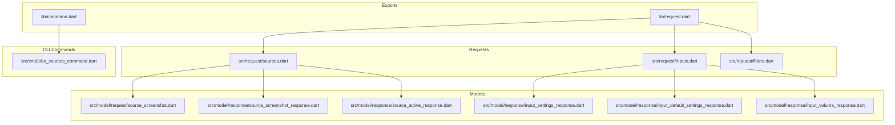
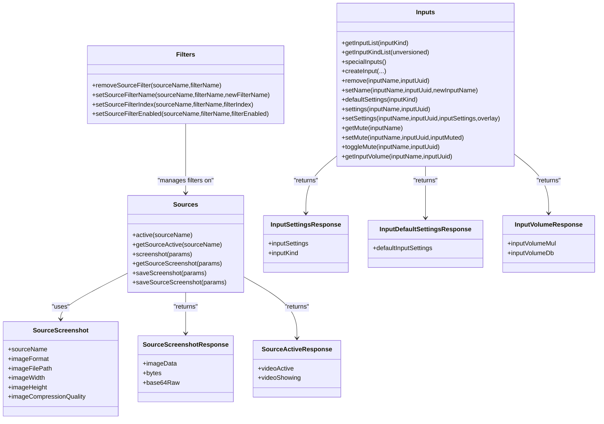
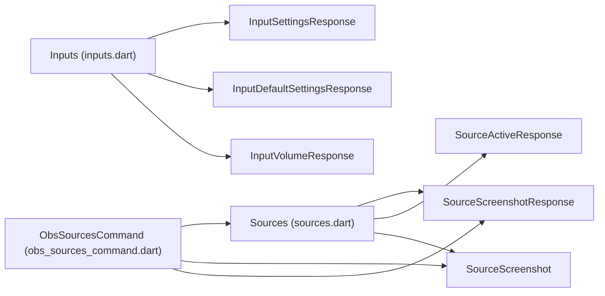

# Source Requests

<cite>
**Referenced Files in This Document**
- [request.dart](file://lib/request.dart)
- [command.dart](file://lib/command.dart)
- [sources.dart](file://lib/src/request/sources.dart)
- [inputs.dart](file://lib/src/request/inputs.dart)
- [filters.dart](file://lib/src/request/filters.dart)
- [obs_sources_command.dart](file://lib/src/cmd/obs_sources_command.dart)
- [source_screenshot.dart](file://lib/src/model/request/source_screenshot.dart)
- [source_screenshot_response.dart](file://lib/src/model/response/source_screenshot_response.dart)
- [source_active_response.dart](file://lib/src/model/response/source_active_response.dart)
- [input_settings_response.dart](file://lib/src/model/response/input_settings_response.dart)
- [input_default_settings_response.dart](file://lib/src/model/response/input_default_settings_response.dart)
- [input_volume_response.dart](file://lib/src/model/response/input_volume_response.dart)
- [obs_mcp_server.dart](file://lib/src/mcp/obs_mcp_server.dart)
</cite>

## Table of Contents
1. [Introduction](#introduction)
2. [Project Structure](#project-structure)
3. [Core Components](#core-components)
4. [Architecture Overview](#architecture-overview)
5. [Detailed Component Analysis](#detailed-component-analysis)
6. [Dependency Analysis](#dependency-analysis)
7. [Performance Considerations](#performance-considerations)
8. [Troubleshooting Guide](#troubleshooting-guide)
9. [Conclusion](#conclusion)

## Introduction
This document provides comprehensive API documentation for Source Requests focused on managing source properties and configuration within the OBS Websocket Dart library. It covers source listing, property retrieval, property modification, and source-specific operations such as screenshots and active state queries. It also documents source type detection via input kinds, property validation, and source state management. Practical examples demonstrate dynamic source configuration, property automation, and source dependency management. Finally, it addresses performance considerations and offers troubleshooting guidance for common source-related issues.

## Project Structure
The Source Requests functionality is organized into request classes, command-line helpers, and model objects for request/response payloads. The primary entry points are exported via module re-exports for easy consumption.

**Diagram sources**
- [request.dart:6-19](file://lib/request.dart#L6-L19)
- [command.dart:6-20](file://lib/command.dart#L6-L20)
- [sources.dart:1-96](file://lib/src/request/sources.dart#L1-L96)
- [inputs.dart:1-389](file://lib/src/request/inputs.dart#L1-L389)
- [filters.dart:1-140](file://lib/src/request/filters.dart#L1-L140)
- [obs_sources_command.dart:1-143](file://lib/src/cmd/obs_sources_command.dart#L1-L143)
- [source_screenshot.dart:1-33](file://lib/src/model/request/source_screenshot.dart#L1-L33)
- [source_screenshot_response.dart:1-28](file://lib/src/model/response/source_screenshot_response.dart#L1-L28)
- [source_active_response.dart:1-27](file://lib/src/model/response/source_active_response.dart#L1-L27)
- [input_settings_response.dart:1-24](file://lib/src/model/response/input_settings_response.dart#L1-L24)
- [input_default_settings_response.dart:1-21](file://lib/src/model/response/input_default_settings_response.dart#L1-L21)
- [input_volume_response.dart:1-25](file://lib/src/model/response/input_volume_response.dart#L1-L25)

**Section sources**
- [request.dart:6-19](file://lib/request.dart#L6-L19)
- [command.dart:6-20](file://lib/command.dart#L6-L20)

## Core Components
This section outlines the primary APIs for source management:

- Sources: Active state queries and screenshot capture/saving.
- Inputs: Listing inputs, input kinds, creating/removing inputs, renaming inputs, retrieving settings and default settings, setting input settings, muting/unmuting/toggling mute, and volume retrieval.
- Filters: Managing filters on sources (remove, rename, reorder, enable/disable).
- CLI: Command-line helpers for source active state and screenshots.

Key capabilities:
- Source listing and type detection via input kinds.
- Property retrieval and modification for inputs.
- Screenshot capture with optional filesystem saving.
- Filter management on sources.
- Audio mute state and volume retrieval.

**Section sources**
- [sources.dart:1-96](file://lib/src/request/sources.dart#L1-L96)
- [inputs.dart:1-389](file://lib/src/request/inputs.dart#L1-L389)
- [filters.dart:1-140](file://lib/src/request/filters.dart#L1-L140)
- [obs_sources_command.dart:1-143](file://lib/src/cmd/obs_sources_command.dart#L1-L143)

## Architecture Overview
The Source Requests architecture follows a layered pattern:
- Request classes encapsulate RPC calls to OBS.
- Model classes define request/response shapes.
- CLI commands provide convenience wrappers for common tasks.
- MCP utilities expose helper methods for automation.

**Diagram sources**
- [sources.dart:1-96](file://lib/src/request/sources.dart#L1-L96)
- [inputs.dart:1-389](file://lib/src/request/inputs.dart#L1-L389)
- [filters.dart:1-140](file://lib/src/request/filters.dart#L1-L140)
- [source_screenshot.dart:1-33](file://lib/src/model/request/source_screenshot.dart#L1-L33)
- [source_screenshot_response.dart:1-28](file://lib/src/model/response/source_screenshot_response.dart#L1-L28)
- [source_active_response.dart:1-27](file://lib/src/model/response/source_active_response.dart#L1-L27)
- [input_settings_response.dart:1-24](file://lib/src/model/response/input_settings_response.dart#L1-L24)
- [input_default_settings_response.dart:1-21](file://lib/src/model/response/input_default_settings_response.dart#L1-L21)
- [input_volume_response.dart:1-25](file://lib/src/model/response/input_volume_response.dart#L1-L25)

## Detailed Component Analysis

### Sources API
The Sources API provides operations to query the active state of a source and to capture screenshots.

- Active state:
  - Endpoint: GetSourceActive
  - Parameters: sourceName
  - Response: SourceActiveResponse with videoActive and videoShowing flags
  - Complexity: 2/5

- Screenshot capture:
  - Endpoint: GetSourceScreenshot
  - Parameters: SourceScreenshot (sourceName, imageFormat, optional imageFilePath, imageWidth, imageHeight, imageCompressionQuality)
  - Response: SourceScreenshotResponse with Base64-encoded image data
  - Complexity: 4/5

- Screenshot save:
  - Endpoint: SaveSourceScreenshot
  - Parameters: Same as screenshot with imageFilePath required
  - Response: SourceScreenshotResponse
  - Complexity: 3/5

Usage examples (conceptual):
- Retrieve active state of a scene or input by name.
- Capture a Base64 screenshot with a specific format and scale.
- Save a screenshot to disk with a given file path and quality.

**Section sources**
- [sources.dart:9-30](file://lib/src/request/sources.dart#L9-L30)
- [sources.dart:32-62](file://lib/src/request/sources.dart#L32-L62)
- [sources.dart:64-94](file://lib/src/request/sources.dart#L64-L94)
- [source_screenshot.dart:7-33](file://lib/src/model/request/source_screenshot.dart#L7-L33)
- [source_screenshot_response.dart:9-28](file://lib/src/model/response/source_screenshot_response.dart#L9-L28)
- [source_active_response.dart:9-27](file://lib/src/model/response/source_active_response.dart#L9-L27)

### Inputs API
The Inputs API manages input creation, deletion, renaming, and property manipulation.

- Listing inputs:
  - Endpoint: GetInputList
  - Parameters: inputKind (optional)
  - Response: Array of inputs

- Listing input kinds:
  - Endpoint: GetInputKindList
  - Parameters: unversioned (boolean)
  - Response: Array of input kind strings

- Special inputs:
  - Endpoint: GetSpecialInputs
  - Response: SpecialInputsResponse

- Create input:
  - Endpoint: CreateInput
  - Parameters: sceneName/sceneUuid, inputName, inputKind, inputSettings, sceneItemEnabled
  - Response: CreateInputResponse

- Remove input:
  - Endpoint: RemoveInput
  - Parameters: inputName or inputUuid

- Rename input:
  - Endpoint: SetInputName
  - Parameters: inputName/inputUuid, newInputName

- Default settings:
  - Endpoint: GetInputDefaultSettings
  - Parameters: inputKind
  - Response: InputDefaultSettingsResponse

- Settings retrieval:
  - Endpoint: GetInputSettings
  - Parameters: inputName or inputUuid
  - Response: InputSettingsResponse

- Settings update:
  - Endpoint: SetInputSettings
  - Parameters: inputName/inputUuid, inputSettings, overlay
  - Notes: Overlay merges provided settings over defaults

- Mute state:
  - Get: GetInputMute
  - Set: SetInputMute
  - Toggle: ToggleInputMute

- Volume:
  - Endpoint: GetInputVolume
  - Response: InputVolumeResponse with multiplier and decibel values

Validation and constraints:
- Either inputName or inputUuid must be provided for operations that target a specific input.
- Settings returned by GetInputSettings do not include defaults; overlay with default settings from GetInputDefaultSettings to form the complete settings object.

**Section sources**
- [inputs.dart:9-22](file://lib/src/request/inputs.dart#L9-L22)
- [inputs.dart:24-37](file://lib/src/request/inputs.dart#L24-L37)
- [inputs.dart:39-57](file://lib/src/request/inputs.dart#L39-L57)
- [inputs.dart:59-108](file://lib/src/request/inputs.dart#L59-L108)
- [inputs.dart:110-138](file://lib/src/request/inputs.dart#L110-L138)
- [inputs.dart:140-175](file://lib/src/request/inputs.dart#L140-L175)
- [inputs.dart:177-190](file://lib/src/request/inputs.dart#L177-L190)
- [inputs.dart:177-200](file://lib/src/request/inputs.dart#L177-L200)
- [inputs.dart:201-236](file://lib/src/request/inputs.dart#L201-L236)
- [inputs.dart:238-279](file://lib/src/request/inputs.dart#L238-L279)
- [inputs.dart:281-340](file://lib/src/request/inputs.dart#L281-L340)
- [inputs.dart:342-364](file://lib/src/request/inputs.dart#L342-L364)
- [inputs.dart:366-387](file://lib/src/request/inputs.dart#L366-L387)
- [input_settings_response.dart:7-24](file://lib/src/model/response/input_settings_response.dart#L7-L24)
- [input_default_settings_response.dart:7-21](file://lib/src/model/response/input_default_settings_response.dart#L7-L21)
- [input_volume_response.dart:7-25](file://lib/src/model/response/input_volume_response.dart#L7-L25)

### Filters API
Filters attached to sources can be managed via dedicated operations.

- Remove filter:
  - Endpoint: RemoveSourceFilter
  - Parameters: sourceName, filterName

- Rename filter:
  - Endpoint: SetSourceFilterName
  - Parameters: sourceName, filterName, newFilterName

- Reorder filter:
  - Endpoint: SetSourceFilterIndex
  - Parameters: sourceName, filterName, filterIndex

- Enable/disable filter:
  - Endpoint: SetSourceFilterEnabled
  - Parameters: sourceName, filterName, filterEnabled

Complexity ratings: 2–3/5 depending on operation.

**Section sources**
- [filters.dart:9-33](file://lib/src/request/filters.dart#L9-L33)
- [filters.dart:35-68](file://lib/src/request/filters.dart#L35-L68)
- [filters.dart:70-103](file://lib/src/request/filters.dart#L70-L103)
- [filters.dart:105-138](file://lib/src/request/filters.dart#L105-L138)

### CLI Commands for Sources
Command-line helpers streamline common source operations.

- sources get-source-active:
  - Options: --source-name
  - Behavior: Calls Sources.active and prints the result

- sources get-source-screenshot:
  - Options: --source-name, --image-format
  - Behavior: Captures a Base64 screenshot and prints the response

- sources save-source-screenshot:
  - Options: --source-name, --image-format, --image-file-path
  - Behavior: Saves a screenshot to disk and prints the response

These commands initialize OBS, execute the requested operation, and close the connection.

**Section sources**
- [obs_sources_command.dart:20-48](file://lib/src/cmd/obs_sources_command.dart#L20-L48)
- [obs_sources_command.dart:54-93](file://lib/src/cmd/obs_sources_command.dart#L54-L93)
- [obs_sources_command.dart:96-142](file://lib/src/cmd/obs_sources_command.dart#L96-L142)

### Source Type Detection and Property Validation
- Detecting source types:
  - Use GetInputKindList to enumerate available input kinds.
  - Use GetInputList with inputKind to list instances of a specific kind.

- Property validation and composition:
  - Retrieve default settings for an input kind via GetInputDefaultSettings.
  - Retrieve current settings via GetInputSettings.
  - Merge current settings over defaults to validate and compose the effective settings object.

- Input targeting:
  - Many input operations require either inputName or inputUuid; the SDK validates this constraint and throws an error if both are absent.

**Section sources**
- [inputs.dart:24-37](file://lib/src/request/inputs.dart#L24-L37)
- [inputs.dart:9-22](file://lib/src/request/inputs.dart#L9-L22)
- [inputs.dart:177-190](file://lib/src/request/inputs.dart#L177-L190)
- [inputs.dart:201-236](file://lib/src/request/inputs.dart#L201-L236)
- [inputs.dart:212-214](file://lib/src/request/inputs.dart#L212-L214)

### Source State Management
- Active state:
  - Use Sources.active to determine whether a source is active in program and visible in the UI.

- Mute and volume:
  - Manage audio state with GetInputMute/SetInputMute/ToggleInputMute.
  - Retrieve volume as linear multiplier and decibels via GetInputVolume.

- Screenshots:
  - Capture or save screenshots for sources to observe visual state or automate captures.

**Section sources**
- [sources.dart:9-30](file://lib/src/request/sources.dart#L9-L30)
- [inputs.dart:281-340](file://lib/src/request/inputs.dart#L281-L340)
- [inputs.dart:366-387](file://lib/src/request/inputs.dart#L366-L387)

### Dynamic Source Configuration and Automation
- Dynamic configuration:
  - Compose effective settings by overlaying inputSettings over defaultInputSettings.
  - Apply settings via SetInputSettings with overlay semantics.

- Automation examples:
  - Batch update settings for multiple inputs by iterating input lists and applying SetInputSettings.
  - Automate screenshot capture for monitoring sources at intervals using GetSourceScreenshot.

- Source dependency management:
  - Create inputs and associate them with scenes via CreateInput.
  - Remove inputs and their scene items via RemoveInput.
  - Manage filters to alter source rendering without changing core properties.

**Section sources**
- [inputs.dart:177-190](file://lib/src/request/inputs.dart#L177-L190)
- [inputs.dart:201-236](file://lib/src/request/inputs.dart#L201-L236)
- [inputs.dart:238-279](file://lib/src/request/inputs.dart#L238-L279)
- [inputs.dart:59-108](file://lib/src/request/inputs.dart#L59-L108)
- [inputs.dart:110-138](file://lib/src/request/inputs.dart#L110-L138)
- [filters.dart:9-33](file://lib/src/request/filters.dart#L9-L33)

## Dependency Analysis
The following diagram shows how request classes depend on models and how CLI commands integrate with the Requests layer.

**Diagram sources**
- [sources.dart:1-96](file://lib/src/request/sources.dart#L1-L96)
- [inputs.dart:1-389](file://lib/src/request/inputs.dart#L1-L389)
- [obs_sources_command.dart:1-143](file://lib/src/cmd/obs_sources_command.dart#L1-L143)
- [source_screenshot.dart:1-33](file://lib/src/model/request/source_screenshot.dart#L1-L33)
- [source_screenshot_response.dart:1-28](file://lib/src/model/response/source_screenshot_response.dart#L1-L28)
- [source_active_response.dart:1-27](file://lib/src/model/response/source_active_response.dart#L1-L27)
- [input_settings_response.dart:1-24](file://lib/src/model/response/input_settings_response.dart#L1-L24)
- [input_default_settings_response.dart:1-21](file://lib/src/model/response/input_default_settings_response.dart#L1-L21)
- [input_volume_response.dart:1-25](file://lib/src/model/response/input_volume_response.dart#L1-L25)

**Section sources**
- [sources.dart:1-96](file://lib/src/request/sources.dart#L1-L96)
- [inputs.dart:1-389](file://lib/src/request/inputs.dart#L1-L389)
- [obs_sources_command.dart:1-143](file://lib/src/cmd/obs_sources_command.dart#L1-L143)

## Performance Considerations
- Screenshot operations:
  - GetSourceScreenshot and SaveSourceScreenshot involve encoding/compression; consider specifying imageWidth/imageHeight to reduce payload size.
  - Prefer SaveSourceScreenshot for large-scale capture scenarios to avoid Base64 overhead.

- Settings updates:
  - Use overlay=true in SetInputSettings to minimize payload size when updating partial settings.

- Batch operations:
  - Use GetInputList and GetInputKindList to pre-filter workloads and avoid unnecessary RPC calls.

- Filter management:
  - Reordering filters (SetSourceFilterIndex) can be expensive; batch reorder operations when possible.

- Audio state:
  - Frequent mute/toggle operations can cause UI churn; coalesce updates where feasible.

[No sources needed since this section provides general guidance]

## Troubleshooting Guide
Common issues and resolutions:

- Missing input identifier:
  - Symptom: Argument errors when calling input operations.
  - Cause: Both inputName and inputUuid are null.
  - Resolution: Provide either inputName or inputUuid.

- Unexpected empty settings:
  - Symptom: GetInputSettings returns only partial settings.
  - Cause: Returned settings exclude defaults.
  - Resolution: Overlay with GetInputDefaultSettings(defaultInputSettings) to form the complete settings object.

- Image format compatibility:
  - Symptom: Screenshot operations fail or produce unexpected results.
  - Cause: Unsupported image format.
  - Resolution: Query supported formats via GetVersion and select a compatible format.

- Filter operations failing:
  - Symptom: Cannot rename or reorder filters.
  - Cause: Incorrect sourceName/filterName combination.
  - Resolution: Verify filter existence on the source and correct naming.

- Volume and mute queries:
  - Symptom: Unexpected mute state or volume values.
  - Resolution: Confirm input exists and use GetInputMute and GetInputVolume to validate state.

Automation helpers:
- Use MCP helpers to retrieve current settings and volume for inputs programmatically.

**Section sources**
- [inputs.dart:212-214](file://lib/src/request/inputs.dart#L212-L214)
- [inputs.dart:201-236](file://lib/src/request/inputs.dart#L201-L236)
- [obs_mcp_server.dart:484-493](file://lib/src/mcp/obs_mcp_server.dart#L484-L493)
- [obs_mcp_server.dart:467-476](file://lib/src/mcp/obs_mcp_server.dart#L467-L476)

## Conclusion
The Source Requests module provides a robust set of APIs for inspecting and manipulating OBS sources. By leveraging input kind enumeration, default and current settings overlays, and filter management, developers can implement dynamic source configuration and automation. The CLI and MCP helpers further simplify common tasks. Following the performance and troubleshooting guidance ensures reliable, efficient integrations.