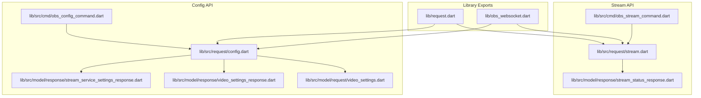
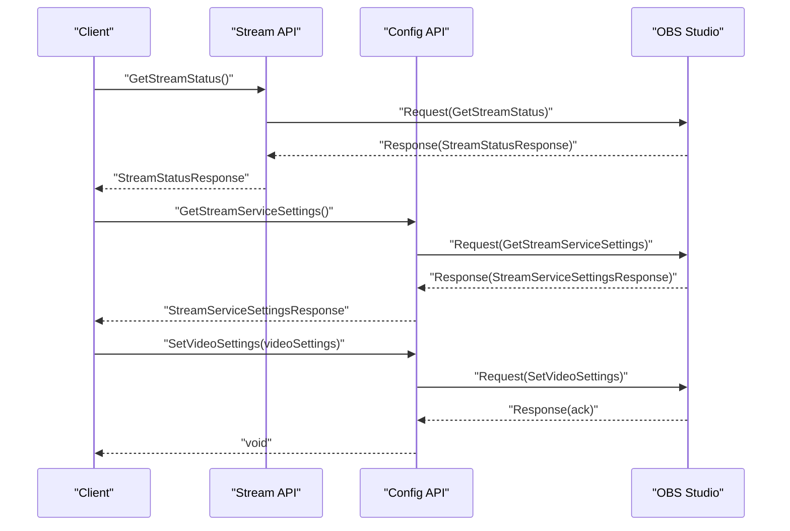
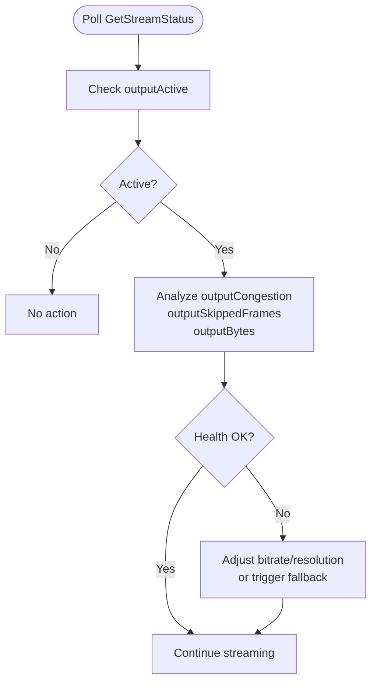
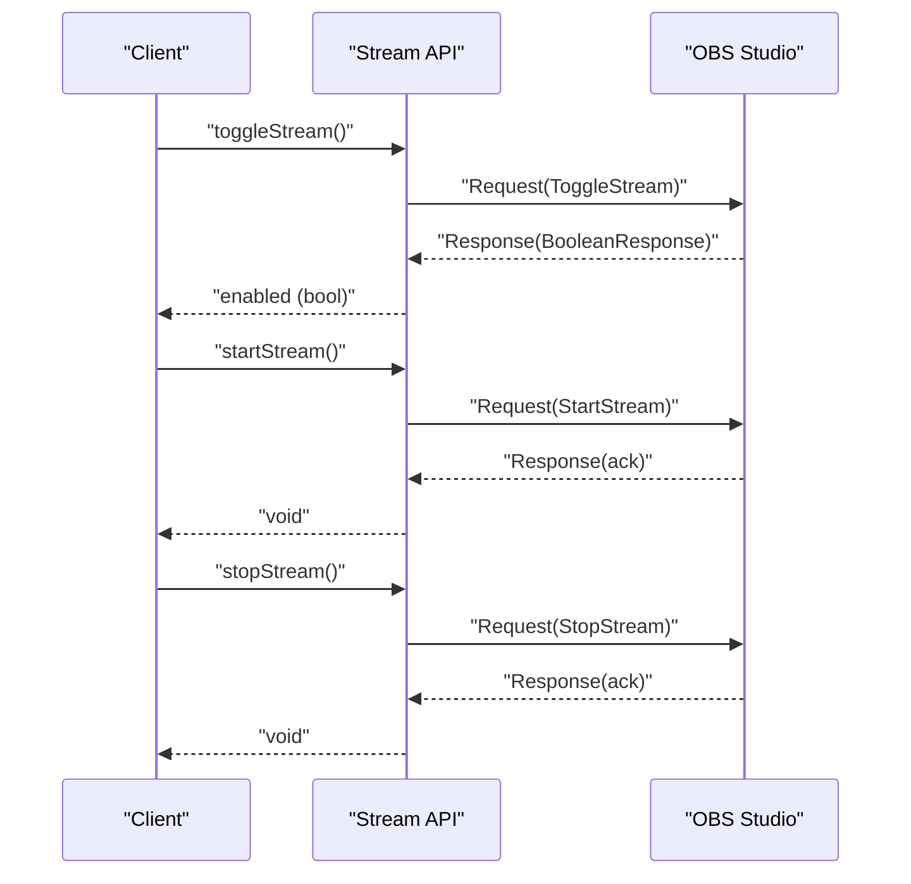
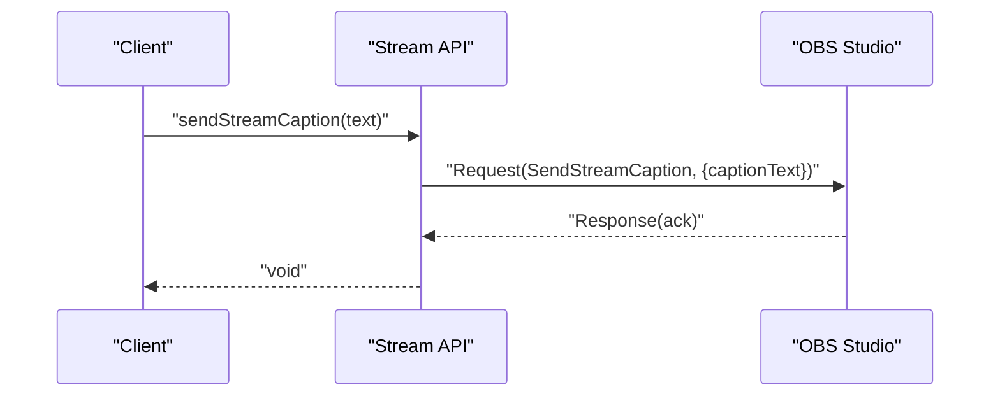
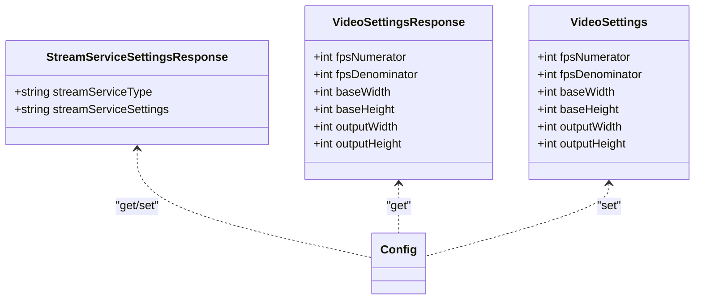
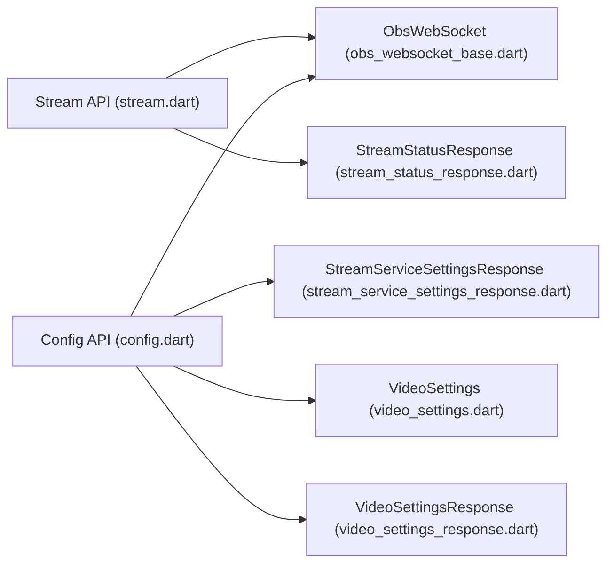

# Stream Requests

<cite>
**Referenced Files in This Document**
- [request.dart](file://lib/request.dart)
- [stream.dart](file://lib/src/request/stream.dart)
- [config.dart](file://lib/src/request/config.dart)
- [stream_status_response.dart](file://lib/src/model/response/stream_status_response.dart)
- [stream_service_settings_response.dart](file://lib/src/model/response/stream_service_settings_response.dart)
- [video_settings.dart](file://lib/src/model/request/video_settings.dart)
- [video_settings_response.dart](file://lib/src/model/response/video_settings_response.dart)
- [obs_stream_command.dart](file://lib/src/cmd/obs_stream_command.dart)
- [obs_config_command.dart](file://lib/src/cmd/obs_config_command.dart)
- [general.dart](file://example/general.dart)
- [obs_websocket_base.dart](file://lib/src/obs_websocket_base.dart)
- [obs_websocket.dart](file://lib/obs_websocket.dart)
- [obs_websocket_stream_test.dart](file://test/obs_websocket_stream_test.dart)
- [config.sample.yaml](file://example/config.sample.yaml)
</cite>

## Table of Contents
1. [Introduction](#introduction)
2. [Project Structure](#project-structure)
3. [Core Components](#core-components)
4. [Architecture Overview](#architecture-overview)
5. [Detailed Component Analysis](#detailed-component-analysis)
6. [Dependency Analysis](#dependency-analysis)
7. [Performance Considerations](#performance-considerations)
8. [Troubleshooting Guide](#troubleshooting-guide)
9. [Conclusion](#conclusion)
10. [Appendices](#appendices)

## Introduction
This document provides comprehensive API documentation for Stream Requests focused on live streaming management. It covers stream lifecycle operations (status retrieval, start/stop/toggle), caption overlay functionality, and stream configuration operations including encoder settings, bitrate management, and platform integration. It also includes practical examples for automated stream initiation, dynamic bitrate adjustment, stream monitoring, health checks, fallback procedures, and integration with streaming platforms.

## Project Structure
The Stream Requests API is organized around a dedicated Stream class and supporting model/response classes. Configuration-related stream settings are exposed via the Config class. CLI helpers demonstrate usage patterns for automation and integration.

**Diagram sources**
- [request.dart:6-16](file://lib/request.dart#L6-L16)
- [stream.dart:1-94](file://lib/src/request/stream.dart#L1-L94)
- [config.dart:1-268](file://lib/src/request/config.dart#L1-L268)
- [stream_status_response.dart:1-37](file://lib/src/model/response/stream_status_response.dart#L1-L37)
- [video_settings.dart:1-33](file://lib/src/model/request/video_settings.dart#L1-L33)
- [video_settings_response.dart:1-38](file://lib/src/model/response/video_settings_response.dart#L1-L38)
- [stream_service_settings_response.dart:1-24](file://lib/src/model/response/stream_service_settings_response.dart#L1-L24)
- [obs_stream_command.dart:1-122](file://lib/src/cmd/obs_stream_command.dart#L1-L122)
- [obs_config_command.dart:126-146](file://lib/src/cmd/obs_config_command.dart#L126-L146)

**Section sources**
- [request.dart:1-19](file://lib/request.dart#L1-L19)
- [obs_websocket.dart:1-69](file://lib/obs_websocket.dart#L1-L69)

## Core Components
- Stream API: Provides methods to check stream status, toggle, start, stop, and send captions.
- Config API: Provides methods to get/set stream service settings and video settings.
- Models/Responses: Strongly typed models for stream status, stream service settings, and video settings.
- CLI Helpers: Demonstrates usage patterns for automation and integration.

Key capabilities:
- Live stream status monitoring
- Toggle/start/stop streaming
- Send CEA-608 captions during streaming
- Configure stream destination (platform settings)
- Configure video encoder settings (resolution, FPS, scaling)
- Retrieve and apply stream statistics for health monitoring

**Section sources**
- [stream.dart:1-94](file://lib/src/request/stream.dart#L1-L94)
- [config.dart:172-245](file://lib/src/request/config.dart#L172-L245)
- [stream_status_response.dart:1-37](file://lib/src/model/response/stream_status_response.dart#L1-L37)
- [stream_service_settings_response.dart:1-24](file://lib/src/model/response/stream_service_settings_response.dart#L1-L24)
- [video_settings.dart:1-33](file://lib/src/model/request/video_settings.dart#L1-L33)

## Architecture Overview
The Stream Requests API integrates with OBS via the obs-websocket protocol. Clients send requests and receive responses; errors are surfaced as exceptions. The Stream class encapsulates stream operations, while the Config class manages encoder and platform settings.

**Diagram sources**
- [stream.dart:28-32](file://lib/src/request/stream.dart#L28-L32)
- [config.dart:219-245](file://lib/src/request/config.dart#L219-L245)
- [stream_status_response.dart:1-37](file://lib/src/model/response/stream_status_response.dart#L1-L37)
- [stream_service_settings_response.dart:1-24](file://lib/src/model/response/stream_service_settings_response.dart#L1-L24)

## Detailed Component Analysis

### Stream Status Monitoring
- Purpose: Retrieve real-time stream health metrics and state.
- Methods:
  - `getStreamStatus()` returns a StreamStatusResponse containing:
    - Active state flag
    - Reconnecting flag
    - Timestamp (timecode)
    - Duration (milliseconds)
    - Congestion (ratio)
    - Bytes transmitted
    - Skipped/total frames

- Usage pattern:
  - Poll periodically to monitor health
  - Track congestion and skipped frames for adaptive bitrate decisions
  - Use duration and timecode for synchronization

**Diagram sources**
- [stream_status_response.dart:8-27](file://lib/src/model/response/stream_status_response.dart#L8-L27)
- [stream.dart:28-32](file://lib/src/request/stream.dart#L28-L32)

**Section sources**
- [stream.dart:9-32](file://lib/src/request/stream.dart#L9-L32)
- [stream_status_response.dart:1-37](file://lib/src/model/response/stream_status_response.dart#L1-L37)
- [obs_websocket_stream_test.dart:6-25](file://test/obs_websocket_stream_test.dart#L6-L25)

### Stream Lifecycle Management
- Methods:
  - `toggleStream()` toggles the current stream state
  - `startStream()` starts the stream output
  - `stopStream()` stops the stream output

- Behavior:
  - Toggle uses a boolean response to confirm enabled state
  - Start/stop are fire-and-forget operations returning completion

**Diagram sources**
- [stream.dart:34-92](file://lib/src/request/stream.dart#L34-L92)

**Section sources**
- [stream.dart:34-92](file://lib/src/request/stream.dart#L34-L92)

### Caption Overlay (CEA-608)
- Method:
  - `sendStreamCaption(captionText)` sends caption text over the stream output
- Notes:
  - Supports CEA-608 caption overlays during live streaming
  - Useful for accessibility and real-time metadata

**Diagram sources**
- [stream.dart:84-92](file://lib/src/request/stream.dart#L84-L92)

**Section sources**
- [stream.dart:84-92](file://lib/src/request/stream.dart#L84-L92)
- [obs_stream_command.dart:95-121](file://lib/src/cmd/obs_stream_command.dart#L95-L121)

### Stream Configuration Operations
- Stream Destination Settings:
  - `getStreamServiceSettings()` retrieves current stream service type and settings
  - `setStreamServiceSettings(type, settings)` updates stream destination
  - Typical settings include platform-specific keys and URLs

- Video Encoder Settings:
  - `getVideoSettings()` retrieves current video settings
  - `setVideoSettings(videoSettings)` applies new encoder configuration
  - Includes FPS numerator/denominator and base/output resolutions

**Diagram sources**
- [config.dart:206-245](file://lib/src/request/config.dart#L206-L245)
- [video_settings.dart:8-23](file://lib/src/model/request/video_settings.dart#L8-L23)
- [video_settings_response.dart:9-28](file://lib/src/model/response/video_settings_response.dart#L9-L28)

**Section sources**
- [config.dart:206-245](file://lib/src/request/config.dart#L206-L245)
- [video_settings.dart:1-33](file://lib/src/model/request/video_settings.dart#L1-L33)
- [video_settings_response.dart:1-38](file://lib/src/model/response/video_settings_response.dart#L1-L38)

### CLI Integration Examples
- Stream Commands:
  - `stream get-stream-status`: Print current stream status
  - `stream toggle-stream`: Toggle stream state
  - `stream start-streaming`: Start streaming
  - `stream stop-streaming`: Stop streaming
  - `stream send-stream-caption`: Send caption text

- Config Commands:
  - `config get-stream-service-settings`: Retrieve stream destination settings
  - `config set-video-settings`: Apply video encoder settings

These commands demonstrate automation patterns for scripted orchestration and integration with external systems.

**Section sources**
- [obs_stream_command.dart:1-122](file://lib/src/cmd/obs_stream_command.dart#L1-L122)
- [obs_config_command.dart:126-146](file://lib/src/cmd/obs_config_command.dart#L126-L146)

## Dependency Analysis
The Stream and Config APIs depend on the core obs-websocket infrastructure for request/response handling, authentication, and error propagation.

**Diagram sources**
- [stream.dart:1-94](file://lib/src/request/stream.dart#L1-L94)
- [config.dart:1-268](file://lib/src/request/config.dart#L1-L268)
- [obs_websocket_base.dart:481-511](file://lib/src/obs_websocket_base.dart#L481-L511)
- [stream_status_response.dart:1-37](file://lib/src/model/response/stream_status_response.dart#L1-L37)
- [stream_service_settings_response.dart:1-24](file://lib/src/model/response/stream_service_settings_response.dart#L1-L24)
- [video_settings.dart:1-33](file://lib/src/model/request/video_settings.dart#L1-L33)
- [video_settings_response.dart:1-38](file://lib/src/model/response/video_settings_response.dart#L1-L38)

**Section sources**
- [obs_websocket_base.dart:481-511](file://lib/src/obs_websocket_base.dart#L481-L511)
- [obs_websocket.dart:46-51](file://lib/obs_websocket.dart#L46-L51)

## Performance Considerations
- Request latency and timeouts:
  - The underlying transport handles request timeouts and propagates ObsTimeoutException when responses are not received within the configured timeout.
- Congestion and frame metrics:
  - Monitor outputCongestion and skipped frames to detect network or encoder bottlenecks.
- Adaptive bitrate:
  - Use stream status polling to dynamically adjust encoder settings (resolution/FPS) based on observed congestion and frame loss.

[No sources needed since this section provides general guidance]

## Troubleshooting Guide
Common issues and remedies:
- Authentication failures:
  - Ensure correct password and proper handshake; verify negotiated RPC version.
- Request timeouts:
  - Increase requestTimeout or reduce workload on OBS; check for long-running operations.
- Stream failures:
  - Inspect stream status fields (active, reconnecting) and platform credentials; reapply stream service settings if needed.
- Network instability:
  - Reduce bitrate/resolution temporarily; monitor congestion and skipped frames; implement fallback to lower quality or pause streaming.

**Section sources**
- [obs_websocket_base.dart:481-511](file://lib/src/obs_websocket_base.dart#L481-L511)
- [stream_status_response.dart:8-27](file://lib/src/model/response/stream_status_response.dart#L8-L27)

## Conclusion
The Stream Requests API provides a robust foundation for live streaming management, including lifecycle control, health monitoring, and configuration. By combining stream status polling, caption overlays, and configurable encoder settings, developers can build resilient streaming solutions with automated fallback and platform integration.

[No sources needed since this section summarizes without analyzing specific files]

## Appendices

### API Reference Summary
- Stream
  - `getStreamStatus()` -> StreamStatusResponse
  - `toggleStream()` -> bool
  - `startStream()` -> void
  - `stopStream()` -> void
  - `sendStreamCaption(text)` -> void
- Config
  - `getStreamServiceSettings()` -> StreamServiceSettingsResponse
  - `setStreamServiceSettings(type, settings)` -> void
  - `getVideoSettings()` -> VideoSettingsResponse
  - `setVideoSettings(videoSettings)` -> void

**Section sources**
- [stream.dart:9-92](file://lib/src/request/stream.dart#L9-L92)
- [config.dart:172-245](file://lib/src/request/config.dart#L172-L245)

### Example Workflows

#### Automated Stream Initiation
- Steps:
  - Connect to OBS
  - Verify stream status is inactive
  - Start streaming
  - Confirm active state via status poll

- References:
  - [general.dart:81-88](file://example/general.dart#L81-L88)

**Section sources**
- [general.dart:81-88](file://example/general.dart#L81-L88)

#### Dynamic Bitrate Adjustment
- Steps:
  - Monitor stream status (congestion, skipped frames)
  - Lower output resolution or FPS via setVideoSettings
  - Resume normal operation when conditions improve

- References:
  - [config.dart:196-204](file://lib/src/request/config.dart#L196-L204)
  - [video_settings_response.dart:1-38](file://lib/src/model/response/video_settings_response.dart#L1-L38)

**Section sources**
- [config.dart:196-204](file://lib/src/request/config.dart#L196-L204)
- [video_settings_response.dart:1-38](file://lib/src/model/response/video_settings_response.dart#L1-L38)

#### Stream Monitoring and Health Checks
- Steps:
  - Periodically fetch stream status
  - Track duration, timecode, bytes, and congestion
  - Trigger alerts or fallback actions when thresholds are exceeded

- References:
  - [stream_status_response.dart:8-27](file://lib/src/model/response/stream_status_response.dart#L8-L27)

**Section sources**
- [stream_status_response.dart:8-27](file://lib/src/model/response/stream_status_response.dart#L8-L27)

#### Fallback Procedures
- Steps:
  - Detect high congestion or reconnecting state
  - Temporarily reduce bitrate/resolution
  - Optionally switch to a backup stream destination

- References:
  - [config.dart:227-245](file://lib/src/request/config.dart#L227-L245)

**Section sources**
- [config.dart:227-245](file://lib/src/request/config.dart#L227-L245)

#### Integration with Streaming Platforms
- Steps:
  - Configure stream service settings (type, server, key)
  - Validate settings via getStreamServiceSettings
  - Apply changes with setStreamServiceSettings

- References:
  - [config.sample.yaml:4-8](file://example/config.sample.yaml#L4-L8)
  - [config.dart:206-245](file://lib/src/request/config.dart#L206-L245)

**Section sources**
- [config.sample.yaml:4-8](file://example/config.sample.yaml#L4-L8)
- [config.dart:206-245](file://lib/src/request/config.dart#L206-L245)