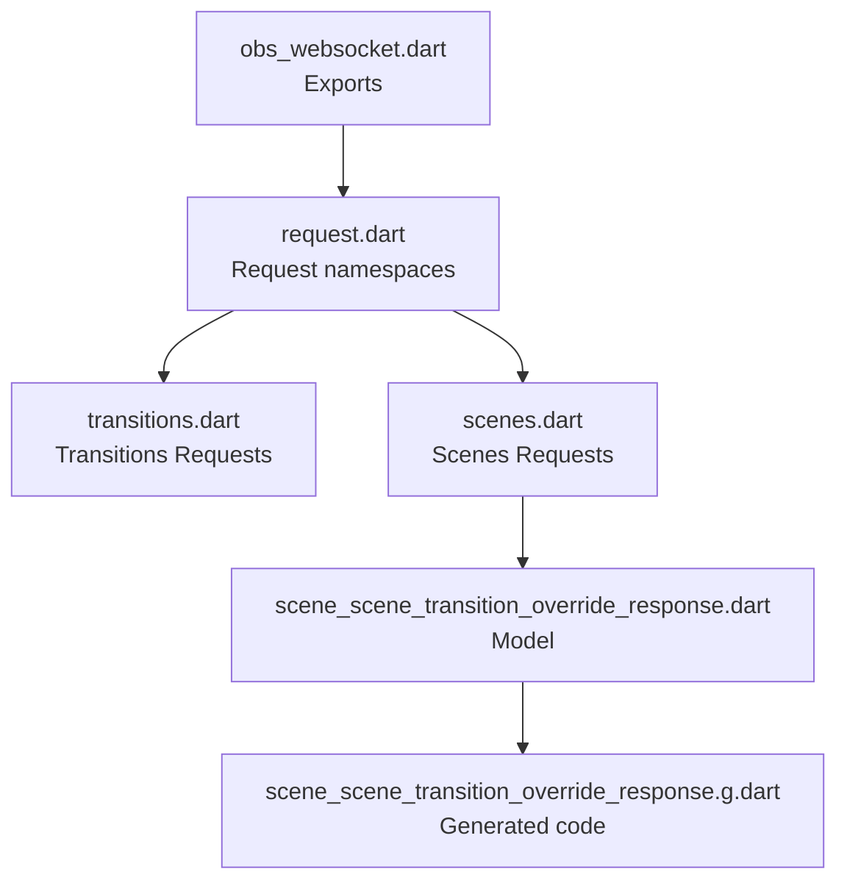
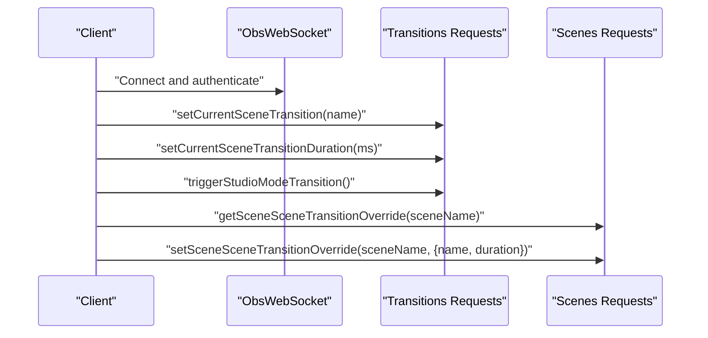
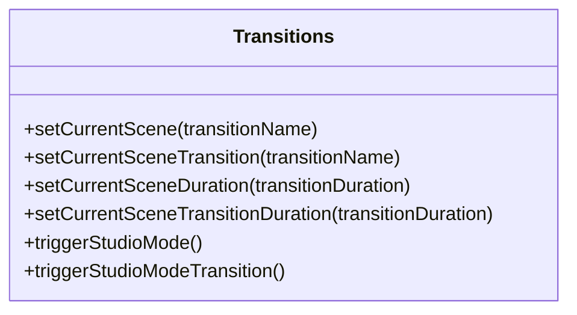
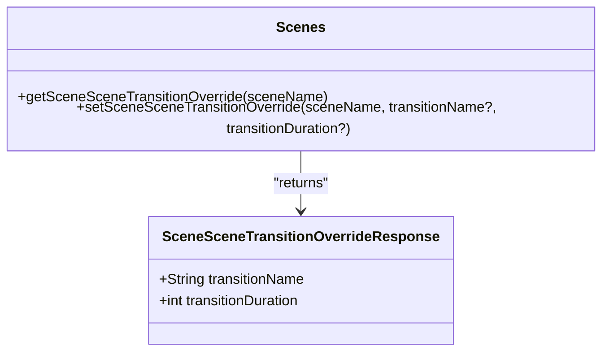
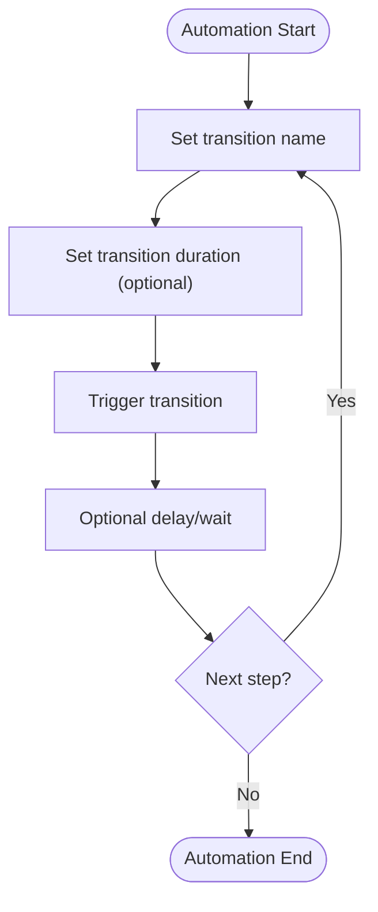
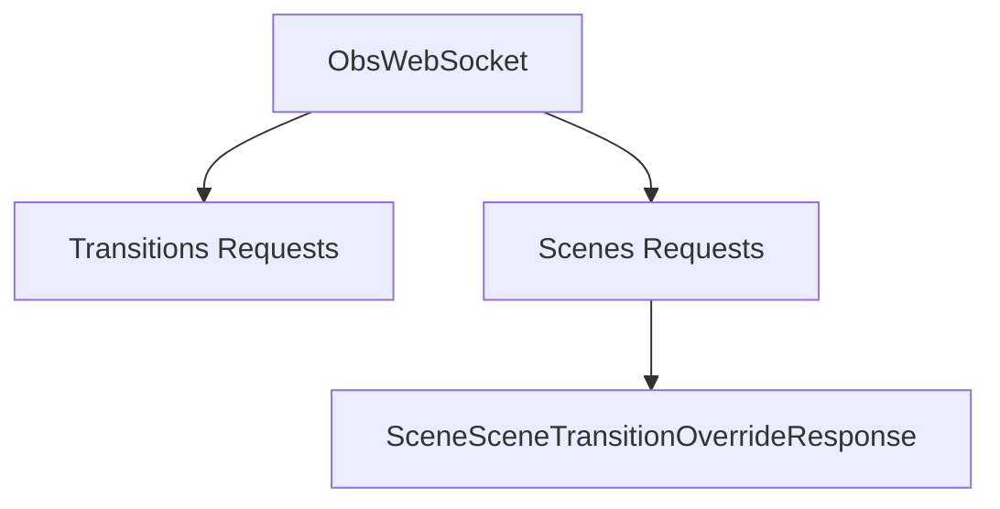

# Transition Requests

<cite>
**Referenced Files in This Document**
- [README.md](file://README.md)
- [obs_websocket.dart](file://lib/obs_websocket.dart)
- [request.dart](file://lib/request.dart)
- [transitions.dart](file://lib/src/request/transitions.dart)
- [scenes.dart](file://lib/src/request/scenes.dart)
- [scene_scene_transition_override_response.dart](file://lib/src/model/response/scene_scene_transition_override_response.dart)
- [scene_scene_transition_override_response.g.dart](file://lib/src/model/response/scene_scene_transition_override_response.g.dart)
- [general.dart](file://example/general.dart)
- [show_scene_item.dart](file://example/show_scene_item.dart)
</cite>

## Table of Contents
1. [Introduction](#introduction)
2. [Project Structure](#project-structure)
3. [Core Components](#core-components)
4. [Architecture Overview](#architecture-overview)
5. [Detailed Component Analysis](#detailed-component-analysis)
6. [Dependency Analysis](#dependency-analysis)
7. [Performance Considerations](#performance-considerations)
8. [Troubleshooting Guide](#troubleshooting-guide)
9. [Conclusion](#conclusion)

## Introduction
This document provides comprehensive API documentation for managing scene transition effects through Transition Requests. It covers transition type selection, transition duration control, transition override settings per scene, and transition state management. It also explains built-in transition types, custom transition configuration, and transition automation patterns. Practical examples demonstrate smooth scene transitions, timed transitions, and scripted transition sequences. Finally, it addresses performance optimization and troubleshooting strategies for transition effects.

## Project Structure
The Transition Requests functionality is exposed through a dedicated request module and integrated with the broader OBS Websocket API surface. The high-level structure relevant to transitions includes:
- Top-level exports for request namespaces
- Transition request helpers
- Scene-level transition override model and response handling
- Examples demonstrating usage patterns

**Diagram sources**
- [obs_websocket.dart:1-71](file://lib/obs_websocket.dart#L1-L71)
- [request.dart:1-19](file://lib/request.dart#L1-L19)
- [transitions.dart:1-75](file://lib/src/request/transitions.dart#L1-L75)
- [scenes.dart:192-231](file://lib/src/request/scenes.dart#L192-L231)
- [scene_scene_transition_override_response.dart:1-26](file://lib/src/model/response/scene_scene_transition_override_response.dart#L1-L26)
- [scene_scene_transition_override_response.g.dart:1-21](file://lib/src/model/response/scene_scene_transition_override_response.g.dart#L1-L21)

**Section sources**
- [obs_websocket.dart:1-71](file://lib/obs_websocket.dart#L1-L71)
- [request.dart:1-19](file://lib/request.dart#L1-L19)

## Core Components
This section documents the Transition Requests API surface and related scene-level overrides.

- Transitions Requests
  - Set current scene transition by name
  - Set current scene transition duration (milliseconds, min 50, max 20000)
  - Trigger studio mode transition (equivalent to pressing the Transition button in studio mode)

- Scene-Level Transition Override
  - Get scene transition override (returns transition name and duration)
  - Set scene transition override (per-scene override of transition name and/or duration)

Key capabilities:
- Built-in transition types: The API exposes a transition name field for selection. The actual available transition kinds are determined by OBS and are not enumerated in this client library.
- Custom transition configuration: Transitions are configured by name; custom transitions can be created and managed in OBS, then selected by name via this API.
- Transition automation: Combine transition selection, duration setting, and triggering to automate scripted sequences.

**Section sources**
- [transitions.dart:9-74](file://lib/src/request/transitions.dart#L9-L74)
- [scenes.dart:192-231](file://lib/src/request/scenes.dart#L192-L231)
- [scene_scene_transition_override_response.dart:8-26](file://lib/src/model/response/scene_scene_transition_override_response.dart#L8-L26)

## Architecture Overview
The Transition Requests architecture integrates with the broader OBS Websocket API. The high-level flow is:
- Client constructs an ObsWebSocket connection
- Client invokes transitions requests to change the active transition or its duration
- Client triggers a studio mode transition to execute the transition
- Scene-level overrides can be set/get to customize transitions per scene

**Diagram sources**
- [transitions.dart:26-74](file://lib/src/request/transitions.dart#L26-L74)
- [scenes.dart:197-230](file://lib/src/request/scenes.dart#L197-L230)

## Detailed Component Analysis

### Transitions Requests
The Transitions Requests class encapsulates operations to manage the current transition globally.

- setCurrentScene and setCurrentSceneTransition: Select the active transition by name.
- setCurrentSceneDuration and setCurrentSceneTransitionDuration: Configure the duration of the current transition (when not fixed).
- triggerStudioMode and triggerStudioModeTransition: Execute the transition (same as the studio mode Transition button).

Constraints and behavior:
- Duration range: milliseconds ≥ 50 and ≤ 20000.
- Transition name uniqueness: Namespaces are generally unique but not guaranteed like inputs.

**Diagram sources**
- [transitions.dart:4-74](file://lib/src/request/transitions.dart#L4-L74)

**Section sources**
- [transitions.dart:9-74](file://lib/src/request/transitions.dart#L9-L74)

### Scene-Level Transition Override
Scene-level overrides allow per-scene customization of transition behavior.

- getSceneSceneTransitionOverride: Retrieves the current per-scene override (name and duration).
- setSceneSceneTransitionOverride: Sets per-scene override for transition name and/or duration. Passing null keeps the existing value.

**Diagram sources**
- [scenes.dart:197-230](file://lib/src/request/scenes.dart#L197-L230)
- [scene_scene_transition_override_response.dart:8-26](file://lib/src/model/response/scene_scene_transition_override_response.dart#L8-L26)

**Section sources**
- [scenes.dart:192-231](file://lib/src/request/scenes.dart#L192-L231)
- [scene_scene_transition_override_response.dart:8-26](file://lib/src/model/response/scene_scene_transition_override_response.dart#L8-L26)

### Transition Automation Patterns
Common automation patterns for transitions:

- Smooth scene transitions
  - Set transition name
  - Optionally set transition duration
  - Trigger transition

- Timed transitions
  - Configure transition duration for a specific transition
  - Trigger transition

- Scripted transition sequences
  - Alternate between multiple transition names
  - Adjust durations between switches
  - Trigger transitions in sequence

[No sources needed since this diagram shows conceptual workflow, not actual code structure]

### Practical Usage Examples
While this repository does not include dedicated transition examples, the general-purpose examples illustrate how to structure automation around transitions:

- Using general-purpose helpers and event subscriptions to orchestrate actions
- Demonstrates connecting, subscribing to events, and issuing requests

**Section sources**
- [general.dart:12-153](file://example/general.dart#L12-L153)
- [show_scene_item.dart:14-69](file://example/show_scene_item.dart#L14-L69)

## Dependency Analysis
The Transition Requests depend on the core ObsWebSocket transport and request/response infrastructure. The Scenes Requests module depends on the SceneSceneTransitionOverrideResponse model for serialization/deserialization.

**Diagram sources**
- [obs_websocket.dart:66-68](file://lib/obs_websocket.dart#L66-L68)
- [transitions.dart:1-75](file://lib/src/request/transitions.dart#L1-L75)
- [scenes.dart:192-231](file://lib/src/request/scenes.dart#L192-L231)
- [scene_scene_transition_override_response.dart:1-26](file://lib/src/model/response/scene_scene_transition_override_response.dart#L1-L26)

**Section sources**
- [obs_websocket.dart:66-68](file://lib/obs_websocket.dart#L66-L68)
- [transitions.dart:1-75](file://lib/src/request/transitions.dart#L1-L75)
- [scenes.dart:192-231](file://lib/src/request/scenes.dart#L192-L231)
- [scene_scene_transition_override_response.dart:1-26](file://lib/src/model/response/scene_scene_transition_override_response.dart#L1-L26)

## Performance Considerations
- Choose appropriate transition durations: Very short durations can cause visual artifacts; very long durations can disrupt pacing. Keep within the supported range.
- Minimize unnecessary transitions: Batch scene changes and transitions to reduce overhead.
- Use scene-level overrides judiciously: Overrides add per-scene complexity; apply only where needed.
- Monitor CPU/GPU impact: Complex transitions can increase resource usage; test with representative hardware.
- Avoid excessive polling: Use events and targeted requests rather than repeated queries.

[No sources needed since this section provides general guidance]

## Troubleshooting Guide
Common issues and resolutions:

- Transition not applied
  - Verify the transition name exists in OBS and is spelled correctly.
  - Confirm studio mode is enabled if using studio mode transition triggering.

- Duration ignored
  - Some transitions are fixed-duration; duration setting applies only when the transition supports variable duration.

- Unexpected transition behavior
  - Check for scene-level overrides that may supersede the global transition settings.
  - Review recent events to confirm the intended transition was triggered.

- Event-driven automation
  - Subscribe to relevant events and ensure handlers execute after transition completion if timing-sensitive logic is required.

**Section sources**
- [README.md:180-189](file://README.md#L180-L189)
- [scenes.dart:192-231](file://lib/src/request/scenes.dart#L192-L231)

## Conclusion
Transition Requests provide a concise API to select, configure, and trigger scene transitions, with optional per-scene overrides. By combining transition selection, duration control, and triggering, you can implement smooth, timed, and scripted transition sequences. Follow the performance and troubleshooting guidance to maintain reliable and efficient transitions in production environments.