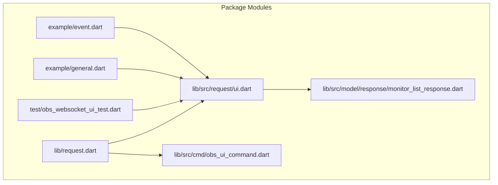
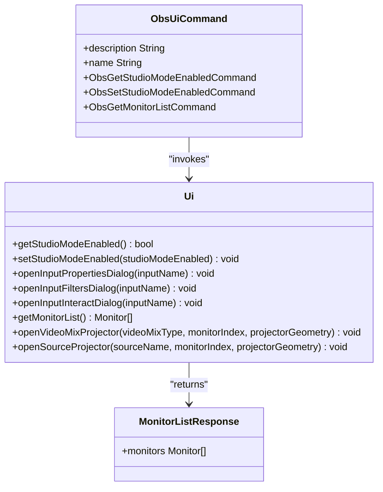
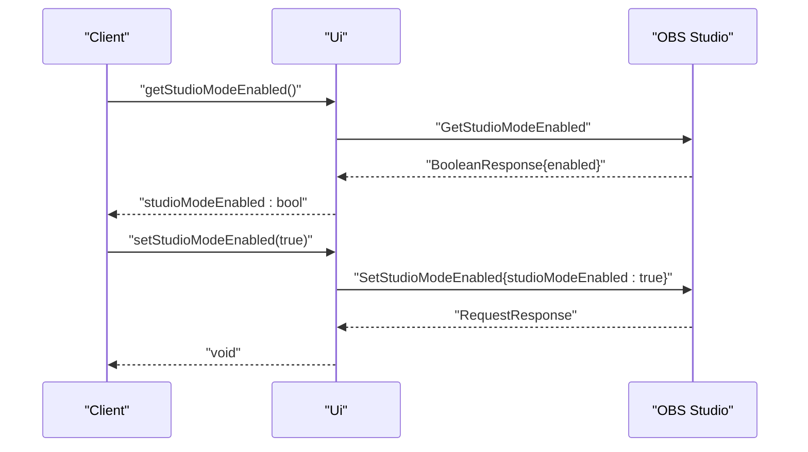
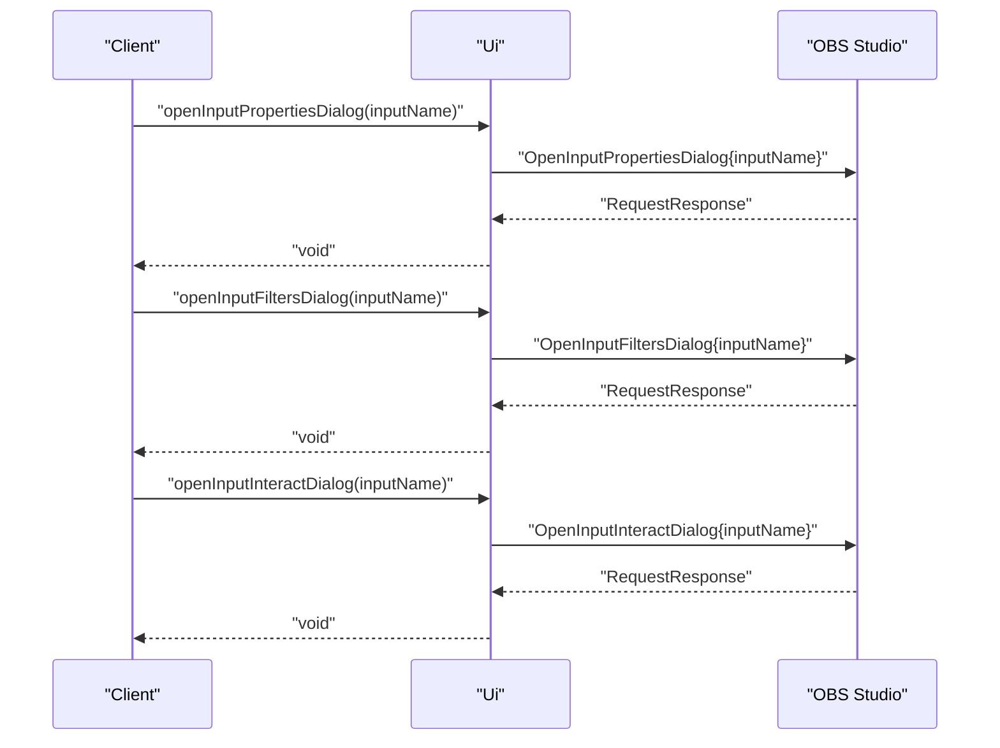
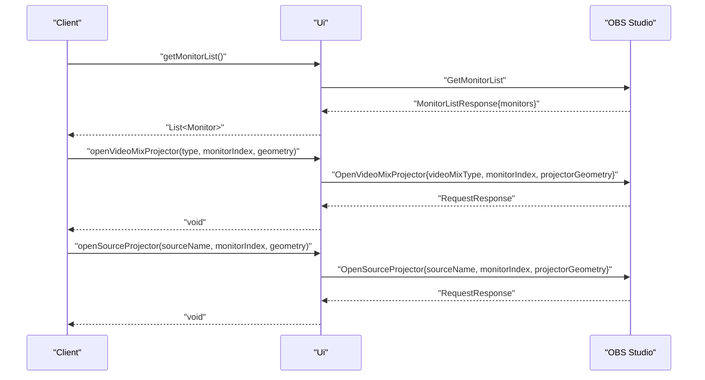
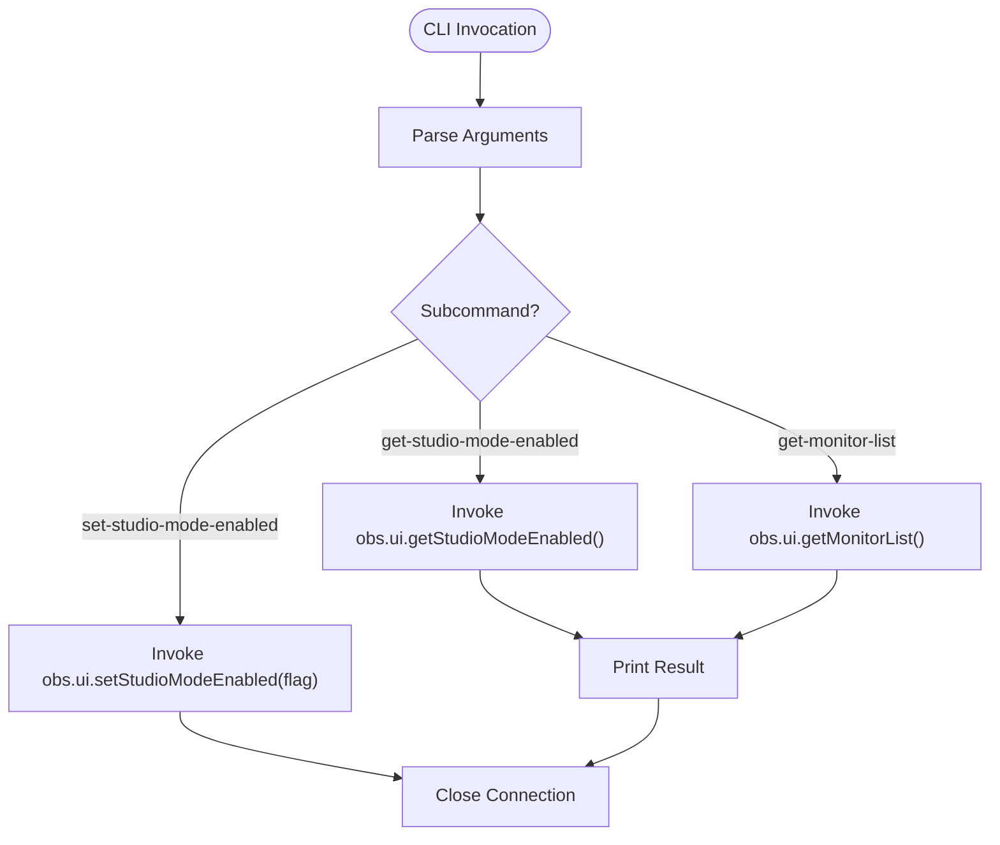
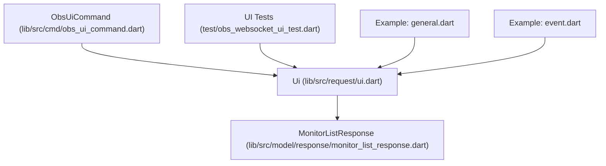

# UI Requests

<cite>
**Referenced Files in This Document**
- [README.md](file://README.md)
- [lib/request.dart](file://lib/request.dart)
- [lib/src/request/ui.dart](file://lib/src/request/ui.dart)
- [lib/src/cmd/obs_ui_command.dart](file://lib/src/cmd/obs_ui_command.dart)
- [lib/src/model/response/monitor_list_response.dart](file://lib/src/model/response/monitor_list_response.dart)
- [test/obs_websocket_ui_test.dart](file://test/obs_websocket_ui_test.dart)
- [example/general.dart](file://example/general.dart)
- [example/event.dart](file://example/event.dart)
</cite>

## Table of Contents
1. [Introduction](#introduction)
2. [Project Structure](#project-structure)
3. [Core Components](#core-components)
4. [Architecture Overview](#architecture-overview)
5. [Detailed Component Analysis](#detailed-component-analysis)
6. [Dependency Analysis](#dependency-analysis)
7. [Performance Considerations](#performance-considerations)
8. [Troubleshooting Guide](#troubleshooting-guide)
9. [Conclusion](#conclusion)
10. [Appendices](#appendices)

## Introduction
This document provides comprehensive API documentation for UI Requests that manage the OBS Studio interface and window controls. It covers UI state queries, window management, and interface automation capabilities exposed through the obs-websocket protocol. The focus areas include studio mode toggling, input dialog automation, monitor enumeration, and projector operations. The guide includes practical examples for automated UI configuration, interface monitoring, and custom interface workflows, along with integration patterns and best practices for reliable automation.

## Project Structure
The UI Requests are implemented as a dedicated module within the obs-websocket Dart package. The primary entry points are:
- High-level UI API class for programmatic control
- CLI subcommands for terminal-based UI operations
- Response models for structured data handling
- Tests validating request/response behavior
- Examples demonstrating usage patterns

**Diagram sources**
- [lib/request.dart:1-19](file://lib/request.dart#L1-L19)
- [lib/src/request/ui.dart:1-138](file://lib/src/request/ui.dart#L1-L138)
- [lib/src/cmd/obs_ui_command.dart:1-82](file://lib/src/cmd/obs_ui_command.dart#L1-L82)
- [lib/src/model/response/monitor_list_response.dart:1-23](file://lib/src/model/response/monitor_list_response.dart#L1-L23)
- [test/obs_websocket_ui_test.dart:1-58](file://test/obs_websocket_ui_test.dart#L1-L58)
- [example/general.dart:1-154](file://example/general.dart#L1-L154)
- [example/event.dart:1-46](file://example/event.dart#L1-L46)

**Section sources**
- [lib/request.dart:1-19](file://lib/request.dart#L1-L19)
- [lib/src/request/ui.dart:1-138](file://lib/src/request/ui.dart#L1-L138)
- [lib/src/cmd/obs_ui_command.dart:1-82](file://lib/src/cmd/obs_ui_command.dart#L1-L82)
- [lib/src/model/response/monitor_list_response.dart:1-23](file://lib/src/model/response/monitor_list_response.dart#L1-L23)
- [test/obs_websocket_ui_test.dart:1-58](file://test/obs_websocket_ui_test.dart#L1-L58)
- [example/general.dart:1-154](file://example/general.dart#L1-L154)
- [example/event.dart:1-46](file://example/event.dart#L1-L46)

## Core Components
The UI Requests module exposes a cohesive set of operations for interacting with the OBS interface:

- Studio Mode Management
  - Query studio mode state
  - Enable/disable studio mode programmatically

- Input Dialog Automation
  - Open input properties dialog
  - Open input filters dialog
  - Open input interact dialog

- Monitor and Projector Operations
  - Enumerate connected monitors
  - Open projectors for video mixes and sources

These components are designed for reliability, with clear request/response contracts and optional CLI support for terminal-based workflows.

**Section sources**
- [lib/src/request/ui.dart:9-138](file://lib/src/request/ui.dart#L9-L138)
- [lib/src/cmd/obs_ui_command.dart:20-81](file://lib/src/cmd/obs_ui_command.dart#L20-L81)

## Architecture Overview
The UI Requests architecture follows a layered design:
- High-level API class encapsulates request methods
- CLI subcommands provide terminal access to UI operations
- Response models parse and expose structured data
- Tests validate request/response correctness
- Examples demonstrate real-world usage patterns

**Diagram sources**
- [lib/src/request/ui.dart:4-138](file://lib/src/request/ui.dart#L4-L138)
- [lib/src/cmd/obs_ui_command.dart:5-18](file://lib/src/cmd/obs_ui_command.dart#L5-L18)
- [lib/src/model/response/monitor_list_response.dart:9-22](file://lib/src/model/response/monitor_list_response.dart#L9-L22)

**Section sources**
- [lib/src/request/ui.dart:4-138](file://lib/src/request/ui.dart#L4-L138)
- [lib/src/cmd/obs_ui_command.dart:5-18](file://lib/src/cmd/obs_ui_command.dart#L5-L18)
- [lib/src/model/response/monitor_list_response.dart:9-22](file://lib/src/model/response/monitor_list_response.dart#L9-L22)

## Detailed Component Analysis

### Studio Mode Management
Studio mode is a core interface state in OBS that enables advanced production features. The UI Requests provide:
- State query: retrieve current studio mode status
- Control: toggle studio mode on/off

**Diagram sources**
- [lib/src/request/ui.dart:14-33](file://lib/src/request/ui.dart#L14-L33)

**Section sources**
- [lib/src/request/ui.dart:14-33](file://lib/src/request/ui.dart#L14-L33)
- [test/obs_websocket_ui_test.dart:7-37](file://test/obs_websocket_ui_test.dart#L7-L37)

### Input Dialog Automation
The UI Requests support opening three types of input dialogs:
- Properties dialog for adjusting input settings
- Filters dialog for managing input effects
- Interact dialog for interactive sources (e.g., browser sources)

**Diagram sources**
- [lib/src/request/ui.dart:40-72](file://lib/src/request/ui.dart#L40-L72)

**Section sources**
- [lib/src/request/ui.dart:40-72](file://lib/src/request/ui.dart#L40-L72)

### Monitor Enumeration and Projector Operations
The UI Requests provide:
- Monitor list retrieval for multi-display setups
- Video mix projector creation for preview/program/multiview
- Source projector creation for individual sources

**Diagram sources**
- [lib/src/request/ui.dart:79-136](file://lib/src/request/ui.dart#L79-L136)
- [lib/src/model/response/monitor_list_response.dart:9-22](file://lib/src/model/response/monitor_list_response.dart#L9-L22)

**Section sources**
- [lib/src/request/ui.dart:79-136](file://lib/src/request/ui.dart#L79-L136)
- [lib/src/model/response/monitor_list_response.dart:9-22](file://lib/src/model/response/monitor_list_response.dart#L9-L22)
- [test/obs_websocket_ui_test.dart:39-56](file://test/obs_websocket_ui_test.dart#L39-L56)

### CLI Integration for UI Operations
The CLI provides subcommands for common UI tasks:
- Query studio mode status
- Toggle studio mode
- Retrieve monitor list

**Diagram sources**
- [lib/src/cmd/obs_ui_command.dart:20-81](file://lib/src/cmd/obs_ui_command.dart#L20-L81)

**Section sources**
- [lib/src/cmd/obs_ui_command.dart:20-81](file://lib/src/cmd/obs_ui_command.dart#L20-L81)

## Dependency Analysis
The UI Requests module exhibits clean separation of concerns:
- API class depends on the core ObsWebSocket transport
- Response models encapsulate data parsing
- CLI commands depend on the API class
- Tests validate request/response contracts
- Examples demonstrate integration patterns

**Diagram sources**
- [lib/src/request/ui.dart:1-138](file://lib/src/request/ui.dart#L1-L138)
- [lib/src/model/response/monitor_list_response.dart:1-23](file://lib/src/model/response/monitor_list_response.dart#L1-L23)
- [lib/src/cmd/obs_ui_command.dart:1-82](file://lib/src/cmd/obs_ui_command.dart#L1-L82)
- [test/obs_websocket_ui_test.dart:1-58](file://test/obs_websocket_ui_test.dart#L1-L58)
- [example/general.dart:1-154](file://example/general.dart#L1-L154)
- [example/event.dart:1-46](file://example/event.dart#L1-L46)

**Section sources**
- [lib/src/request/ui.dart:1-138](file://lib/src/request/ui.dart#L1-L138)
- [lib/src/model/response/monitor_list_response.dart:1-23](file://lib/src/model/response/monitor_list_response.dart#L1-L23)
- [lib/src/cmd/obs_ui_command.dart:1-82](file://lib/src/cmd/obs_ui_command.dart#L1-L82)
- [test/obs_websocket_ui_test.dart:1-58](file://test/obs_websocket_ui_test.dart#L1-L58)
- [example/general.dart:1-154](file://example/general.dart#L1-L154)
- [example/event.dart:1-46](file://example/event.dart#L1-L46)

## Performance Considerations
- Minimize repeated monitor enumeration; cache results when appropriate
- Batch UI operations where feasible to reduce network overhead
- Use targeted event subscriptions to avoid unnecessary processing
- Close connections promptly to prevent resource leaks

## Troubleshooting Guide
Common issues and resolutions:
- Authentication failures: ensure password matches OBS configuration
- Network connectivity: verify OBS is reachable and obs-websocket is enabled
- Request timeouts: confirm OBS responsiveness and adjust client timeouts
- Permission errors: validate that UI operations are permitted by OBS configuration

Validation patterns:
- Use tests to verify request/response correctness
- Employ examples as working templates for integration
- Subscribe to relevant events to monitor UI state changes

**Section sources**
- [test/obs_websocket_ui_test.dart:7-56](file://test/obs_websocket_ui_test.dart#L7-L56)
- [example/general.dart:12-19](file://example/general.dart#L12-L19)
- [example/event.dart:12-19](file://example/event.dart#L12-L19)

## Conclusion
The UI Requests module provides a robust foundation for automating OBS Studio interface interactions. With studio mode control, input dialog automation, and projector operations, developers can build sophisticated automation workflows. The combination of high-level APIs, CLI support, and comprehensive examples enables rapid integration and reliable operation.

## Appendices

### API Reference Summary
- Studio Mode
  - Query: GetStudioModeEnabled → BooleanResponse
  - Control: SetStudioModeEnabled → RequestResponse
- Input Dialogs
  - OpenInputPropertiesDialog → RequestResponse
  - OpenInputFiltersDialog → RequestResponse
  - OpenInputInteractDialog → RequestResponse
- Monitors and Projectors
  - GetMonitorList → MonitorListResponse
  - OpenVideoMixProjector → RequestResponse
  - OpenSourceProjector → RequestResponse

**Section sources**
- [lib/src/request/ui.dart:14-136](file://lib/src/request/ui.dart#L14-L136)

### Integration Patterns and Best Practices
- Use event subscriptions to monitor UI state changes
- Cache monitor lists for multi-display environments
- Encapsulate UI operations in higher-level workflows
- Validate request responses and handle errors gracefully
- Keep connections alive only during active sessions

**Section sources**
- [README.md:254-263](file://README.md#L254-L263)
- [example/event.dart:21-44](file://example/event.dart#L21-L44)
- [example/general.dart:12-19](file://example/general.dart#L12-L19)