# Testing and Quality Assurance

<cite>
**Referenced Files in This Document**
- [.github/workflows/dart.yml](file://.github/workflows/dart.yml)
- [pubspec.yaml](file://pubspec.yaml)
- [analysis_options.yaml](file://analysis_options.yaml)
- [test/obs_websocket_general_test.dart](file://test/obs_websocket_general_test.dart)
- [test/obs_websocket_inputs_test.dart](file://test/obs_websocket_inputs_test.dart)
- [test/obs_websocket_scene_items_test.dart](file://test/obs_websocket_scene_items_test.dart)
- [test/obs_websocket_stream_test.dart](file://test/obs_websocket_stream_test.dart)
- [test/obs_websocket_outputs_test.dart](file://test/obs_websocket_outputs_test.dart)
- [test/obs_websocket_config_test.dart](file://test/obs_websocket_config_test.dart)
- [test/obs_websocket_media_inputs_test.dart](file://test/obs_websocket_media_inputs_test.dart)
- [test/obs_websocket_media_inputs_command_test.dart](file://test/obs_websocket_media_inputs_command_test.dart)
- [test/obs_websocket_media_inputs_validation_test.dart](file://test/obs_websocket_media_inputs_validation_test.dart)
- [test/public_html/obs-browser.html](file://test/public_html/obs-browser.html)
</cite>

## Table of Contents
1. [Introduction](#introduction)
2. [Project Structure](#project-structure)
3. [Core Components](#core-components)
4. [Architecture Overview](#architecture-overview)
5. [Detailed Component Analysis](#detailed-component-analysis)
6. [Dependency Analysis](#dependency-analysis)
7. [Performance Considerations](#performance-considerations)
8. [Troubleshooting Guide](#troubleshooting-guide)
9. [Conclusion](#conclusion)
10. [Appendices](#appendices)

## Introduction
This document describes the testing and quality assurance practices for the project. It explains how tests are organized by functional areas (general, inputs, scenes, stream, outputs, configuration, media inputs, and CLI commands), the testing strategies used, and the testing infrastructure. It also covers test data management, fixtures, cleanup, continuous integration, and best practices for WebSocket connections, event handling, and error scenarios.

## Project Structure
The test suite is organized by functional area under the test directory. Each file targets a specific domain of the OBS Websocket API and includes focused unit tests that validate request/response parsing, model serialization/deserialization, and CLI argument parsing and validation.

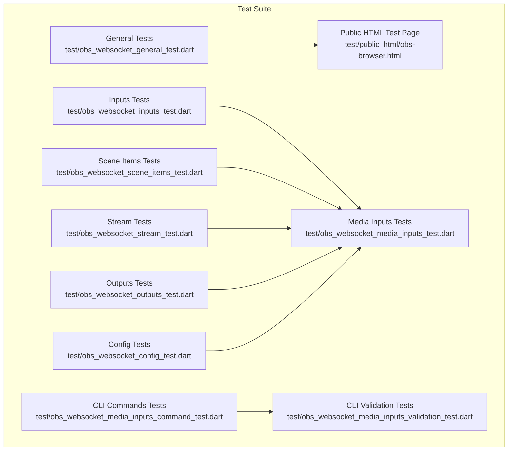

**Diagram sources**
- [test/obs_websocket_general_test.dart:1-98](file://test/obs_websocket_general_test.dart#L1-L98)
- [test/obs_websocket_inputs_test.dart:1-244](file://test/obs_websocket_inputs_test.dart#L1-L244)
- [test/obs_websocket_scene_items_test.dart:1-58](file://test/obs_websocket_scene_items_test.dart#L1-L58)
- [test/obs_websocket_stream_test.dart:1-26](file://test/obs_websocket_stream_test.dart#L1-L26)
- [test/obs_websocket_outputs_test.dart:1-24](file://test/obs_websocket_outputs_test.dart#L1-L24)
- [test/obs_websocket_config_test.dart:1-58](file://test/obs_websocket_config_test.dart#L1-L58)
- [test/obs_websocket_media_inputs_test.dart:1-444](file://test/obs_websocket_media_inputs_test.dart#L1-L444)
- [test/obs_websocket_media_inputs_command_test.dart:1-504](file://test/obs_websocket_media_inputs_command_test.dart#L1-L504)
- [test/obs_websocket_media_inputs_validation_test.dart:1-260](file://test/obs_websocket_media_inputs_validation_test.dart#L1-L260)
- [test/public_html/obs-browser.html:1-34](file://test/public_html/obs-browser.html#L1-L34)

**Section sources**
- [test/obs_websocket_general_test.dart:1-98](file://test/obs_websocket_general_test.dart#L1-L98)
- [test/obs_websocket_inputs_test.dart:1-244](file://test/obs_websocket_inputs_test.dart#L1-L244)
- [test/obs_websocket_scene_items_test.dart:1-58](file://test/obs_websocket_scene_items_test.dart#L1-L58)
- [test/obs_websocket_stream_test.dart:1-26](file://test/obs_websocket_stream_test.dart#L1-L26)
- [test/obs_websocket_outputs_test.dart:1-24](file://test/obs_websocket_outputs_test.dart#L1-L24)
- [test/obs_websocket_config_test.dart:1-58](file://test/obs_websocket_config_test.dart#L1-L58)
- [test/obs_websocket_media_inputs_test.dart:1-444](file://test/obs_websocket_media_inputs_test.dart#L1-L444)
- [test/obs_websocket_media_inputs_command_test.dart:1-504](file://test/obs_websocket_media_inputs_command_test.dart#L1-L504)
- [test/obs_websocket_media_inputs_validation_test.dart:1-260](file://test/obs_websocket_media_inputs_validation_test.dart#L1-L260)
- [test/public_html/obs-browser.html:1-34](file://test/public_html/obs-browser.html#L1-L34)

## Core Components
- Functional Areas and Coverage
  - General: Validates basic API responses and model parsing for general requests.
  - Inputs: Exercises input listing, creation/removal, settings retrieval/updates, mute toggles, and volume queries.
  - Scenes: Verifies scene item listing and lock/unlock operations.
  - Stream: Confirms stream status parsing and response handling.
  - Outputs: Tests replay buffer toggle and related status fields.
  - Configuration: Covers persistent data and scene collection listing.
  - Media Inputs: Comprehensive coverage of media input status, cursor manipulation, offsets, and actions; includes enum and serialization tests.
  - CLI Commands: Argument parsing and validation for media input commands.
  - Browser Integration: Provides a static HTML page for browser-based event testing.

- Test Organization
  - Each functional area has its own test file, grouping related tests with descriptive names.
  - Tests use synthetic JSON responses to simulate OBS WebSocket responses, enabling deterministic unit tests without external dependencies.

- Mock Implementation Strategy
  - Tests rely on decoding pre-defined JSON payloads and constructing model objects via generated serializers.
  - No real OBS instance is required; tests validate parsing and model behavior deterministically.

- Test Data Management
  - JSON fixtures are embedded directly in tests as decoded maps, ensuring reproducibility and self-containment.
  - Enum and model tests validate serialization/deserialization and edge cases (e.g., nulls, unknown states).

- Cleanup Procedures
  - No persistent resources are created during tests; cleanup is implicit through Dart’s test lifecycle.

**Section sources**
- [test/obs_websocket_general_test.dart:1-98](file://test/obs_websocket_general_test.dart#L1-L98)
- [test/obs_websocket_inputs_test.dart:1-244](file://test/obs_websocket_inputs_test.dart#L1-L244)
- [test/obs_websocket_scene_items_test.dart:1-58](file://test/obs_websocket_scene_items_test.dart#L1-L58)
- [test/obs_websocket_stream_test.dart:1-26](file://test/obs_websocket_stream_test.dart#L1-L26)
- [test/obs_websocket_outputs_test.dart:1-24](file://test/obs_websocket_outputs_test.dart#L1-L24)
- [test/obs_websocket_config_test.dart:1-58](file://test/obs_websocket_config_test.dart#L1-L58)
- [test/obs_websocket_media_inputs_test.dart:1-444](file://test/obs_websocket_media_inputs_test.dart#L1-L444)
- [test/obs_websocket_media_inputs_command_test.dart:1-504](file://test/obs_websocket_media_inputs_command_test.dart#L1-L504)
- [test/obs_websocket_media_inputs_validation_test.dart:1-260](file://test/obs_websocket_media_inputs_validation_test.dart#L1-L260)

## Architecture Overview
The testing architecture centers on unit tests that validate:
- Request/response parsing and status handling
- Model serialization/deserialization for API responses
- CLI argument parsing and validation logic
- Browser event integration via a static HTML page

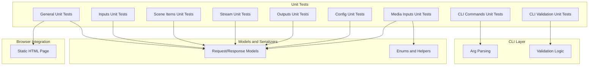

**Diagram sources**
- [test/obs_websocket_general_test.dart:1-98](file://test/obs_websocket_general_test.dart#L1-L98)
- [test/obs_websocket_inputs_test.dart:1-244](file://test/obs_websocket_inputs_test.dart#L1-L244)
- [test/obs_websocket_scene_items_test.dart:1-58](file://test/obs_websocket_scene_items_test.dart#L1-L58)
- [test/obs_websocket_stream_test.dart:1-26](file://test/obs_websocket_stream_test.dart#L1-L26)
- [test/obs_websocket_outputs_test.dart:1-24](file://test/obs_websocket_outputs_test.dart#L1-L24)
- [test/obs_websocket_config_test.dart:1-58](file://test/obs_websocket_config_test.dart#L1-L58)
- [test/obs_websocket_media_inputs_test.dart:1-444](file://test/obs_websocket_media_inputs_test.dart#L1-L444)
- [test/obs_websocket_media_inputs_command_test.dart:1-504](file://test/obs_websocket_media_inputs_command_test.dart#L1-L504)
- [test/obs_websocket_media_inputs_validation_test.dart:1-260](file://test/obs_websocket_media_inputs_validation_test.dart#L1-L260)
- [test/public_html/obs-browser.html:1-34](file://test/public_html/obs-browser.html#L1-L34)

## Detailed Component Analysis

### General Tests
- Purpose: Validate top-level API responses and model parsing for general requests.
- Coverage:
  - GetVersion, GetStats, CallVendorRequest, GetHotkeyList
  - Ensures opcode and request response parsing correctness
- Test Data: Embedded JSON fixtures decoded into Dart structures and validated against expected fields.

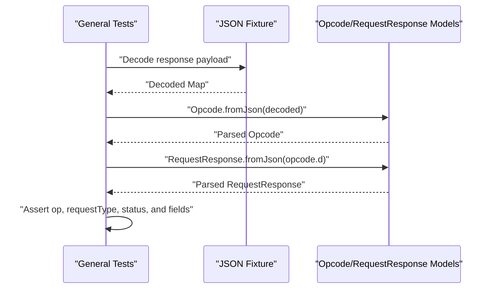

**Diagram sources**
- [test/obs_websocket_general_test.dart:7-22](file://test/obs_websocket_general_test.dart#L7-L22)
- [test/obs_websocket_general_test.dart:24-39](file://test/obs_websocket_general_test.dart#L24-L39)
- [test/obs_websocket_general_test.dart:41-58](file://test/obs_websocket_general_test.dart#L41-L58)
- [test/obs_websocket_general_test.dart:60-77](file://test/obs_websocket_general_test.dart#L60-L77)
- [test/obs_websocket_general_test.dart:79-96](file://test/obs_websocket_general_test.dart#L79-L96)

**Section sources**
- [test/obs_websocket_general_test.dart:1-98](file://test/obs_websocket_general_test.dart#L1-L98)

### Inputs Tests
- Purpose: Validate input listing, kinds, special inputs, creation/removal, renaming, default settings, settings retrieval/updates, mute toggles, and volume queries.
- Coverage:
  - GetInputList, GetInputKindList, GetSpecialInputs
  - CreateInput, RemoveInput, SetInputName
  - GetInputDefaultSettings, GetInputSettings, SetInputSettings
  - GetInputMute, SetInputMute, ToggleInputMute
  - GetInputVolume
- Test Data: Embedded JSON fixtures for each operation, asserting response shapes and field values.

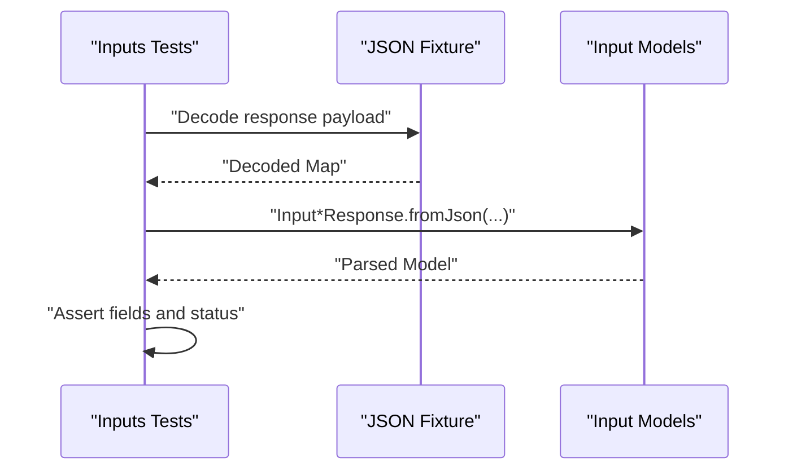

**Diagram sources**
- [test/obs_websocket_inputs_test.dart:7-24](file://test/obs_websocket_inputs_test.dart#L7-L24)
- [test/obs_websocket_inputs_test.dart:26-43](file://test/obs_websocket_inputs_test.dart#L26-L43)
- [test/obs_websocket_inputs_test.dart:45-62](file://test/obs_websocket_inputs_test.dart#L45-L62)
- [test/obs_websocket_inputs_test.dart:64-84](file://test/obs_websocket_inputs_test.dart#L64-L84)
- [test/obs_websocket_inputs_test.dart:86-99](file://test/obs_websocket_inputs_test.dart#L86-L99)
- [test/obs_websocket_inputs_test.dart:101-114](file://test/obs_websocket_inputs_test.dart#L101-L114)
- [test/obs_websocket_inputs_test.dart:116-136](file://test/obs_websocket_inputs_test.dart#L116-L136)
- [test/obs_websocket_inputs_test.dart:138-155](file://test/obs_websocket_inputs_test.dart#L138-L155)
- [test/obs_websocket_inputs_test.dart:157-170](file://test/obs_websocket_inputs_test.dart#L157-L170)
- [test/obs_websocket_inputs_test.dart:172-189](file://test/obs_websocket_inputs_test.dart#L172-L189)
- [test/obs_websocket_inputs_test.dart:191-204](file://test/obs_websocket_inputs_test.dart#L191-L204)
- [test/obs_websocket_inputs_test.dart:206-223](file://test/obs_websocket_inputs_test.dart#L206-L223)
- [test/obs_websocket_inputs_test.dart:225-242](file://test/obs_websocket_inputs_test.dart#L225-L242)

**Section sources**
- [test/obs_websocket_inputs_test.dart:1-244](file://test/obs_websocket_inputs_test.dart#L1-L244)

### Scene Items Tests
- Purpose: Validate scene item listing and locking operations.
- Coverage:
  - GetSceneItemList, GetSceneItemLocked, SetSceneItemLocked
- Test Data: Embedded JSON fixtures for scene items and lock status.

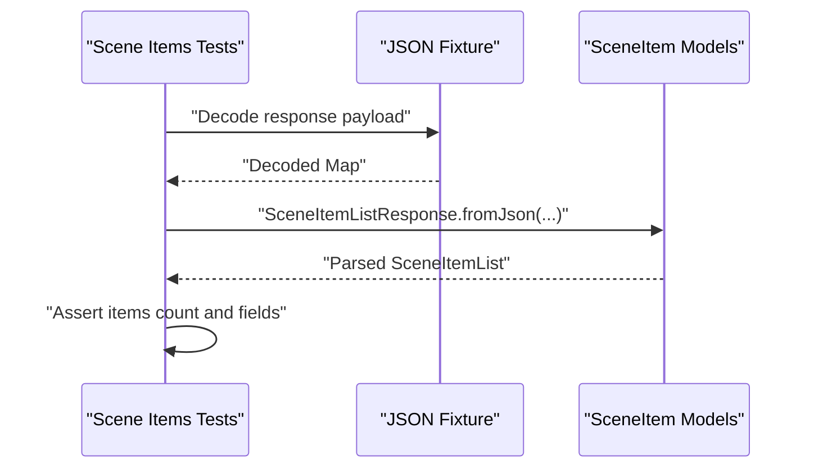

**Diagram sources**
- [test/obs_websocket_scene_items_test.dart:7-24](file://test/obs_websocket_scene_items_test.dart#L7-L24)
- [test/obs_websocket_scene_items_test.dart:26-41](file://test/obs_websocket_scene_items_test.dart#L26-L41)
- [test/obs_websocket_scene_items_test.dart:43-56](file://test/obs_websocket_scene_items_test.dart#L43-L56)

**Section sources**
- [test/obs_websocket_scene_items_test.dart:1-58](file://test/obs_websocket_scene_items_test.dart#L1-L58)

### Stream Tests
- Purpose: Validate stream status parsing and response handling.
- Coverage:
  - GetStreamStatus
- Test Data: Embedded JSON fixture for stream status.

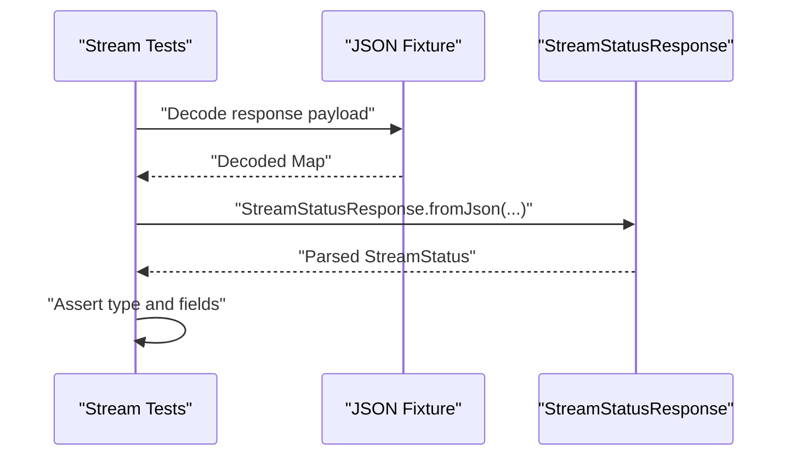

**Diagram sources**
- [test/obs_websocket_stream_test.dart:7-24](file://test/obs_websocket_stream_test.dart#L7-L24)

**Section sources**
- [test/obs_websocket_stream_test.dart:1-26](file://test/obs_websocket_stream_test.dart#L1-L26)

### Outputs Tests
- Purpose: Validate output-related operations (e.g., replay buffer toggle).
- Coverage:
  - ToggleReplayBuffer
- Test Data: Embedded JSON fixture for output status.

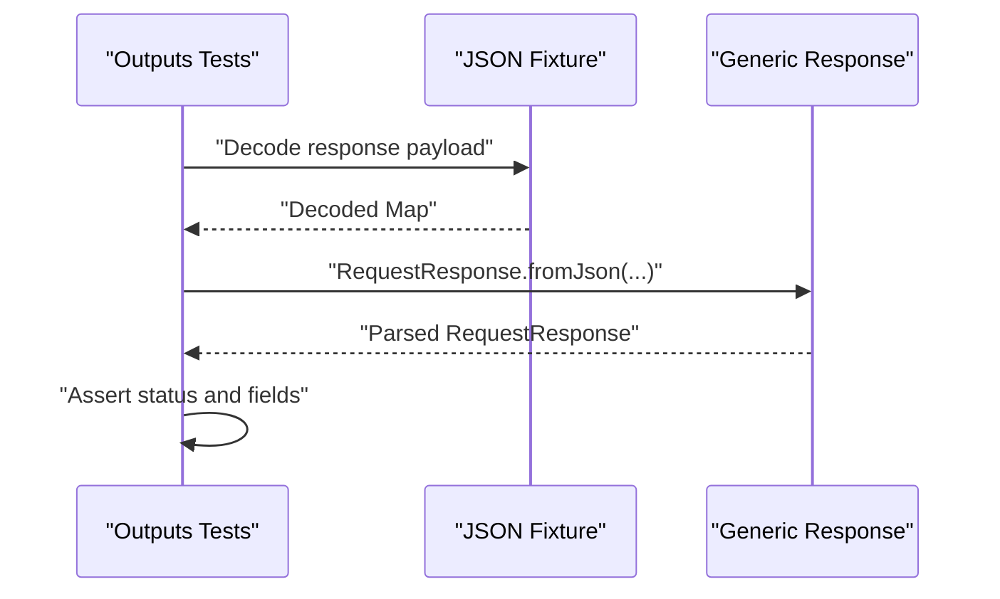

**Diagram sources**
- [test/obs_websocket_outputs_test.dart:7-22](file://test/obs_websocket_outputs_test.dart#L7-L22)

**Section sources**
- [test/obs_websocket_outputs_test.dart:1-24](file://test/obs_websocket_outputs_test.dart#L1-L24)

### Configuration Tests
- Purpose: Validate configuration and persistence operations.
- Coverage:
  - GetPersistentData, SetPersistentData, GetSceneCollectionList
- Test Data: Embedded JSON fixtures for persistent data and scene collections.

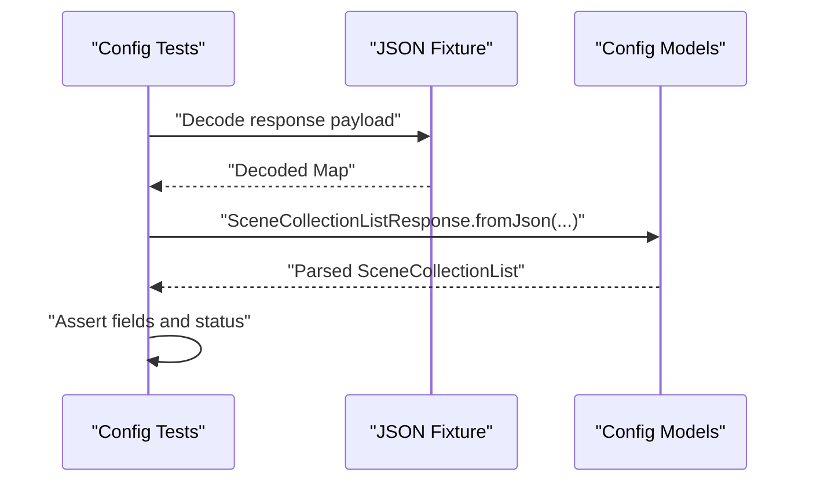

**Diagram sources**
- [test/obs_websocket_config_test.dart:7-22](file://test/obs_websocket_config_test.dart#L7-L22)
- [test/obs_websocket_config_test.dart:24-37](file://test/obs_websocket_config_test.dart#L24-L37)
- [test/obs_websocket_config_test.dart:39-56](file://test/obs_websocket_config_test.dart#L39-L56)

**Section sources**
- [test/obs_websocket_config_test.dart:1-58](file://test/obs_websocket_config_test.dart#L1-L58)

### Media Inputs Tests
- Purpose: Comprehensive validation of media input operations, enums, and serialization.
- Coverage:
  - GetMediaInputStatus (by name/uuid, various states, nulls, errors)
  - SetMediaInputCursor, OffsetMediaInputCursor
  - TriggerMediaInputAction (all supported actions)
  - ObsMediaInputAction and ObsMediaState enums
  - MediaInputStatusResponse serialization/deserialization and toString
  - Error response handling
- Test Data: Extensive JSON fixtures for all scenarios.

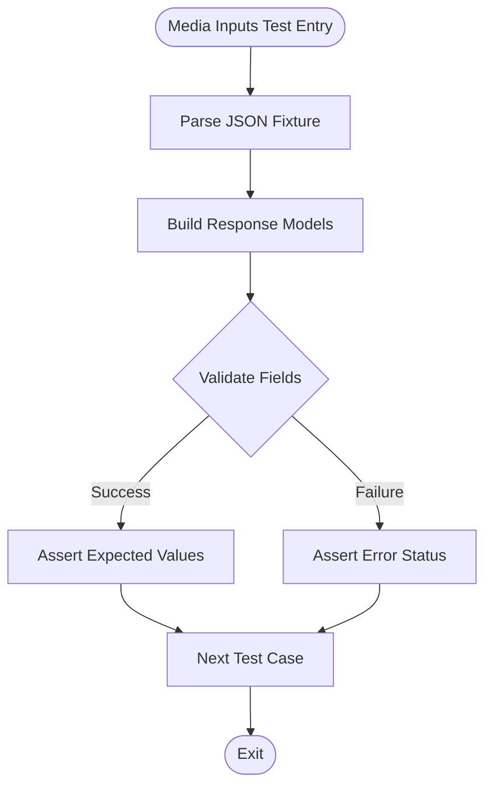

**Diagram sources**
- [test/obs_websocket_media_inputs_test.dart:8-26](file://test/obs_websocket_media_inputs_test.dart#L8-L26)
- [test/obs_websocket_media_inputs_test.dart:28-46](file://test/obs_websocket_media_inputs_test.dart#L28-L46)
- [test/obs_websocket_media_inputs_test.dart:48-86](file://test/obs_websocket_media_inputs_test.dart#L48-L86)
- [test/obs_websocket_media_inputs_test.dart:88-106](file://test/obs_websocket_media_inputs_test.dart#L88-L106)
- [test/obs_websocket_media_inputs_test.dart:108-121](file://test/obs_websocket_media_inputs_test.dart#L108-L121)
- [test/obs_websocket_media_inputs_test.dart:123-151](file://test/obs_websocket_media_inputs_test.dart#L123-L151)
- [test/obs_websocket_media_inputs_test.dart:153-211](file://test/obs_websocket_media_inputs_test.dart#L153-L211)
- [test/obs_websocket_media_inputs_test.dart:213-241](file://test/obs_websocket_media_inputs_test.dart#L213-L241)
- [test/obs_websocket_media_inputs_test.dart:244-273](file://test/obs_websocket_media_inputs_test.dart#L244-L273)
- [test/obs_websocket_media_inputs_test.dart:275-325](file://test/obs_websocket_media_inputs_test.dart#L275-L325)
- [test/obs_websocket_media_inputs_test.dart:327-376](file://test/obs_websocket_media_inputs_test.dart#L327-L376)
- [test/obs_websocket_media_inputs_test.dart:378-441](file://test/obs_websocket_media_inputs_test.dart#L378-L441)

**Section sources**
- [test/obs_websocket_media_inputs_test.dart:1-444](file://test/obs_websocket_media_inputs_test.dart#L1-L444)

### CLI Commands Tests
- Purpose: Validate argument parsing and help text for media input commands.
- Coverage:
  - ObsMediaInputsCommand and subcommands
  - Argument options, descriptions, and allowed values
  - Help parsing across subcommands
- Test Data: Uses the args CommandRunner to parse command-line arguments and assert parsed results.

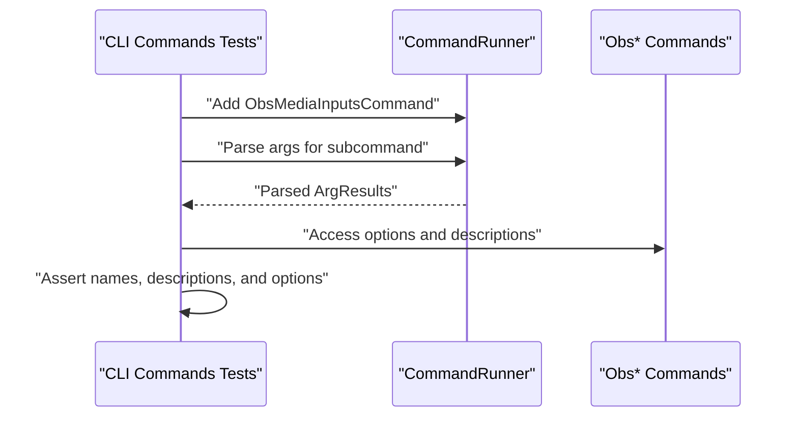

**Diagram sources**
- [test/obs_websocket_media_inputs_command_test.dart:9-12](file://test/obs_websocket_media_inputs_command_test.dart#L9-L12)
- [test/obs_websocket_media_inputs_command_test.dart:15-52](file://test/obs_websocket_media_inputs_command_test.dart#L15-L52)
- [test/obs_websocket_media_inputs_command_test.dart:56-117](file://test/obs_websocket_media_inputs_command_test.dart#L56-L117)
- [test/obs_websocket_media_inputs_command_test.dart:120-161](file://test/obs_websocket_media_inputs_command_test.dart#L120-L161)
- [test/obs_websocket_media_inputs_command_test.dart:164-233](file://test/obs_websocket_media_inputs_command_test.dart#L164-L233)
- [test/obs_websocket_media_inputs_command_test.dart:236-274](file://test/obs_websocket_media_inputs_command_test.dart#L236-L274)
- [test/obs_websocket_media_inputs_command_test.dart:277-355](file://test/obs_websocket_media_inputs_command_test.dart#L277-L355)
- [test/obs_websocket_media_inputs_command_test.dart:431-501](file://test/obs_websocket_media_inputs_command_test.dart#L431-L501)

**Section sources**
- [test/obs_websocket_media_inputs_command_test.dart:1-504](file://test/obs_websocket_media_inputs_command_test.dart#L1-L504)

### CLI Validation Tests
- Purpose: Validate validation logic for media input commands (cursor, offsets, input parameters, actions).
- Coverage:
  - validateMediaCursor, validateMediaCursorOffset, validateInputParameters, validateMediaAction
  - Edge cases: nulls, invalid types, negatives, allowed actions
- Test Data: Inline validation helpers tested in isolation.

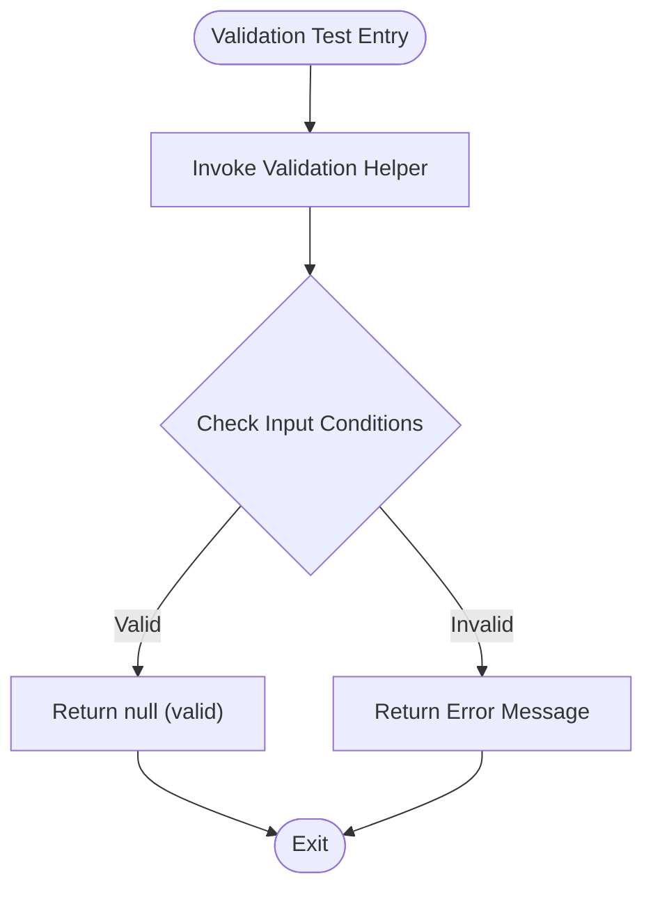

**Diagram sources**
- [test/obs_websocket_media_inputs_validation_test.dart:4-19](file://test/obs_websocket_media_inputs_validation_test.dart#L4-L19)
- [test/obs_websocket_media_inputs_validation_test.dart:22-34](file://test/obs_websocket_media_inputs_validation_test.dart#L22-L34)
- [test/obs_websocket_media_inputs_validation_test.dart:37-45](file://test/obs_websocket_media_inputs_validation_test.dart#L37-L45)
- [test/obs_websocket_media_inputs_validation_test.dart:48-67](file://test/obs_websocket_media_inputs_validation_test.dart#L48-L67)
- [test/obs_websocket_media_inputs_validation_test.dart:72-127](file://test/obs_websocket_media_inputs_validation_test.dart#L72-L127)
- [test/obs_websocket_media_inputs_validation_test.dart:129-161](file://test/obs_websocket_media_inputs_validation_test.dart#L129-L161)
- [test/obs_websocket_media_inputs_validation_test.dart:163-185](file://test/obs_websocket_media_inputs_validation_test.dart#L163-L185)
- [test/obs_websocket_media_inputs_validation_test.dart:187-215](file://test/obs_websocket_media_inputs_validation_test.dart#L187-L215)
- [test/obs_websocket_media_inputs_validation_test.dart:217-257](file://test/obs_websocket_media_inputs_validation_test.dart#L217-L257)

**Section sources**
- [test/obs_websocket_media_inputs_validation_test.dart:1-260](file://test/obs_websocket_media_inputs_validation_test.dart#L1-L260)

### Browser Integration Test Page
- Purpose: Provide a minimal HTML page to test browser-source events and custom events in OBS.
- Usage:
  - Serve locally and reference in a browser source scene.
  - Emit custom events from Dart and observe updates in the page.

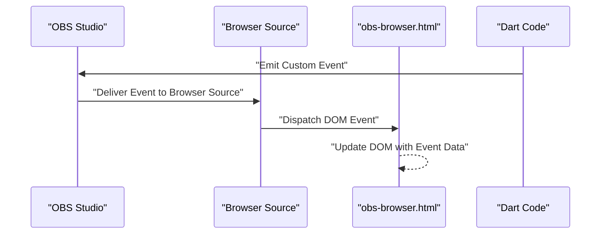

**Diagram sources**
- [test/public_html/obs-browser.html:18-27](file://test/public_html/obs-browser.html#L18-L27)

**Section sources**
- [test/public_html/obs-browser.html:1-34](file://test/public_html/obs-browser.html#L1-L34)

## Dependency Analysis
- Testing Dependencies
  - The project uses the test framework for unit tests and the args package for CLI command parsing.
  - Generated models and serializers are used to parse JSON fixtures into typed Dart objects.
- Continuous Integration
  - GitHub Actions job installs Dart, runs formatting verification, static analysis, and executes the test suite.

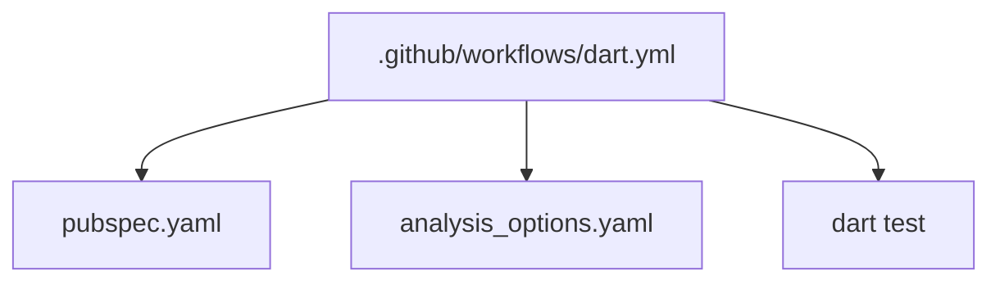

**Diagram sources**
- [.github/workflows/dart.yml:18-45](file://.github/workflows/dart.yml#L18-L45)
- [pubspec.yaml:24-34](file://pubspec.yaml#L24-L34)
- [analysis_options.yaml:1-24](file://analysis_options.yaml#L1-L24)

**Section sources**
- [.github/workflows/dart.yml:1-46](file://.github/workflows/dart.yml#L1-L46)
- [pubspec.yaml:1-38](file://pubspec.yaml#L1-L38)
- [analysis_options.yaml:1-24](file://analysis_options.yaml#L1-L24)

## Performance Considerations
- Unit tests are fast and deterministic because they operate on in-memory JSON fixtures and model parsing.
- Avoid adding network-dependent tests to the unit suite; keep them isolated to integration tests if needed.
- Keep test fixtures concise and focused to minimize overhead.

## Troubleshooting Guide
- Fixtures and Parsing
  - If a test fails due to parsing, inspect the JSON fixture and the corresponding model constructor to ensure field names and types match.
  - Validate that generated serializers are up to date and that the model supports nullable fields when applicable.
- CLI Argument Parsing
  - If CLI tests fail, verify the argument names, descriptions, and allowed values in the command definitions.
  - Confirm help parsing works across subcommands.
- Browser Events
  - Ensure the local server is running and the browser source scene references the correct URL.
  - Confirm the event name matches between Dart emission and the HTML event listener.
- Continuous Integration
  - If CI fails, review the logs for formatting, analysis, or test failures. Run the same commands locally to reproduce.

**Section sources**
- [test/obs_websocket_general_test.dart:1-98](file://test/obs_websocket_general_test.dart#L1-L98)
- [test/obs_websocket_inputs_test.dart:1-244](file://test/obs_websocket_inputs_test.dart#L1-L244)
- [test/obs_websocket_scene_items_test.dart:1-58](file://test/obs_websocket_scene_items_test.dart#L1-L58)
- [test/obs_websocket_stream_test.dart:1-26](file://test/obs_websocket_stream_test.dart#L1-L26)
- [test/obs_websocket_outputs_test.dart:1-24](file://test/obs_websocket_outputs_test.dart#L1-L24)
- [test/obs_websocket_config_test.dart:1-58](file://test/obs_websocket_config_test.dart#L1-L58)
- [test/obs_websocket_media_inputs_test.dart:1-444](file://test/obs_websocket_media_inputs_test.dart#L1-L444)
- [test/obs_websocket_media_inputs_command_test.dart:1-504](file://test/obs_websocket_media_inputs_command_test.dart#L1-L504)
- [test/obs_websocket_media_inputs_validation_test.dart:1-260](file://test/obs_websocket_media_inputs_validation_test.dart#L1-L260)
- [test/public_html/obs-browser.html:1-34](file://test/public_html/obs-browser.html#L1-L34)
- [.github/workflows/dart.yml:18-45](file://.github/workflows/dart.yml#L18-L45)

## Conclusion
The test suite is well-organized by functional areas, uses deterministic fixtures for unit tests, and validates both API parsing and CLI argument handling. The CI pipeline enforces formatting, static analysis, and test execution. For broader integration scenarios, the browser test page enables manual verification of browser-source events.

## Appendices
- Guidelines for Writing New Tests
  - Place tests in the appropriate functional file or create a new one if needed.
  - Add a small, representative JSON fixture and decode it into a Dart map for parsing.
  - Use model constructors to parse the decoded data and assert expected fields.
  - For CLI tests, define argument options and descriptions, and add help parsing assertions.
  - For validation logic, write focused tests around helper functions and edge cases.
- Test Coverage Requirements
  - Aim to cover all major request/response pairs for each functional area.
  - Include error scenarios and edge cases (nulls, invalid types, missing parameters).
- Continuous Integration
  - Ensure formatting and analysis pass locally before pushing changes.
  - Review CI logs for failures and resolve them promptly.