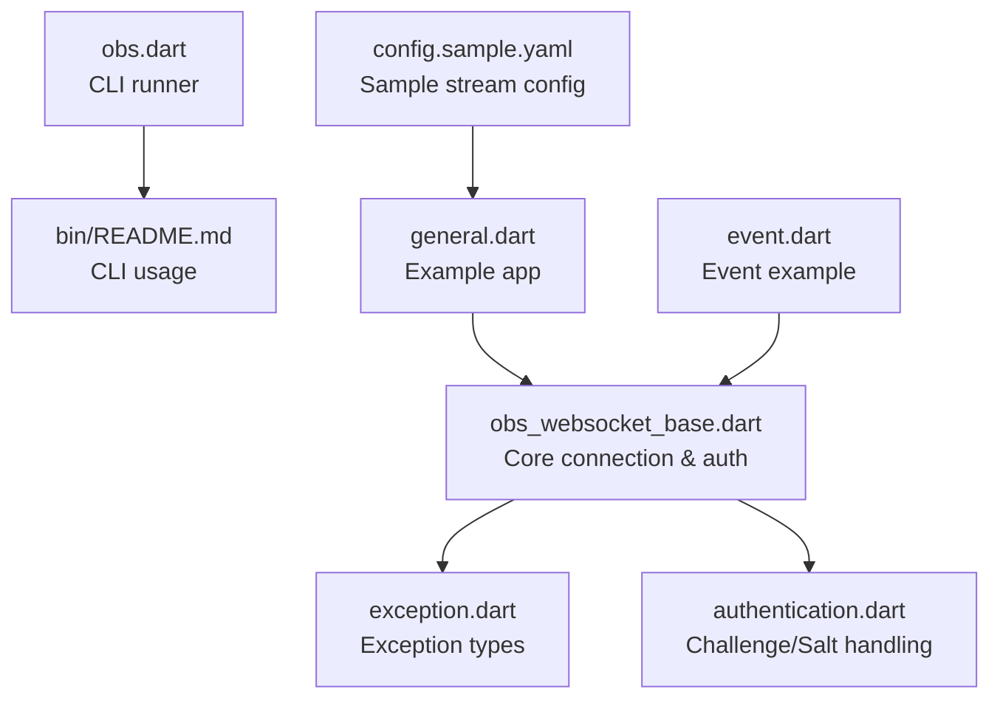
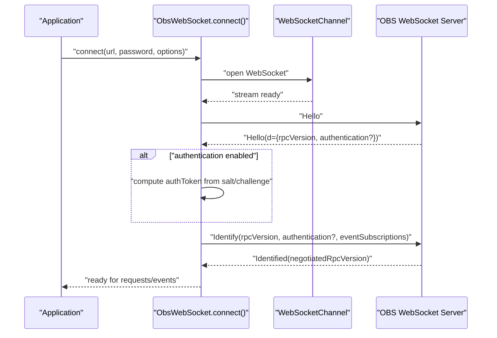
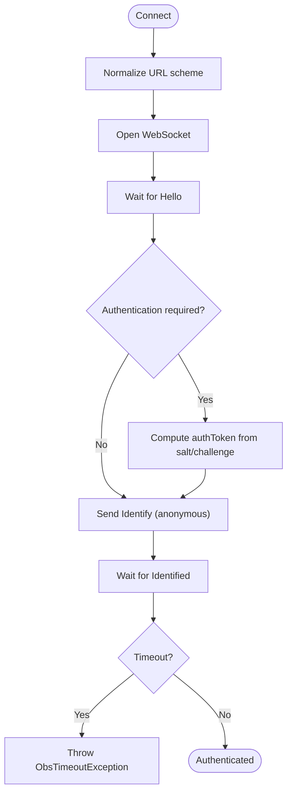
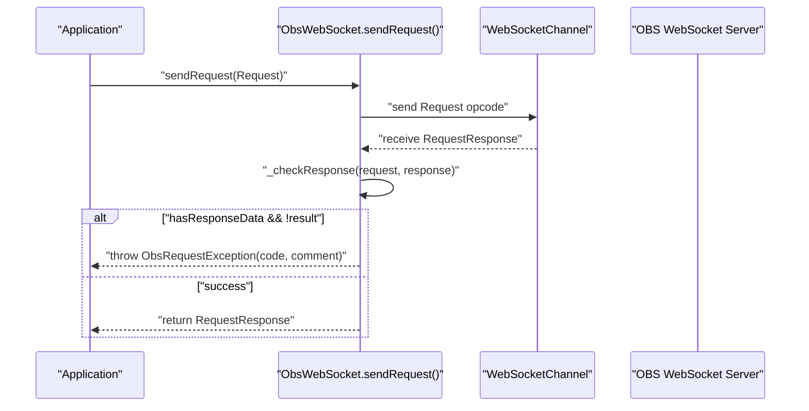
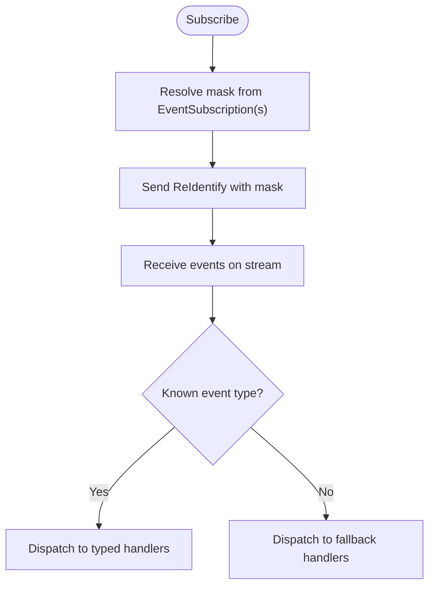
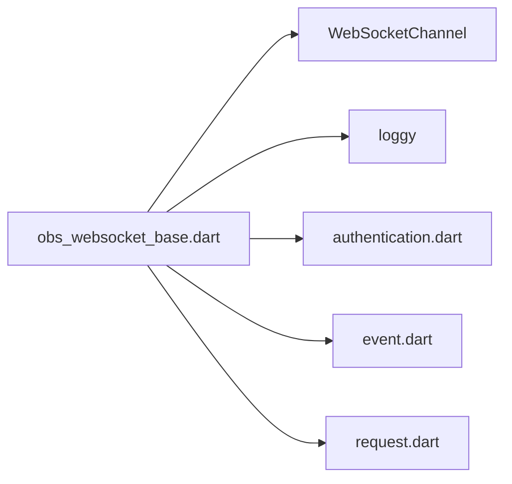

# Troubleshooting and FAQ

<cite>
**Referenced Files in This Document**
- [README.md](file://README.md)
- [obs_websocket_base.dart](file://lib/src/obs_websocket_base.dart)
- [exception.dart](file://lib/src/exception.dart)
- [obs.dart](file://bin/obs.dart)
- [README.md](file://bin/README.md)
- [general.dart](file://example/general.dart)
- [event.dart](file://example/event.dart)
- [config.sample.yaml](file://example/config.sample.yaml)
- [authentication.dart](file://lib/src/model/comm/authentication.dart)
</cite>

## Table of Contents
1. [Introduction](#introduction)
2. [Project Structure](#project-structure)
3. [Core Components](#core-components)
4. [Architecture Overview](#architecture-overview)
5. [Detailed Component Analysis](#detailed-component-analysis)
6. [Dependency Analysis](#dependency-analysis)
7. [Performance Considerations](#performance-considerations)
8. [Troubleshooting Guide](#troubleshooting-guide)
9. [Conclusion](#conclusion)
10. [Appendices](#appendices)

## Introduction
This document provides comprehensive troubleshooting and Frequently Asked Questions for the obs-websocket-dart library. It focuses on diagnosing and resolving connection and authentication issues, interpreting error codes, optimizing performance, debugging WebSocket communication and event handling, and addressing platform-specific and integration concerns. It also covers migration considerations from older obs-websocket protocol versions.

## Project Structure
The repository is a Dart package that exposes a high-level API for OBS Studio via the obs-websocket protocol. Key areas relevant to troubleshooting:
- Library entry points and exports
- Core connection and authentication logic
- Exception types and error semantics
- CLI tooling for diagnostics
- Examples demonstrating logging, event subscriptions, and request handling
- Configuration samples for stream settings

**Diagram sources**
- [obs_websocket_base.dart:118-169](file://lib/src/obs_websocket_base.dart#L118-L169)
- [exception.dart:19-76](file://lib/src/exception.dart#L19-L76)
- [authentication.dart:8-12](file://lib/src/model/comm/authentication.dart#L8-L12)
- [obs.dart:6-56](file://bin/obs.dart#L6-L56)
- [README.md:1-125](file://bin/README.md#L1-L125)
- [general.dart:1-152](file://example/general.dart#L1-L152)
- [event.dart:1-44](file://example/event.dart#L1-L44)
- [config.sample.yaml:1-8](file://example/config.sample.yaml#L1-L8)

**Section sources**
- [README.md:1-120](file://README.md#L1-L120)
- [obs_websocket_base.dart:118-169](file://lib/src/obs_websocket_base.dart#L118-L169)
- [obs.dart:6-56](file://bin/obs.dart#L6-L56)
- [README.md:1-125](file://bin/README.md#L1-L125)
- [general.dart:1-152](file://example/general.dart#L1-L152)
- [event.dart:1-44](file://example/event.dart#L1-L44)
- [config.sample.yaml:1-8](file://example/config.sample.yaml#L1-L8)

## Core Components
- Connection and authentication: Establishes WebSocket, performs handshake, optional authentication, and sets up event subscriptions.
- Request/response pipeline: Manages request IDs, timeouts, and response validation.
- Exception model: Provides structured exceptions for authentication failures, request errors, timeouts, and protocol decoding issues.
- CLI diagnostics: Offers commands to authorize, listen to events, and send low-level requests for quick checks.
- Examples: Demonstrate logging, event subscription masks, and request patterns.

Key implementation references:
- Connection establishment and logging: [obs_websocket_base.dart:142-169](file://lib/src/obs_websocket_base.dart#L142-L169)
- Handshake and authentication flow: [obs_websocket_base.dart:260-318](file://lib/src/obs_websocket_base.dart#L260-L318)
- Request dispatch and timeout handling: [obs_websocket_base.dart:477-503](file://lib/src/obs_websocket_base.dart#L477-L503)
- Response validation and error propagation: [obs_websocket_base.dart:505-513](file://lib/src/obs_websocket_base.dart#L505-L513)
- Exception types: [exception.dart:19-76](file://lib/src/exception.dart#L19-L76)
- CLI argument parsing and commands: [obs.dart:6-56](file://bin/obs.dart#L6-L56)
- CLI usage and commands: [README.md:1-125](file://bin/README.md#L1-L125)
- Example logging and subscriptions: [general.dart:10-19](file://example/general.dart#L10-L19), [event.dart:10-21](file://example/event.dart#L10-L21)

**Section sources**
- [obs_websocket_base.dart:142-169](file://lib/src/obs_websocket_base.dart#L142-L169)
- [obs_websocket_base.dart:260-318](file://lib/src/obs_websocket_base.dart#L260-L318)
- [obs_websocket_base.dart:477-503](file://lib/src/obs_websocket_base.dart#L477-L503)
- [obs_websocket_base.dart:505-513](file://lib/src/obs_websocket_base.dart#L505-L513)
- [exception.dart:19-76](file://lib/src/exception.dart#L19-L76)
- [obs.dart:6-56](file://bin/obs.dart#L6-L56)
- [README.md:1-125](file://bin/README.md#L1-L125)
- [general.dart:10-19](file://example/general.dart#L10-L19)
- [event.dart:10-21](file://example/event.dart#L10-L21)

## Architecture Overview
The library orchestrates a WebSocket-based RPC with OBS. The flow includes:
- Establishing a WebSocket channel
- Exchanging handshake opcodes (Hello/Identify)
- Optional authentication using challenge/salt
- Subscribing to events
- Sending requests and receiving responses with request IDs
- Handling timeouts and protocol errors

**Diagram sources**
- [obs_websocket_base.dart:130-169](file://lib/src/obs_websocket_base.dart#L130-L169)
- [obs_websocket_base.dart:260-318](file://lib/src/obs_websocket_base.dart#L260-L318)
- [authentication.dart:8-12](file://lib/src/model/comm/authentication.dart#L8-L12)

**Section sources**
- [obs_websocket_base.dart:130-169](file://lib/src/obs_websocket_base.dart#L130-L169)
- [obs_websocket_base.dart:260-318](file://lib/src/obs_websocket_base.dart#L260-L318)
- [authentication.dart:8-12](file://lib/src/model/comm/authentication.dart#L8-L12)

## Detailed Component Analysis

### Connection and Authentication Flow
Common issues:
- Incorrect scheme or missing scheme in URL
- Wrong password or authentication mismatch
- OBS not exposing the WebSocket server or firewall blocking
- Slow or interrupted handshake timing out

Diagnostic steps:
- Verify URL scheme is ws:// or wss://; the library normalizes missing scheme
- Confirm OBS WebSocket settings and password
- Use CLI to authorize and test connectivity
- Enable debug logs to inspect handshake opcodes and negotiated RPC version

**Diagram sources**
- [obs_websocket_base.dart:145-147](file://lib/src/obs_websocket_base.dart#L145-L147)
- [obs_websocket_base.dart:260-318](file://lib/src/obs_websocket_base.dart#L260-L318)

**Section sources**
- [obs_websocket_base.dart:145-147](file://lib/src/obs_websocket_base.dart#L145-L147)
- [obs_websocket_base.dart:260-318](file://lib/src/obs_websocket_base.dart#L260-L318)

### Request Pipeline and Error Propagation
Common issues:
- Request timeouts due to slow OBS or heavy load
- Non-success request status codes returned by OBS
- Malformed responses or protocol mismatches

Diagnostic steps:
- Increase requestTimeout if legitimate delays are expected
- Inspect requestStatus.code and comment for actionable hints
- Enable debug logs to correlate request IDs with responses

**Diagram sources**
- [obs_websocket_base.dart:477-503](file://lib/src/obs_websocket_base.dart#L477-L503)
- [obs_websocket_base.dart:505-513](file://lib/src/obs_websocket_base.dart#L505-L513)

**Section sources**
- [obs_websocket_base.dart:477-503](file://lib/src/obs_websocket_base.dart#L477-L503)
- [obs_websocket_base.dart:505-513](file://lib/src/obs_websocket_base.dart#L505-L513)

### Event Handling and Subscriptions
Common issues:
- Missing or incorrect event subscription masks
- Unhandled events falling back to fallback handlers
- High-volume events overwhelming consumers

Diagnostic steps:
- Use subscribe() with EventSubscription masks or bitwise combinations
- Implement fallbackEventHandler to capture unknown events
- Reduce high-volume subscriptions (e.g., inputVolumeMeters) when not needed

**Diagram sources**
- [obs_websocket_base.dart:354-372](file://lib/src/obs_websocket_base.dart#L354-L372)
- [obs_websocket_base.dart:375-395](file://lib/src/obs_websocket_base.dart#L375-L395)
- [obs_websocket_base.dart:431-446](file://lib/src/obs_websocket_base.dart#L431-L446)

**Section sources**
- [obs_websocket_base.dart:354-372](file://lib/src/obs_websocket_base.dart#L354-L372)
- [obs_websocket_base.dart:375-395](file://lib/src/obs_websocket_base.dart#L375-L395)
- [obs_websocket_base.dart:431-446](file://lib/src/obs_websocket_base.dart#L431-L446)

### CLI Diagnostics
Use the CLI to quickly verify connectivity and inspect events:
- authorize: generate credentials file
- listen: stream events to stdout
- send: low-level request testing
- Version and stats queries for environment insights

References:
- CLI commands and usage: [README.md:1-125](file://bin/README.md#L1-L125)
- CLI argument parsing: [obs.dart:6-56](file://bin/obs.dart#L6-L56)

**Section sources**
- [README.md:1-125](file://bin/README.md#L1-L125)
- [obs.dart:6-56](file://bin/obs.dart#L6-L56)

## Dependency Analysis
The core module depends on:
- WebSocket channel abstraction for transport
- Logging framework for diagnostics
- Protocol models for handshake and authentication
- Event subscription masks for selective event delivery

**Diagram sources**
- [obs_websocket_base.dart:1-10](file://lib/src/obs_websocket_base.dart#L1-L10)
- [authentication.dart:1-21](file://lib/src/model/comm/authentication.dart#L1-L21)

**Section sources**
- [obs_websocket_base.dart:1-10](file://lib/src/obs_websocket_base.dart#L1-L10)
- [authentication.dart:1-21](file://lib/src/model/comm/authentication.dart#L1-L21)

## Performance Considerations
- Prefer batching requests when possible to reduce round-trips
- Limit high-volume event subscriptions to avoid CPU spikes
- Close connections when done to free resources
- Tune requestTimeout for environments with higher latency
- Monitor OBS stats via general.getStats to detect bottlenecks

[No sources needed since this section provides general guidance]

## Troubleshooting Guide

### Connection Problems
Symptoms:
- Immediate disconnect or handshake timeout
- Authentication failures
- No events received despite subscription

Checklist:
- Confirm OBS WebSocket server is enabled and listening on the expected port
- Verify firewall/NAT allows traffic to the OBS host
- Ensure the URL uses ws:// or wss://; the library normalizes missing scheme
- Validate password against OBS settings
- Use CLI authorize and listen to confirm server responsiveness

Resolution steps:
- Re-run CLI authorize to refresh credentials
- Temporarily disable authentication in OBS for testing (not recommended for production)
- Increase requestTimeout during connect if OBS is under heavy load
- Close connections properly to prevent resource leaks

**Section sources**
- [obs_websocket_base.dart:145-147](file://lib/src/obs_websocket_base.dart#L145-L147)
- [obs_websocket_base.dart:130-169](file://lib/src/obs_websocket_base.dart#L130-L169)
- [README.md:165-183](file://bin/README.md#L165-L183)

### Authentication Failures
Symptoms:
- ObsAuthException during handshake
- Identical authToken computation yields mismatch

Checklist:
- Match the exact password configured in OBS
- Ensure salt/challenge are correctly processed
- Confirm RPC version negotiation succeeded

Resolution steps:
- Recreate credentials with CLI authorize
- Verify OBS settings for authentication and RPC version
- Inspect logs for handshake opcodes and negotiated RPC version

**Section sources**
- [obs_websocket_base.dart:260-318](file://lib/src/obs_websocket_base.dart#L260-L318)
- [authentication.dart:8-12](file://lib/src/model/comm/authentication.dart#L8-L12)

### Network Connectivity Issues
Symptoms:
- Timeouts opening WebSocket or during handshake
- Intermittent disconnections

Checklist:
- Test reachability to OBS host/port from client machine
- Check for proxy or VPN interference
- Validate DNS resolution and hostnames

Resolution steps:
- Use CLI send to probe basic connectivity
- Increase connection and request timeouts
- Prefer wss:// for encrypted channels in constrained networks

**Section sources**
- [obs_websocket_base.dart:130-169](file://lib/src/obs_websocket_base.dart#L130-L169)
- [obs_websocket_base.dart:260-318](file://lib/src/obs_websocket_base.dart#L260-L318)

### OBS WebSocket Server Configuration
Symptoms:
- Client connects but receives no events
- Requests fail immediately

Checklist:
- Confirm event subscriptions are enabled and set appropriately
- Verify OBS WebSocket settings align with client expectations
- Review OBS logs for server-side errors

Resolution steps:
- Use CLI listen with appropriate masks
- Adjust eventSubscriptions via subscribe()
- Reconfigure OBS WebSocket server settings

**Section sources**
- [obs_websocket_base.dart:354-372](file://lib/src/obs_websocket_base.dart#L354-L372)
- [README.md:443-476](file://bin/README.md#L443-L476)

### Error Codes and Meanings
Observed error semantics:
- Non-success requestStatus.result triggers ObsRequestException with code and optional comment
- Timeouts trigger ObsTimeoutException with requestType and timeout
- Malformed frames produce protocol warnings and may indicate decoding issues

Resolution steps:
- Log requestStatus.code and comment for targeted fixes
- Increase requestTimeout for transient delays
- Validate request payload and parameters

**Section sources**
- [obs_websocket_base.dart:505-513](file://lib/src/obs_websocket_base.dart#L505-L513)
- [obs_websocket_base.dart:486-494](file://lib/src/obs_websocket_base.dart#L486-L494)
- [exception.dart:34-76](file://lib/src/exception.dart#L34-L76)

### Performance Issues, Memory Leaks, and Resource Management
Symptoms:
- Gradual memory growth or increased CPU usage
- Stalled requests or hanging connections

Checklist:
- Ensure connections are closed after use
- Avoid excessive high-volume event subscriptions
- Monitor OBS stats via general.getStats

Resolution steps:
- Always call close() on ObsWebSocket instances
- Reduce event subscription masks to essential categories
- Batch requests to minimize overhead

**Section sources**
- [obs_websocket_base.dart:398-408](file://lib/src/obs_websocket_base.dart#L398-L408)
- [general.dart:36-42](file://example/general.dart#L36-L42)

### Debugging Techniques
Techniques:
- Enable debug logging to trace opcodes and request IDs
- Use CLI listen to observe real-time events
- Employ CLI send to validate individual requests
- Capture and inspect fallback events for unknown types

References:
- Example logging setup: [general.dart:10-19](file://example/general.dart#L10-L19)
- CLI listen and send: [README.md:443-520](file://bin/README.md#L443-L520)

**Section sources**
- [general.dart:10-19](file://example/general.dart#L10-L19)
- [README.md:443-520](file://bin/README.md#L443-L520)

### Platform-Specific Issues
Windows:
- Antivirus or Windows Defender may block WebSocket ports
- UAC restrictions affecting OBS startup

macOS:
- Firewall settings and Gatekeeper policies
- Homebrew-installed Dart runtime considerations

Linux:
- SELinux/AppArmor policies
- systemd user services and permissions

Resolution steps:
- Temporarily disable protections for testing
- Add exceptions for OBS and Dart binaries
- Run as the same user context as OBS

[No sources needed since this section provides general guidance]

### Common Integration Problems with Flutter Applications
Symptoms:
- Build failures or missing dependencies
- Runtime errors on mobile platforms unsupported by WebSocketChannel

Checklist:
- Verify platform support for WebSocketChannel
- Ensure proper permissions for network access
- Handle app lifecycle events to close connections

Resolution steps:
- Confirm target platform supports web sockets
- Wrap connection logic with platform checks
- Close connections on app termination

[No sources needed since this section provides general guidance]

### Diagnostic Procedures
Step-by-step:
- Use CLI authorize to generate credentials
- Run CLI listen to verify event delivery
- Execute CLI send with a simple request (e.g., GetVersion)
- Enable debug logs in your app and review handshake and request IDs
- Validate OBS stats and resource usage

**Section sources**
- [README.md:165-183](file://bin/README.md#L165-L183)
- [README.md:597-611](file://bin/README.md#L597-L611)
- [general.dart:10-19](file://example/general.dart#L10-L19)

### Frequently Asked Questions

Q: What changed between obs-websocket v4.x and v5.x?
A: Major breaking changes require rewriting code for v5.x. Review the protocol differences and update integrations accordingly.

Q: How do I handle authentication with obs-websocket?
A: Provide the password to connect(); if OBS requires authentication, the library computes the token using challenge/salt.

Q: Why am I getting timeouts?
A: Increase requestTimeout or investigate network latency and OBS load.

Q: How do I subscribe to events?
A: Use subscribe() with EventSubscription masks or bitwise combinations.

Q: What do the request status codes mean?
A: Non-success codes raise ObsRequestException with code and comment for diagnosis.

Q: How do I close connections safely?
A: Always call close() to release resources and avoid performance issues.

Q: Can I integrate with Flutter?
A: Ensure platform support for web sockets; handle lifecycle and permissions carefully.

Q: How do I migrate from older obs-websocket versions?
A: Update to v5.x protocol, rewrite legacy code, and reconfigure OBS WebSocket settings.

**Section sources**
- [README.md:37-40](file://README.md#L37-L40)
- [obs_websocket_base.dart:130-169](file://lib/src/obs_websocket_base.dart#L130-L169)
- [obs_websocket_base.dart:354-372](file://lib/src/obs_websocket_base.dart#L354-L372)
- [obs_websocket_base.dart:505-513](file://lib/src/obs_websocket_base.dart#L505-L513)
- [README.md:483-489](file://README.md#L483-L489)

## Conclusion
This guide consolidates practical steps to diagnose and resolve common obs-websocket-dart issues. By leveraging built-in logging, CLI diagnostics, and structured exception handling, most problems can be quickly identified and resolved. Adhering to best practices for connection lifecycle, event subscriptions, and timeouts ensures robust integrations across platforms and deployment scenarios.

## Appendices

### Appendix A: Example Configuration
- Stream settings sample: [config.sample.yaml:1-8](file://example/config.sample.yaml#L1-L8)

**Section sources**
- [config.sample.yaml:1-8](file://example/config.sample.yaml#L1-L8)